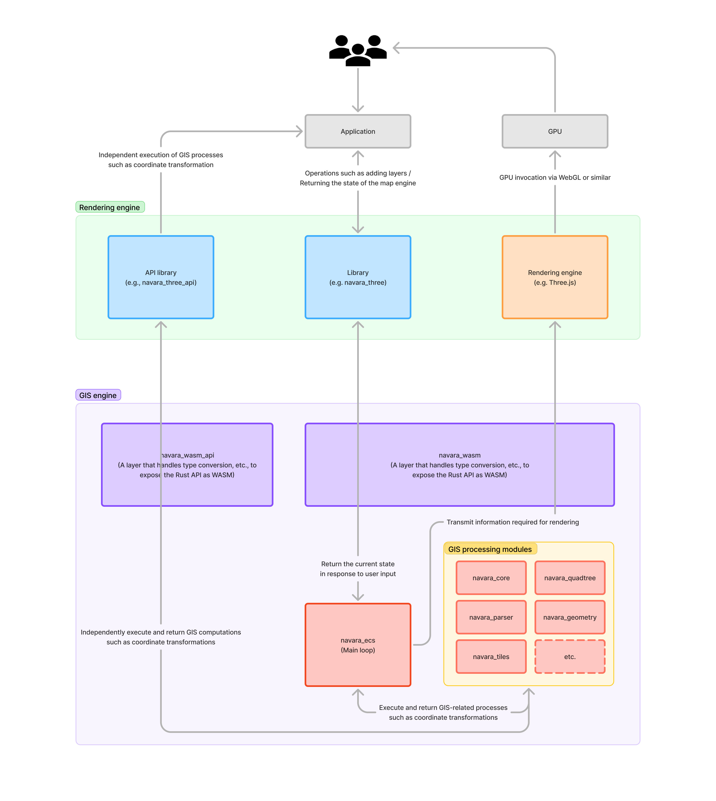

# Navara

3D globe map engine prototype built on Rust + WebAssembly + Three.js

## Usage

__TODO__

## Architecture



## Development

### Install toolchains

You have to install the following environment.

- Rust (stable)
- Node.js (LTS)
- [pnpm](https://pnpm.io/installation)
- protoc

### Install prerequisites

```console
cargo install cargo-make
cargo install cargo-watch
cargo install wasm-pack
```

**MacOS**

```console
brew install protobuf
```

For more information: https://grpc.io/docs/protoc-installation/

### Initial setup

You need to run this command first time.

```console
cargo make prepare
```

### Run with hot-reload

```console
cargo make dev
```

> An error is displayed in the Web browser, but this is because the compilation of WASM has not been completed. Wait a little and when the compilation of WASM is completed, reload the page and it will be displayed correctly.


Alternatively, use `web` if you are working on the web side (using release rust builds + debug web builds)
```console
cargo make web
```

### Screenshots

Please take a screenshot when you add/update an example in `navara_three/example`.

```sh
pnpm navara_three screenshots {PAGE_NAME}
```

## License

Licensed under either of

- Apache License, Version 2.0
  ([LICENSE-APACHE](LICENSE-APACHE) or http://www.apache.org/licenses/LICENSE-2.0)
- MIT license
  ([LICENSE-MIT](LICENSE-MIT) or http://opensource.org/licenses/MIT)

at your option.

## Contribution

Unless you explicitly state otherwise, any contribution intentionally submitted
for inclusion in the work by you, as defined in the Apache-2.0 license, shall be
dual licensed as above, without any additional terms or conditions.
