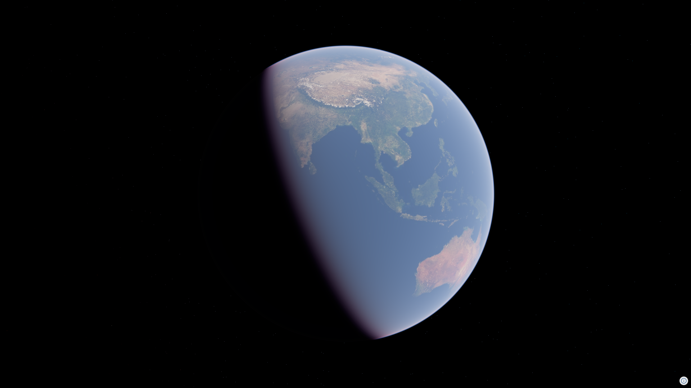
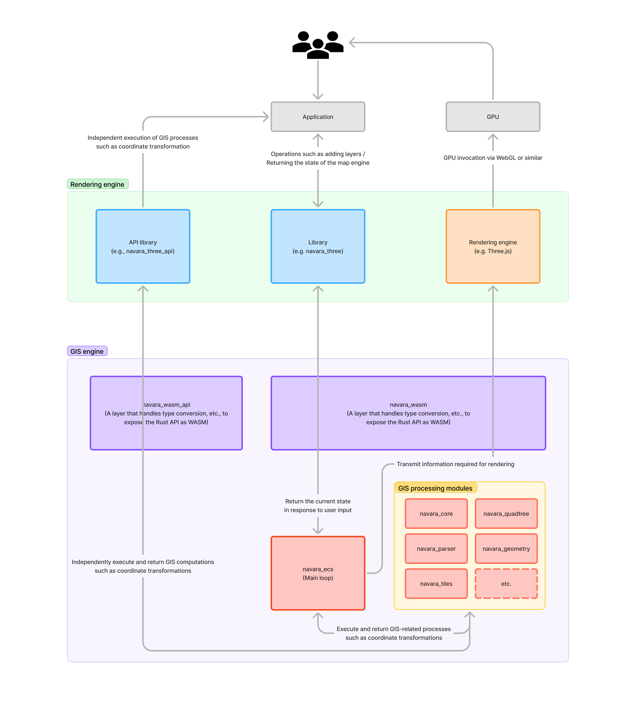

# Navara



<p align="center">
  <sub><i>Imagery courtesy of <a href="https://earthdata.nasa.gov/gibs">NASA EOSDIS GIBS</a> · Blue Marble: Next Generation (public domain)</i></sub>
</p>

Web map engines have long forced a choice: engines with polished declarative APIs are easy to adopt but hard to extend beyond their built-in features, while engines that expose deep low-level control are powerful but demand steep expertise — and fully 3D globe applications usually leave no option but the latter. Navara is a general-purpose 3D globe map engine built to remove that trade-off. It streams real-world geospatial data — satellite imagery, terrain, 3D city models, and vector data — onto an interactive globe, and lets you present it the way your application needs: as a clean basemap for data visualization, styled per feature by attributes, or as a photorealistic scene with atmosphere, sunlight, and shadows.

Navara's answer to the trade-off is a tiered API. Capabilities are organized into four tiers, so you start with the simplicity of a declarative engine and drop down — as far as the render pipeline itself — only when you need more control:

- **Declarative API** — add sources and layers as plain config objects (basemaps, terrain, vector data, 3D Tiles); meshes, effects, and lights work the same declarative way.
- **Plugins** — ready-made bundles such as the photorealistic scene, first-person walking, DOM overlays, and the attribution UI; anyone can package and share their own plugin.
- **Low-level API** — per-feature styling by attributes (`FeatureEvaluator`), feature picking, terrain sampling, and standalone geodetic/ECEF math utilities usable without the map engine.
- **Custom Descriptors** — write your own mesh/effect/light descriptors with full access to the rendering engine's scene graph and render pipeline.

Under the hood, Navara implements the complex but reusable GIS logic in a Rust/WebAssembly core, and delegates drawing to libraries specialized in CG rendering — currently Three.js. Rendering is where GPU APIs and platforms vary the most, so keeping that layer swappable is what lets Navara expand to other rendering engines and platforms in the future.

Navara is part of the [MapLibre](https://maplibre.org/) ecosystem. For discussions, join the `#maplibre` channel on the OSM-US Slack ([invite link](https://slack.openstreetmap.us)).

- 📖 **Documentation**: https://navara-docs.netlify.app/
- 🌏 **Live examples**: https://navara-preview.netlify.app/

## Usage

See [What is Navara?](https://navara-docs.netlify.app/guides/introduction/what-is-navara/) for an overview and [Getting Started](https://navara-docs.netlify.app/guides/introduction/getting-started/) to build your first globe.

## Architecture



## Development

### Install toolchains

You have to install the following environment.

- Rust (stable)
- Node.js (LTS)
- [pnpm](https://pnpm.io/installation)

### Install prerequisites

```console
cargo install cargo-make
cargo install cargo-watch
cargo install wasm-bindgen-cli --version 0.2.118
rustup component add rust-src
```
Optional: Install binaryen for `wasm-opt` optimization: https://github.com/WebAssembly/binaryen

`rust-src` is required by release WASM builds, which rebuild std with `-Z build-std` for smaller binaries.

### Initial setup

You need to run this command first time.

```console
cargo make prepare
```

### Run with hot-reload

```console
cargo make dev
```

> An error is displayed in the Web browser, but this is because the compilation of WASM has not been completed. Wait a little and when the compilation of WASM is completed, reload the page and it will be displayed correctly.


Alternatively, use `web` if you are working on the web side (using release rust builds + debug web builds)
```console
cargo make web
```

### Screenshots

Please take a screenshot when you add/update an example in `navara_three/example`.

```sh
pnpm navara_three screenshots {PAGE_NAME}
```

## API Document

See [docs/README.md](docs/README.md) for details.

```console
pnpm dev:docs      # Start dev server
pnpm build:docs    # Build for production
pnpm preview:docs  # Preview production build
```

## License

Copyright (c) 2026 MapLibre contributors

Licensed under either of

- Apache License, Version 2.0
  ([LICENSE-APACHE](LICENSE-APACHE) or http://www.apache.org/licenses/LICENSE-2.0)
- MIT license
  ([LICENSE-MIT](LICENSE-MIT) or http://opensource.org/licenses/MIT)

at your option.

## Contribution

Unless you explicitly state otherwise, any contribution intentionally submitted
for inclusion in the work by you, as defined in the Apache-2.0 license, shall be
dual licensed as above, without any additional terms or conditions.
