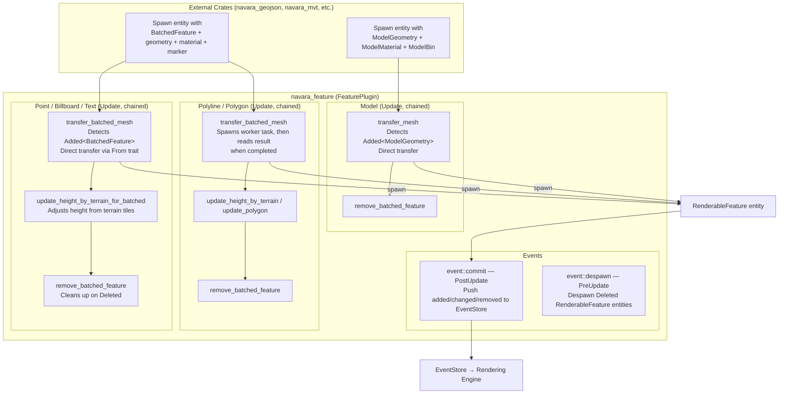
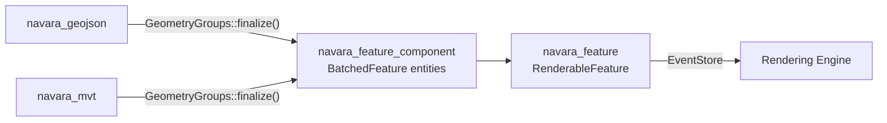

# navara_feature

ECS-based feature rendering plugin for Navara. Handles the lifecycle of geographic features (point, billboard, text, polyline, polygon, model) — from batched geometry components to renderable entities consumed by the rendering engine.

## Architecture Overview



## How to Trigger Rendering

Other crates trigger `navara_feature`'s systems by spawning an ECS entity with the right set of components. The systems detect new entities and spawn a corresponding `RenderableFeature`.

### Required Components (Point / Billboard / Text / Polyline / Polygon)

| Component | Description |
|-----------|-------------|
| **Marker** (`PointMarker`, `BillboardMarker`, `TextMarker`, `PolylineMarker`, `PolygonMarker`) | Identifies the feature type for system queries |
| **Material** (`PointMaterial`, `BillboardMaterial`, `TextMaterial`, `PolylineMaterial`, `PolygonMaterial`) | Visual appearance configuration |
| **`BatchedFeature`** | Triggers `transfer_batched_mesh` — detected via `Added<BatchedFeature>` (point types) or `is_added()` change detection (polyline/polygon) |
| **Batched Geometry** (`BatchedPointGeometry`, `BatchedPolylineGeometry`, `BatchedPolygonGeometry`) | Geometry data stored as handles into `BufferStore` |
| **`FeatureBatchId`** | Batch ID linking to BatchTable properties |
| **`GlobalBatchIds`** | Per-vertex batch IDs (handle into BufferStore) |
| **`FeatureId`** | Mutable — set by `transfer_batched_mesh` to point to the spawned RenderableFeature |
| **`LayerId`** | Layer identifier for grouping and lifecycle management |

### Required Components (Model)

Model features follow a different pattern — they don't use `BatchedFeature` or batched geometry components:

| Component | Description |
|-----------|-------------|
| **`ModelGeometry`** | Coordinates and CRS — triggers `transfer_mesh` via `Added<ModelGeometry>` |
| **`ModelMaterial`** | Visual appearance (size, rotation, clamp_to_ground, etc.) |
| **`ModelBin`** | Binary model data (GLB) |
| **`FeatureBatchId`** | Optional batch ID |
| **`GlobalBatchIds`** | Optional per-vertex batch IDs |
| **`FeatureId`** | Mutable — set to point to spawned RenderableFeature |
| **`LayerId`** | Layer identifier |

### Example (conceptual)

```rust
commands.spawn((
    PointMarker,
    point_material.clone(),
    BatchedFeature::default(),
    batched_point_geometry,  // built via PointGeometryAccumulator
    FeatureBatchId(batch_id),
    global_batch_ids,
    FeatureId::default(),
    LayerId("my_layer".to_string()),
));
// navara_feature's transfer_batched_mesh will automatically detect this
// and spawn a RenderableFeature::Point entity.
```

> In practice, you don't spawn these manually — `GeometryGroups::finalize()` in `navara_feature_component` handles it. See `navara_geojson` and `navara_mvt` for real usage.

## System Pipeline

### Point / Billboard / Text — Direct Transfer (3-stage chain)

1. **`transfer_batched_mesh`** — Queries `Added<BatchedFeature>` with the appropriate marker. Converts `BatchedPointGeometry` → `TransferablePointGeometry` via the `From` trait (zero-copy handle forwarding) and spawns `RenderableFeature::Point` / `Billboard` / `Text` immediately.

2. **`update_height_by_terrain_for_batched`** — Adjusts feature positions based on terrain tile data. Runs when new terrain tiles are loaded (`Added<TileMeshMarker>`), the feature's `should_recalculate_height` flag is set, or the feature uses `clamp_to_ground`.

3. **`remove_batched_feature`** — Triggered when `Deleted` is inserted on a `BatchedFeature` entity. Destroys RenderableFeature geometry buffers, removes batch ID mappings, cleans up BufferStore handles, and despawns entities.

### Polyline / Polygon — Worker-based Transfer (3-stage chain)

1. **`transfer_batched_mesh`** — Uses `is_added()` change detection on `BatchedFeature`. On first detection, spawns a worker task entity (e.g., `ConstructPolylineBatchedFeatureWorkerTaskBundle`) for tessellation. On subsequent frames, checks if the worker task has completed. When the result is ready, reads the tessellated geometry and spawns `RenderableFeature::Polyline` / `Polygon`.

2. **`update_height_by_terrain`** (polyline) / **`update_polygon`** (polygon) — Adjusts terrain height or applies material updates.

3. **`remove_batched_feature`** — Same as point types, plus cleans up worker task results if tessellation completed but the RenderableFeature was not yet created.

### Model — Direct Transfer (2-stage chain)

1. **`transfer_mesh`** — Queries `Added<ModelGeometry>` (not `Added<BatchedFeature>`). Computes world-space position and rotation from coordinates, CRS, and material settings. Supports both standard model placement (with optional rotation to align with globe surface) and point cloud mode. Spawns `RenderableFeature::Model` with the GLB binary data (`ModelBin`).

2. **`remove_batched_feature`** — Cleans up `ModelBin` buffer handle, batch IDs, and despawns entities.

> Note: Model has **no terrain height update system** — height adjustment is handled at spawn time via material settings.

## Event System

| Schedule | System | Purpose |
|----------|--------|---------|
| `PreUpdate` | `event::despawn` | Despawns `RenderableFeature` entities marked `Deleted` |
| `PostUpdate` | `event::commit` | Pushes added/changed/removed `RenderableFeature` entities to `EventStore` for the rendering engine |

## Supported Feature Types

| Type | Marker | Trigger | Geometry Source | Transfer Method |
|------|--------|---------|----------------|-----------------|
| Point | `PointMarker` | `Added<BatchedFeature>` | `BatchedPointGeometry` | Direct (From trait) |
| Billboard | `BillboardMarker` | `Added<BatchedFeature>` | `BatchedPointGeometry` | Direct (From trait) |
| Text | `TextMarker` | `Added<BatchedFeature>` | `BatchedPointGeometry` | Direct (From trait) |
| Polyline | `PolylineMarker` | `BatchedFeature::is_added()` | `BatchedPolylineGeometry` | Worker task |
| Polygon | `PolygonMarker` | `BatchedFeature::is_added()` | `BatchedPolygonGeometry` | Worker task |
| Model | `ModelMarker` | `Added<ModelGeometry>` | `ModelGeometry` + `ModelBin` | Direct |

## Cross-Crate Relationship


