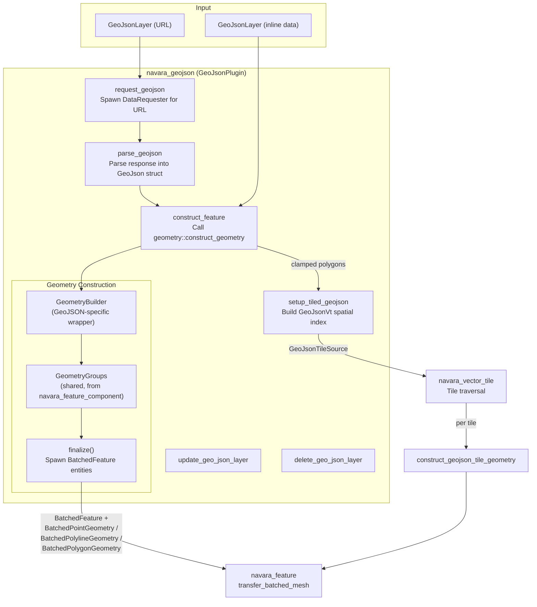
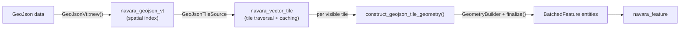

# navara_geojson

GeoJSON parsing and feature construction plugin for Navara. Parses GeoJSON data (from inline data or URL), constructs batched geometry, and feeds it into `navara_feature` for rendering.

## Architecture Overview

## System Pipeline

All systems run in the `Update` schedule, chained in `VectorTileSet::Prepare` order:

| Order | System | Purpose |
|-------|--------|---------|
| 1 | `request_geojson` | For URL-based layers, spawns a `DataRequester` to fetch GeoJSON data |
| 2 | `parse_geojson` | When fetch completes, parses the response bytes into a `GeoJson` struct and stores it in `GeoJsonLayer.data` |
| 3 | `construct_feature` | For layers with `Added` or `Changed` GeoJSON data, calls `geometry::construct_geometry()` to build and spawn batched feature entities |
| 4 | `setup_tiled_geojson` | For layers with `clamp_to_ground` or `tiled` polygon/polyline appearances, sets up tiled rendering via `navara_geojson_vt` |
| 5 | `update_geo_json_layer` | Applies appearance changes to existing rendered features |
| 6 | `delete_geo_json_layer` | Removes all entities and resources for deleted layers |

## GeometryBuilder & GeometryGroups

Geometry construction uses a two-level builder pattern. `navara_geojson` and `navara_mvt` share the same underlying `GeometryGroups` from `navara_feature_component`, but wrap it with format-specific logic.

### GeometryBuilder (GeoJSON-specific)

Defined in `geometry/builder.rs`. Wraps `GeometryGroups` and adds:
- **BatchTable management** — initializes batch entries with `batch_table.init_values()`, stores GeoJSON feature properties via `batch_table.add_values()`
- **Lazy property commitment** — `begin_feature()` stores properties, but they are only committed to the BatchTable when the first geometry is actually added for that appearance kind. This avoids phantom entries for features with no matching geometry.
- **Geometry accumulation** — `add_point()`, `add_polyline()`, `add_polygon()` delegate to `GeometryGroups::track_point_rte/rtc()`, `track_polyline()`, `track_polygon()`

### GeometryGroups (shared)

Defined in `navara_feature_component::geometry_builder`. Groups accumulated geometry by `GeometryAppearanceKind`:

| Kind | Accumulator | Resulting Component |
|------|-------------|-------------------|
| `Point` | `PointGeometryAccumulator` | `BatchedPointGeometry` |
| `Billboard` | `PointGeometryAccumulator` | `BatchedPointGeometry` |
| `Text` | `PointGeometryAccumulator` | `BatchedPointGeometry` |
| `Polyline` | `PolylineGeometryAccumulator` | `BatchedPolylineGeometry` |
| `Polygon` | `PolygonGeometryAccumulator` | `BatchedPolygonGeometry` |

`finalize()` converts each accumulator into a handle-based ECS component (storing Vec data into `BufferStore`) and spawns a `BatchedFeature` entity with the appropriate marker and material. These entities are then automatically picked up by `navara_feature`'s `transfer_batched_mesh` systems.

## Geometry Processing

`geometry/process.rs` contains:

- **`construct_geometry()`** — Main entry point. Creates a `GeometryBuilder`, iterates GeoJSON features, calls `process_geometry()` for each, then calls `finalize()`.
- **`process_geometry()`** — Dispatches by geometry type and appearance:
  - Point/MultiPoint with Point/Billboard/Text appearance → `add_point()` (RTE encoding)
  - LineString/MultiLineString with Polyline appearance → `add_polyline()` (skips `clamp_to_ground` and `tiled` polylines — those go through the tiled rendering pipeline)
  - Polygon/MultiPolygon with Polygon appearance → `add_polygon()` (skips `clamp_to_ground` and `tiled` polygons — those go through the tiled rendering pipeline)
  - GeometryCollection → recurses without resetting feature state

## Tiled GeoJSON (Clamped Polygons)

When a GeoJSON layer has a `clamp_to_ground` or `tiled` polygon/polyline appearance, the data goes through a tiled rendering pipeline instead of direct construction:

1. `setup_tiled_geojson` builds a `GeoJsonVt` spatial index and registers a `GeoJsonTileSource` with `navara_vector_tile`
2. `navara_vector_tile`'s tile traversal system requests tiles as the camera moves
3. For each visible tile, `construct_geojson_tile_geometry()` queries the spatial index, converts tile-local coordinates, and constructs batched features using the same `GeometryBuilder` → `GeometryGroups::finalize()` path

## Relationship with Other Crates

| Crate | Relationship |
|-------|-------------|
| `navara_feature_component` | Provides `GeometryGroups`, `BatchedFeature`, batched geometry components, and `RenderableFeature` types |
| `navara_feature` | Consumes spawned `BatchedFeature` entities and creates `RenderableFeature` for rendering |
| `navara_geojson_vt` | Spatial index for tiled GeoJSON rendering (polygon clamping) |
| `navara_vector_tile` | Tile traversal, caching, and lifecycle management for tiled layers |
| `navara_parser` | Provides `GeoJson` parsing from bytes |
| `navara_data_requester` | HTTP fetch abstraction for URL-based layers |
