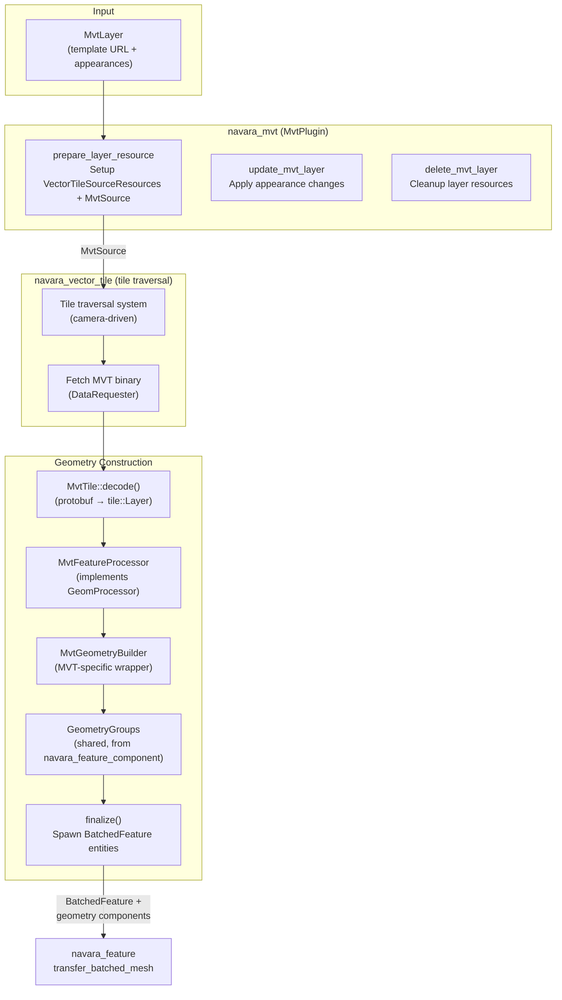
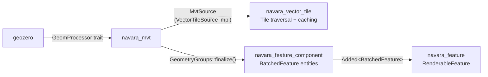

# navara_mvt

MVT (Mapbox Vector Tiles) parsing and feature construction plugin for Navara. Decodes MVT protobuf binary using `geozero`, constructs batched geometry, and feeds it into `navara_feature` for rendering.

## Architecture Overview



## System Pipeline

### Plugin Systems (Update schedule)

| System | Purpose |
|--------|---------|
| `prepare_layer_resource` | For newly added `MvtLayer` entities, creates or reuses `VectorTileSourceResources` and registers `MvtSource` (implements `VectorTileSource`). Runs in `VectorTileSet::Prepare`. |
| `update_mvt_layer` | Applies appearance changes to rendered features for existing layers |
| `delete_mvt_layer` | Removes layer entities, tile cache, and all associated features |

### Tile Loading (driven by navara_vector_tile)

The actual MVT parsing and feature construction happens when `navara_vector_tile`'s tile traversal system requests a new tile:

1. Camera movement triggers tile traversal → determines which tiles are visible
2. `navara_vector_tile` fetches the MVT binary via `DataRequester`
3. `MvtSource::construct_geometry()` is called with the fetched bytes (via the `VectorTileSource` trait)
4. This calls `construct_geometry_multi_layer()` — the main geometry construction entry point

## Geometry Construction

### construct_geometry_multi_layer()

Entry point in `geometry/process.rs`. Parses the MVT binary **once** and processes all sublayers:

```text
MVT binary → MvtTile::decode() → for each tile::Layer:
    → find matching target layer from matched_layers
    → create MvtGeometryBuilder
    → for each feature:
        → process with MvtFeatureProcessor (geozero)
    → builder.groups.finalize() → spawn BatchedFeature entities
```

**Multi-layer optimization**: When multiple `MvtLayer`s share the same source URL, the MVT binary is parsed once and sublayers are dispatched to their matching target layers.

### geozero Integration

`MvtFeatureProcessor` implements geozero's `GeomProcessor` trait, enabling **direct accumulation** of geometry during protobuf decode — no intermediate `geo_types::Geometry` allocation:

| GeomProcessor callback | Action |
|----------------------|--------|
| `point_begin` | Set `in_point` flag |
| `coordinate` (point) | Project coordinates via `PosConverter`, call `builder.add_point()` for each point appearance kind |
| `linestring_begin` | Allocate projected coordinate buffer |
| `coordinate` (line/polygon) | Project and accumulate coordinates |
| `linestring_end` (polyline) | Call `builder.add_polyline()` with accumulated coordinates |
| `linestring_end` (polygon ring) | Store as outer ring or hole |
| `polygon_end` | Call `builder.add_polygon()` with outer ring + holes |

### MvtGeometryBuilder & GeometryGroups

Same two-level builder pattern as `navara_geojson`:

**MvtGeometryBuilder** (MVT-specific, `geometry/builder.rs`):
- Wraps `GeometryGroups` and adds MVT-specific batch management
- Stores MVT **tags** (key/value indices) instead of JSON properties
- Initializes batches with `batch_table.init_mvt()` and stores `MvtLayerData` (shared keys/values Arc references)
- Lazy tag commitment — `begin_feature(tags)` stores tags, committed only when geometry is first added for a kind

**GeometryGroups** (shared, from `navara_feature_component`):
- Groups geometry by `GeometryAppearanceKind` (Point/Billboard/Text/Polyline/Polygon)
- `finalize()` converts accumulators to handle-based ECS components and spawns `BatchedFeature` entities
- Same implementation used by both `navara_geojson` and `navara_mvt`

### Coordinate Projection

MVT tile coordinates (integer [0, extent]) are converted to world-space positions using `PosConverter`:
- **Points**: Projected to geocentric coordinates with RTC encoding (relative to tile center)
- **Lines/Polygons**: Projected to either flat [-1, 1] coordinates (for clamped rendering) or geographic lon/lat (for 3D rendering)

## Source Caching

`MvtSourceCache` manages shared tile sources:
- Multiple `MvtLayer`s with the same template URL share a single `VectorTileSourceResources`
- When a new layer references an existing source, it is added as a layer reference without creating duplicate tile fetches
- `MvtSourceId` identifies sources by their URL pattern

## Relationship with Other Crates



| Crate | Relationship |
|-------|-------------|
| `navara_feature_component` | Provides `GeometryGroups`, `BatchedFeature`, batched geometry components |
| `navara_feature` | Consumes spawned `BatchedFeature` entities and creates `RenderableFeature` for rendering |
| `navara_vector_tile` | Tile traversal, caching, and lifecycle — MVT is one `TileSource` implementation |
| `geozero` | Provides `GeomProcessor` trait and MVT protobuf decoding (`MvtTile::decode`, `process_geom`) |
| `navara_parser` | Provides `MvtLayerData` for batch table MVT tag storage |
