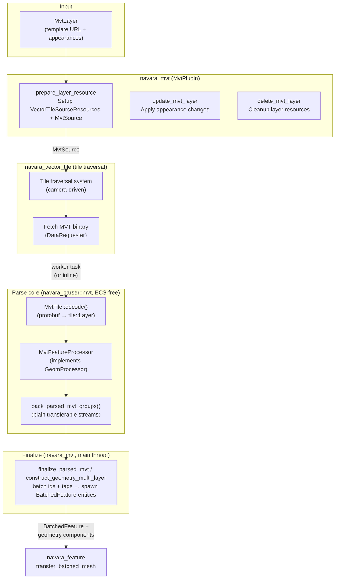
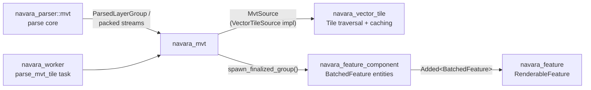

# navara_mvt

MVT (Mapbox Vector Tiles) feature construction plugin for Navara. The ECS-free parse core (protobuf decode via `geozero`, geometry projection) lives in `navara_parser::mvt`; this crate drives it — by default on a **Web Worker** (`delegated_worker` feature) — and finalizes the parsed plain geometry into batched feature entities for `navara_feature` to render.

## Architecture Overview

```mermaid
graph TB
    subgraph "Input"
        SRC["MvtLayer<br/>(template URL + appearances)"]
    end

    subgraph "navara_mvt (MvtPlugin)"
        PREP[prepare_layer_resource<br/>Setup VectorTileSourceResources + MvtSource]
        UPD[update_mvt_layer<br/>Apply appearance changes]
        DEL[delete_mvt_layer<br/>Cleanup layer resources]
    end

    subgraph "navara_vector_tile (tile traversal)"
        TRAV["Tile traversal system<br/>(camera-driven)"]
        FETCH["Fetch MVT binary<br/>(DataRequester)"]
    end

    subgraph "Parse core (navara_parser::mvt, ECS-free)"
        DECODE["MvtTile::decode()<br/>(protobuf → tile::Layer)"]
        PROC["MvtFeatureProcessor<br/>(implements GeomProcessor)"]
        PACK["pack_parsed_mvt_groups()<br/>(plain transferable streams)"]
        DECODE --> PROC --> PACK
    end

    subgraph "Finalize (navara_mvt, main thread)"
        FIN["finalize_parsed_mvt / construct_geometry_multi_layer<br/>batch ids + tags → spawn BatchedFeature entities"]
    end

    SRC --> PREP
    PREP -->|"MvtSource"| TRAV
    TRAV --> FETCH -->|"worker task<br/>(or inline)"| DECODE
    PACK --> FIN
    FIN -->|"BatchedFeature +<br/>geometry components"| NF[navara_feature<br/>transfer_batched_mesh]
```

## System Pipeline

### Plugin Systems (Update schedule)

| System | Purpose |
|--------|---------|
| `prepare_layer_resource` | For newly added `MvtLayer` entities, creates or reuses `VectorTileSourceResources` and registers `MvtSource` (implements `VectorTileSource`). Runs in `VectorTileSet::Prepare`. |
| `update_mvt_layer` | Applies appearance changes to rendered features for existing layers |
| `delete_mvt_layer` | Removes layer entities, tile cache, and all associated features |
| `finalize_parsed_mvt` | (`delegated_worker`) Spawns feature entities from completed worker parse results and links them to their `RenderedTile` |
| `cancel_evicted_parse_tasks` | (`delegated_worker`) Cancels in-flight parses whose tile has been evicted |

### Tile Loading (driven by navara_vector_tile)

The actual MVT parsing and feature construction happens when `navara_vector_tile`'s tile traversal system requests a new tile:

1. Camera movement triggers tile traversal → determines which tiles are visible
2. `navara_vector_tile` fetches the MVT binary via `DataRequester`
3. `MvtSource::construct_geometry()` is called with the fetched bytes (via the `VectorTileSource` trait)
4. With the default `delegated_worker` feature this **spawns a `parse_mvt_tile` worker task** and returns no features yet; without it, it calls `construct_geometry_multi_layer()` inline

## Geometry Construction

The parse itself is a pure function, `navara_parser::mvt::parse_mvt_tile()`: MVT binary in, plain per-(layer, kind) `ParsedLayerGroup` geometry out — no ECS, no entity spawning. That split is what makes it worker-offloadable; everything that needs the ECS world (batch-id assignment, tag registration, entity spawning) stays on the main thread in this crate.

### Worker delegation (`delegated_worker`, default on)

`geometry/async_finalize.rs` drives the asynchronous path:

1. `spawn_parse_mvt_task()` snapshots the layer parse configs and appearances (`Arc`-shared) and spawns a `parse_mvt_tile` worker task (`navara_worker`); the pbf bytes are transferred to the worker
2. The worker runs `parse_mvt_tile()` and returns the groups packed into plain transferable streams (`pack_parsed_mvt_groups`)
3. On completion, `finalize_parsed_mvt` slices the streams back into groups, spawns the batched feature entities, and links them to the originating `RenderedTile` — but only if that tile is still the canonical one for its handle (stale results after eviction are dropped). It also forces a re-traversal so the new features get activated even with a static camera
4. `cancel_evicted_parse_tasks` cancels in-flight parses whose tile has been evicted

### construct_geometry_multi_layer()

Synchronous entry point in `geometry/process.rs` (the non-worker build): calls `parse_mvt_tile()` inline and finalizes the resulting groups through the **same** finalize helpers (`build_accumulated_geometry` / `spawn_finalized_group`) the async path uses.

**Multi-layer optimization**: When multiple `MvtLayer`s share the same source URL, the MVT binary is parsed once and sublayers are dispatched to their matching target layers (the last matching layer per sublayer wins).

### geozero Integration

`MvtFeatureProcessor` (`navara_parser::mvt::parse`) implements geozero's `GeomProcessor` trait, enabling **direct accumulation** of geometry during protobuf decode — no intermediate `geo_types::Geometry` allocation:

| GeomProcessor callback | Action |
|----------------------|--------|
| `point_begin` | Set `in_point` flag |
| `coordinate` (point) | Project coordinates via `PosConverter`, accumulate for each point appearance kind |
| `linestring_begin` | Allocate projected coordinate buffer |
| `coordinate` (line/polygon) | Project and accumulate coordinates |
| `linestring_end` (polyline) | Accumulate the polyline's coordinates |
| `linestring_end` (polygon ring) | Store as outer ring or hole |
| `polygon_end` | Accumulate the polygon's outer ring + holes |

### Parsed groups and finalization

The processor accumulates into one `ParsedLayerGroup` per (layer, kind) pair — plain `Vec`s of coordinates, sizes and batch indices (`ParsedGeometry`), plus the MVT **tags** (key/value indices) per feature. Tags are committed lazily: a feature's pending tags are recorded only when geometry is first added for a kind, so features that produce no geometry cost nothing.

Finalization (this crate) turns a group into one batched feature entity:
- Registers the layer's property table with `batch_table.init_mvt()` and stores `MvtLayerData` (shared keys/values `Arc` references)
- Generates a global batch id per geometry item and builds the handle-based geometry components (`build_accumulated_geometry`)
- Spawns the `BatchedFeature` entity (`spawn_finalized_group`) for `navara_feature` to render

### Coordinate Projection

MVT tile coordinates (integer [0, extent]) are converted to world-space positions using `PosConverter` (`navara_parser::mvt`):
- **Points**: Projected to geocentric coordinates with RTC encoding (relative to tile center)
- **Lines/Polygons**: Projected to either flat [-1, 1] coordinates (for clamped rendering) or geographic lon/lat (for 3D rendering)

## Source Caching

`MvtSourceCache` manages shared tile sources:
- Multiple `MvtLayer`s with the same template URL share a single `VectorTileSourceResources`
- When a new layer references an existing source, it is added as a layer reference without creating duplicate tile fetches
- `MvtSourceId` identifies sources by their URL pattern

## Relationship with Other Crates

```mermaid
graph LR
    MVT[navara_mvt] -->|"MvtSource<br/>(VectorTileSource impl)"| VT[navara_vector_tile<br/>Tile traversal + caching]
    MVT -->|"spawn_finalized_group()"| FC[navara_feature_component<br/>BatchedFeature entities]
    FC -->|"Added&lt;BatchedFeature&gt;"| F[navara_feature<br/>RenderableFeature]
    P[navara_parser::mvt<br/>parse core] -->|"ParsedLayerGroup /<br/>packed streams"| MVT
    W[navara_worker<br/>parse_mvt_tile task] --> MVT
```

| Crate | Relationship |
|-------|-------------|
| `navara_parser` | ECS-free parse core: `parse_mvt_tile`, `MvtFeatureProcessor` (geozero), `PosConverter`, stream packing, `MvtLayerData` for batch table MVT tag storage |
| `navara_worker` | Hosts the `parse_mvt_tile` delegated task the async path spawns; `navara_wasm_worker` runs it in the Web Worker |
| `navara_feature_component` | Provides `BatchedFeature` and the batched geometry components |
| `navara_feature` | Consumes spawned `BatchedFeature` entities and creates `RenderableFeature` for rendering |
| `navara_vector_tile` | Tile traversal, caching, and lifecycle — MVT is one `TileSource` implementation |
| `geozero` | Provides the `GeomProcessor` trait and MVT protobuf decoding (used inside the parse core) |
