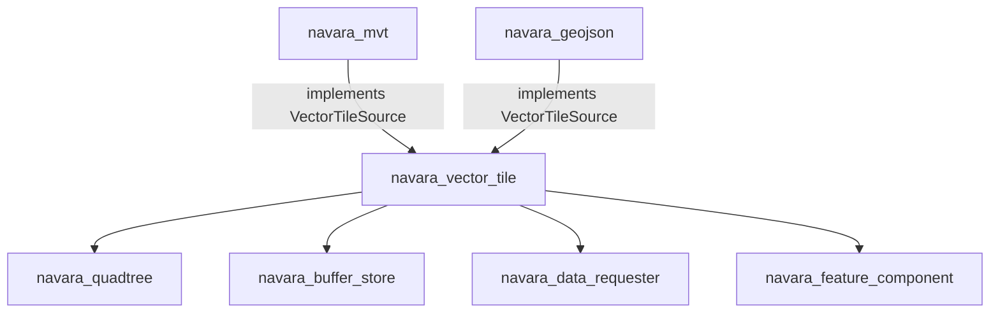
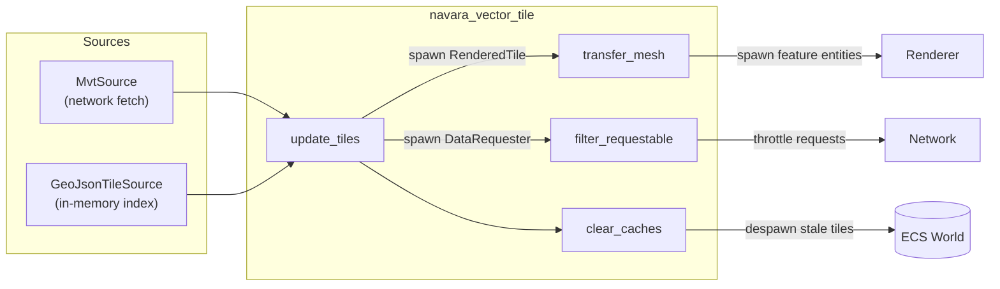
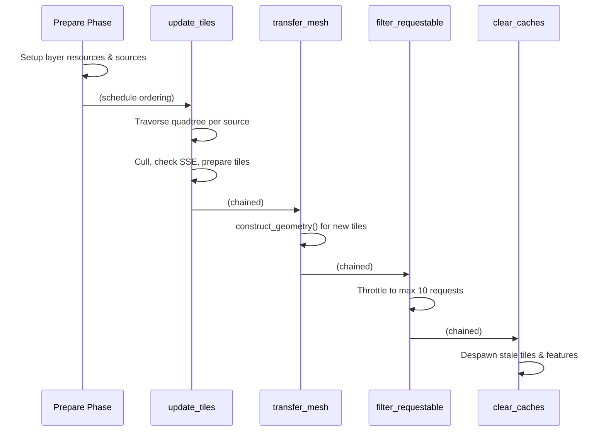

# navara_vector_tile

A format-agnostic vector tile rendering pipeline for the Navara map engine. This crate provides the shared infrastructure — tile traversal, caching, source deduplication, and rendering coordination — so that concrete formats like MVT and GeoJSON (and future ones) plug in through a single trait.

## Why This Crate Exists

Before `navara_vector_tile`, the MVT pipeline owned the entire tile lifecycle (traversal, caching, rendering). Adding GeoJSON tiling required either duplicating that machinery or extracting it into a shared abstraction. This crate is the extraction: it owns the *how* of tile management while delegating the *what* to individual source implementations.

## Architecture

### The `VectorTileSource` Trait

Every tile format implements this trait:

```rust
pub trait VectorTileSource: Send + Sync + 'static {
    /// Request tile data (network fetch for MVT, index lookup for GeoJSON).
    fn prepare_tile(&mut self, ...) -> bool;

    /// Build geometry entities from tile data.
    fn construct_geometry(&mut self, ...) -> Option<Vec<Entity>>;

    /// Check whether a tile's data is available.
    fn ready_state(&self, ...) -> ReadyState;

    /// Clean up when a tile leaves the viewport.
    fn evict_tile(&mut self, _handle: TileHandle) {}
}
```

`ReadyState` is one of `Success`, `Pending`, or `Failed`.

### Key Types

| Type | Kind | Purpose |
|---|---|---|
| `TileSource` | Component | Wraps a `Box<dyn VectorTileSource>`, attached to the source entity |
| `VectorTileSourceResources` | Component | Shared per-source state: quadtree entity, tile cache entity, and layer references |
| `VectorTileSourceCache` | Resource | Global registry mapping `SourceId → Entity`, enables source deduplication |
| `SourceId` | Value | Opaque key (`String`) + `TraversalConfig`; identity for deduplication |
| `TraversalConfig` | Value | Rendering parameters: max zoom, SSE threshold, clamp-to-ground flag |
| `TileCacheManager` | Component | Tracks rendered and requested tiles per source |
| `RenderedTile` | Component | Attached to tile entities; holds feature entity IDs |
| `LayerResources` | Component | Per-layer reference to its shared source, quadtree, and cache |
| `VectorTileFeatureMarker` | Component | Marker on feature entities created by this pipeline |

### Multi-Layer Source Sharing

Multiple layers pointing at the same data share a single `VectorTileSourceResources` entity, identified by `SourceId`:

```
Layer A ──┐
           ├─ SourceId("https://tiles.example/{z}/{x}/{y}.pbf", config)
Layer B ──┘       │
                  ▼
          VectorTileSourceResources
          ├── TileSource(MvtSource { ... })
          ├── Quadtree (shared)
          └── TileCacheManager (shared)
```

When the last layer is removed, the shared resources are cleaned up via reference counting in `VectorTileSourceResources.layer_refs`.

## System Pipeline

All systems run in the `Update` schedule. The `Prepare` phase runs first (handled by downstream crates), then the `Process` phase runs four chained systems:

```
VectorTileSet::Prepare          VectorTileSet::Process
─────────────────────          ──────────────────────────────────────────────
  MVT: prepare_layer_resource    1. update_tiles
  GeoJSON: setup_tiled_geojson   2. transfer_mesh
                                 3. filter_requestable_data_requester
                                 4. clear_caches
```

### `update_tiles`

Performs quadtree traversal for each source. For every tile node:
1. Frustum and occlusion culling
2. Screen-space error (SSE) evaluation
3. Calls `source.ready_state()` to check data availability
4. Calls `source.prepare_tile()` to initiate data requests
5. Recursively traverses children when SSE threshold is not met
6. Activates/deactivates `RenderableFeature` components for smooth LOD transitions

### `transfer_mesh`

For newly spawned `RenderedTile` entities (those without a `Rendered` marker):
1. Calls `source.construct_geometry()` to build feature entities
2. Inserts the `Rendered` marker component

### `filter_requestable_data_requester`

Throttles concurrent data requests to a maximum of 10, discarding lower-priority tiles.

### `clear_caches`

Removes tiles that are no longer in the viewport:
1. Despawns tile entities and their features
2. Calls `source.evict_tile()` for source-specific cleanup
3. Removes pending requests for tiles no longer needed

## Collaboration with Other Crates

### `navara_mvt` → `MvtSource`

- **`prepare_tile`**: Creates a network `DataRequester` to fetch protobuf tile data
- **`construct_geometry`**: Decodes protobuf, builds geometry for matched layers
- **`ready_state`**: Maps `DataRequesterStatus` to `ReadyState`
- Registers systems in `VectorTileSet::Prepare` for layer setup/teardown

### `navara_geojson` → `GeoJsonTileSource`

- **`prepare_tile`**: No network request; checks the in-memory `GeoJsonVt` spatial index
- **`construct_geometry`**: Looks up pre-tiled features from the spatial index
- **`ready_state`**: Returns `Failed` for empty tiles, `Success` otherwise
- **`evict_tile`**: Clears the internal prepared-tile cache
- Registers systems in `VectorTileSet::Prepare` for GeoJSON parsing and tiling setup

## Diagrams

### Crate Relationships



### Data Flow



### System Pipeline



## Future Extensibility

The `VectorTileSource` trait and `SourceId` design are intentionally format-agnostic. Adding a new vector tile format (e.g., MapLibre Tiles, PMTiles, FlatGeobuf) requires:

1. Implement `VectorTileSource` for the new format
2. Register setup/teardown systems in `VectorTileSet::Prepare`
3. Construct a `SourceId` with an appropriate key string

No changes to the core traversal, caching, or rendering systems are needed.
