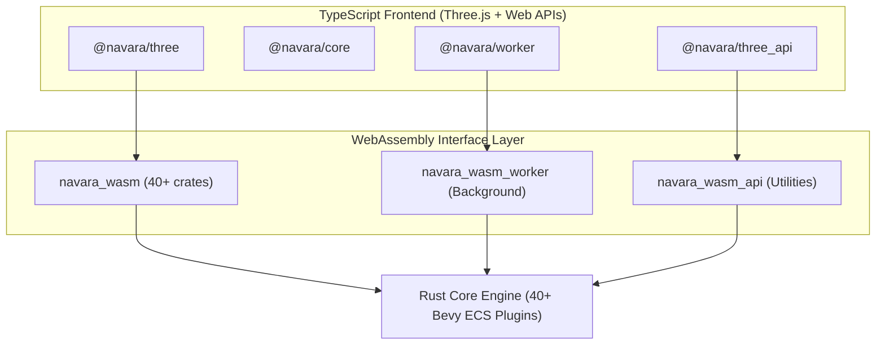

## Overview

Navara is a headless map engine — its GIS core is intentionally designed with no dependency on any specific rendering technology. The core is written in Rust using the [Bevy ECS](https://bevyengine.org/) framework, and each crate is modularized as a Bevy ECS Plugin. This means the engine is composed of independent, composable plugins that register their own systems, components, and resources into a shared ECS world. The Rust codebase is compiled to WebAssembly, and all spatial data processing runs independently of any renderer, producing rendering-ready output that any rendering backend can consume. Currently, a Three.js-based backend handles scene composition and GPU rendering, but the architecture supports future backends (other rendering engines, native platforms). Communication between the GIS core and any rendering backend flows through a well-defined WASM bridge.

For details on the individual Rust crates and their responsibilities, see [Internal Modules](../internal-modules/).

## Data Flow

At the top, the user interacts with `@navara/three` through the `ThreeView` API. Commands such as adding layers, setting the camera, or updating styles are translated into calls to the WASM GIS engine. The GIS engine processes these requests — loading tiles, parsing features, computing geometry, managing spatial indices — and produces rendering-ready data that flows back up to the Three.js scene. TypeScript bindings are generated by `wasm-bindgen` during the build process, and the WASM modules are compiled to the `web/wasm/` directory where they are consumed by the TypeScript packages as dependencies.

## WASM Bridge: Two Approaches

Navara compiles two separate WASM modules that serve fundamentally different purposes.

**`navara_wasm`** is the full engine, built from over 40 Rust crates. It maintains a complete Bevy ECS world with persistent state — entities, camera state, tile hierarchies, feature batches, and rendering buffers. Each frame, the ECS main loop processes input events, updates spatial state, coordinates tile loading, and issues draw commands. This module handles all the complex, coordinated operations that a map engine requires: multi-layer tile management with LOD, feature batching and geometry processing, format parsing (MVT, GeoJSON, 3D Tiles), and background worker task delegation.

**`navara_wasm_api`** is a lightweight utility module built from only 6 core crates. It provides stateless mathematical functions — coordinate transformations, geometric calculations, ray intersections, and reference frame conversions. Each function call is independent with no persistent state, making this module fast to initialize and efficient for one-off computations. It is exposed to users through `@navara/three_api` for cases where GIS math is needed without the full engine.

A third module, **`navara_wasm_worker`**, runs in Web Workers to handle CPU-intensive background tasks such as terrain mesh construction and polygon/polyline batch processing, keeping the main thread responsive.

## Application Layer Integration

The rendering layer provides two paths for communication with the WASM engine.

`@navara/three` is the main interface, connecting to `navara_wasm`. It receives comprehensive processed data — transformed geometry, camera matrices, material properties, LOD information — and manages the Three.js scene accordingly. Layer additions, removals, and updates flow through this path. Event-driven rendering updates ensure that the scene stays synchronized with the GIS engine's state.

`@navara/three_api` provides a lightweight bridge to `navara_wasm_api` for utility operations. It wraps WASM functions in idiomatic TypeScript, accepting plain JavaScript objects and Three.js types as input and returning the same, without exposing WASM internals. This is used for operations like screen-to-world coordinate conversion and geodesic calculations.

## Performance Optimizations

Navara employs several techniques to maintain high performance across the WASM boundary and during rendering.

Zero-copy transfers are used where possible when passing data between JavaScript and WASM. Buffer pooling reduces allocation overhead for frequently created and destroyed geometry and texture resources. Spatial culling — frustum culling and horizon culling — is performed in the GIS engine before any data is sent to the renderer, avoiding unnecessary GPU work. CPU-intensive tasks such as terrain mesh generation and feature batching are offloaded to Web Workers through a managed worker pool, keeping the main thread available for rendering and user interaction.
