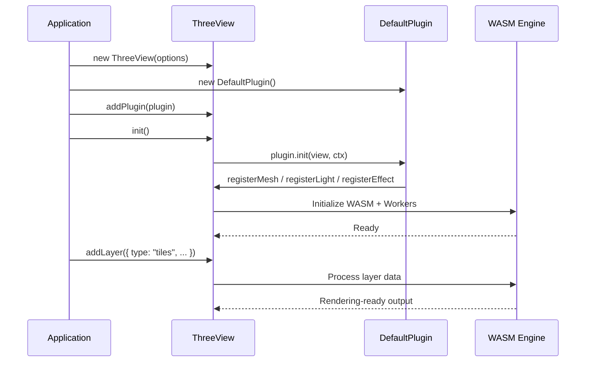
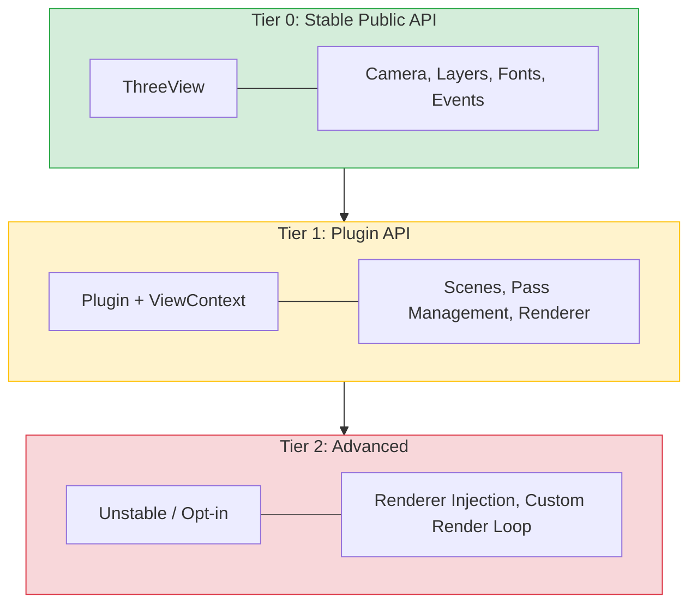

## Plugin-Based Architecture

Navara uses a plugin system to register layer types. Before calling `init()`, you add plugins to a `ThreeView` instance. Each plugin registers the mesh, light, and effect layer types it provides. After initialization, you can add layers of those registered types.

[`DefaultPlugin`](../../../three_default_plugin/about/) (from `@navara/three_default_plugin`) registers built-in mesh, light, and effect layers. For most applications, adding `DefaultPlugin` is all you need to get started.

You can also create your own mesh layers, effect layers, and light layers with full access to the Three.js scene graph. This is the same mechanism that powers Navara's built-in layers. For details, see the [Custom Layer](../../../three/Core/custom-layer/) documentation.

In addition to these, Navara provides [resource layers](../../../three/Resource%20Layer/about/) for loading and displaying geographic data such as GeoJSON, MVT, and 3D Tiles. Resource layers handle the complexity of features and their attributes — parsing, spatial indexing, and attribute-based styling through [`FeatureEvaluator`](../../../three/API/feature-evaluator/). Mesh layers, on the other hand, deal only with geometry and rendering, which allows them to be optimized purely for draw performance and is suited for rendering large numbers of objects efficiently. This separation lets you choose the right tool for each use case. For more on layer types, see [About Layer](../../../three/Introduction/about-layer/).

## Tiered API

Navara organizes its API into tiers with different stability guarantees, so that casual users get a simple, stable interface while plugin developers can access deeper functionality when needed.

**Tier 0: ThreeView** is the primary entry point for all users. It provides high-level methods for camera positioning, layer management, plugin registration, and lifecycle control. This surface is intentionally kept small and stable — breaking changes require a major version bump. See the [ThreeView API reference](../../../three/API/threeview-class/) for details.

**Tier 1: Plugin + ViewContext** is available to plugin and layer developers. When a plugin is initialized, it receives a `ViewContext` that provides controlled access to rendering internals such as scenes, pass management, and the renderer reference. This level offers more power at the cost of occasional breaking changes between minor versions. See the [Plugin](../../../three/Core/plugin/) and [Custom Layer](../../../three/Core/custom-layer/) documentation for details.

**Tier 2: Advanced** is planned for future use cases that require deeper integration, such as injecting an external renderer or replacing the render loop. These APIs will be explicitly marked as unstable.

For most applications, you will only interact with Tier 0 — the `ThreeView` class.

## Library Overview

Navara is split into several npm packages. This can seem complex at first, but the separation follows directly from the headless design: the GIS engine is independent of any renderer, the rendering backend is a separate layer, and layer implementations are separate from the core so you can choose which ones to include.

In practice, most applications only need two packages: `@navara/three` for the core engine and `@navara/three_default_plugin` for the built-in layers.

| Package | Role | When you need it |
|---------|------|-----------------|
| `@navara/three` | Main package — `ThreeView` class, layer API, camera control | Always |
| `@navara/three_default_plugin` | `DefaultPlugin` — built-in mesh, light, and effect layers | Almost always |
| `@navara/three_default_layers` | Individual layer class implementations | When registering layers manually without `DefaultPlugin` |
| `@navara/three_api` | Standalone GIS utilities (coordinate transforms, geodesic calculations) | When you need GIS math without the full map engine |

## Navigating the Documentation

This documentation is organized into several sections that correspond to different parts of the system.

The [**three** section](../../../three/Introduction/what-is-navara-three/) covers everything related to `@navara/three` — the `ThreeView` API, camera controls, layer concepts, and step-by-step tutorials. If you are building an application with Navara, this is where you will spend most of your time.

The [**three_default_layers** section](../../../three_default_layers/about/) is a reference for all the mesh, effect, and light layer types provided by `@navara/three_default_layers`. Each layer type has its own page documenting its configuration options and usage examples.

The [**three_default_plugin** section](../../../three_default_plugin/about/) documents the `DefaultPlugin` API, including the convenience methods it provides for common setups.

The **guides** section (where you are now) contains this introduction, community resources, and contributor documentation.

## Next Steps

Ready to see Navara in action? Head to [Getting Started](../getting-started/) to set up your first project with a working code example.
