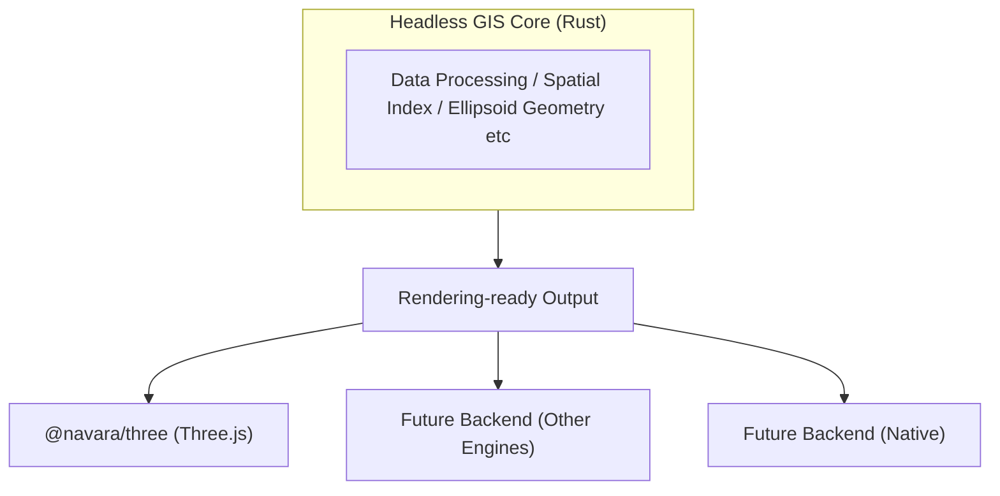

## What is Navara?

Navara is a headless 3D globe map engine. Its GIS core is written in Rust and compiled to WebAssembly, deliberately separated from any specific rendering technology. Currently, Navara provides a Three.js-based rendering backend (`@navara/three`), but the engine is designed so that other rendering engines — and even native platforms — can be supported in the future.

## Key Features

Navara supports a wide range of geospatial data formats including GeoJSON, Mapbox Vector Tiles (MVT), Cesium 3D Tiles, raster tiles, and terrain data. You can display and style these data sources as layers on a 3D globe, with per-feature styling through [`FeatureEvaluator`](../../../three/API/feature-evaluator/).

The Three.js rendering backend includes photorealistic capabilities such as atmospheric scattering, shadow mapping, volumetric clouds, and post-processing effects. These are all available as composable effect layers through the plugin system.

The Rust/WASM GIS engine handles all geospatial computation independently of the renderer, and CPU-intensive tasks are distributed across Web Workers for responsive performance even with large datasets.

## How Navara Compares to Other Map Engines

Each web map engine has its own design philosophy and strengths. Understanding these helps clarify where Navara fits and what trade-offs it makes.

**CesiumJS** is the most mature 3D geospatial engine and the creator of the 3D Tiles specification, with an extensive track record in large-scale 3D data visualization. It provides a wide range of low-level APIs that allow developers to implement diverse functionality with considerable freedom. The trade-off is a steeper learning curve — the breadth of its API surface means developers need deeper knowledge to build custom features effectively.

**MapLibre GL JS** offers a polished, high-level API that makes it easy to customize map styles declaratively. Its active open-source community and mature ecosystem make it an excellent choice for 2D vector tile applications. However, when it comes to extending functionality beyond what the built-in API provides, customization options are more limited.

**deck.gl** extends MapLibre GL JS (or MapboxGL) with a rich set of visualization layers and a clear composable layer model. The combination is powerful, but it requires learning both libraries and their integration patterns.

**Navara** aims to combine the strengths of these approaches under a single, tiered API. For general users, Navara provides a high-level, declarative API for adding layers and styling features through [`FeatureEvaluator`](../../../three/API/feature-evaluator/). Plugins can further simplify workflows — for example, loading layer definitions from JSON, or using the MapLibre Style Plugin (in development) to define feature styles in a familiar JSON format. For advanced users who need to build custom functionality, Navara exposes a lower-level API through the plugin system, custom mesh layers, and custom effect layers — the same foundation that powers Navara's own built-in layers. Additionally, Navara offers standalone GIS APIs for coordinate transforms and geodesic calculations that can be used independently of the map engine itself.

## Next Steps

To understand how Navara is structured and why it has multiple packages, continue to [How Navara Works](../how-navara-works/).
