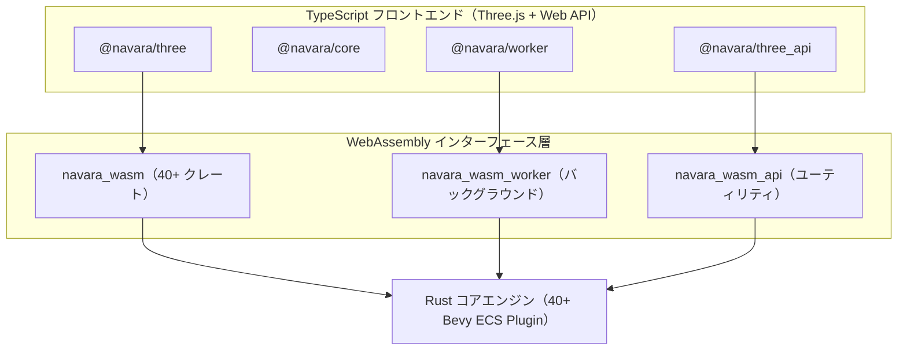

## 概要

Navara はヘッドレスマップエンジンです — GIS コアは特定のレンダリング技術に一切依存しないよう意図的に設計されています。コアは Rust と [Bevy ECS](https://bevyengine.org/) フレームワークで書かれており、各クレートは Bevy ECS Plugin 単位でモジュール化されています。つまり、エンジンは独立した合成可能なプラグインで構成されており、各プラグインが自身のシステム、コンポーネント、リソースを共有 ECS ワールドに登録します。Rust コードベースは WebAssembly にコンパイルされ、すべての空間データ処理はレンダラーとは独立して実行され、任意のレンダリングバックエンドが消費できるレンダリング可能な出力を生成します。現在、Three.js ベースのバックエンドがシーン構成と GPU レンダリングを担当していますが、このアーキテクチャは将来のバックエンド（他のレンダリングエンジン、ネイティブプラットフォーム）をサポートします。GIS コアと任意のレンダリングバックエンド間の通信は、明確に定義された WASM ブリッジを通じて行われます。

各 Rust クレートの詳細と責務については、[Internal Modules](../internal-modules/) を参照してください。

## データフロー

最上部で、ユーザーは `ThreeView` API を通じて `@navara/three` とやり取りします。レイヤーの追加、カメラの設定、スタイルの更新などのコマンドは、WASM GIS エンジンへの呼び出しに変換されます。GIS エンジンはこれらのリクエストを処理し — タイルの読み込み、フィーチャーの解析、ジオメトリの計算、空間インデックスの管理 — レンダリング可能なデータを生成して Three.js シーンに返します。TypeScript バインディングはビルドプロセス中に `wasm-bindgen` によって生成され、WASM モジュールは `web/wasm/` ディレクトリにコンパイルされ、TypeScript パッケージの依存関係として消費されます。

## WASM ブリッジ：2 つのアプローチ

Navara は、根本的に異なる目的を果たす 2 つの個別の WASM モジュールをコンパイルします。

**`navara_wasm`** は 40 以上の Rust クレートから構築されたフルエンジンです。永続的な状態 — エンティティ、カメラ状態、タイル階層、フィーチャーバッチ、レンダリングバッファ — を持つ完全な Bevy ECS ワールドを維持します。各フレームで、ECS メインループが入力イベントを処理し、空間状態を更新し、タイルの読み込みを調整し、描画コマンドを発行します。このモジュールは、マップエンジンが必要とするすべての複雑で協調的な操作を処理します：LOD 付きマルチレイヤータイル管理、フィーチャーバッチングとジオメトリ処理、フォーマット解析（MVT、GeoJSON、3D Tiles）、バックグラウンドワーカータスクの委譲。

**`navara_wasm_api`** は 6 つのコアクレートのみから構築された軽量ユーティリティモジュールです。ステートレスな数学関数 — 座標変換、幾何学的計算、レイ交差、参照フレーム変換 — を提供します。各関数呼び出しは永続的な状態を持たず独立しているため、初期化が高速で、単発の計算に効率的です。ユーザーには `@navara/three_api` を通じて、フルエンジンなしで GIS 計算が必要な場合に公開されます。

3 つ目のモジュール **`navara_wasm_worker`** は Web Worker で実行され、地形メッシュの構築やポリゴン/ポリラインのバッチ処理など、CPU 負荷の高いバックグラウンドタスクを処理し、メインスレッドのレスポンシブ性を維持します。

## アプリケーション層の統合

レンダリング層は WASM エンジンとの通信に 2 つのパスを提供します。

`@navara/three` は `navara_wasm` に接続するメインインターフェースです。変換済みジオメトリ、カメラ行列、マテリアルプロパティ、LOD 情報などの包括的な処理済みデータを受け取り、Three.js シーンを管理します。レイヤーの追加、削除、更新はこのパスを通じて行われます。イベント駆動のレンダリング更新により、シーンが GIS エンジンの状態と同期した状態を保ちます。

`@navara/three_api` は `navara_wasm_api` へのユーティリティ操作用の軽量ブリッジを提供します。WASM 関数を TypeScript らしいインターフェースでラップし、プレーンな JavaScript オブジェクトと Three.js 型を入出力として受け付け、WASM の内部を公開しません。スクリーン座標からワールド座標への変換や測地線計算などの操作に使用されます。

## パフォーマンス最適化

Navara は WASM 境界とレンダリング中の高パフォーマンスを維持するために、いくつかのテクニックを採用しています。

JavaScript と WASM 間のデータ受け渡しでは、可能な限りゼロコピー転送を使用します。バッファプーリングにより、頻繁に作成・破棄されるジオメトリやテクスチャリソースのアロケーションオーバーヘッドを削減します。空間カリング（視錐台カリングと水平線カリング）は、データがレンダラーに送信される前に GIS エンジン内で実行され、不要な GPU 作業を回避します。地形メッシュ生成やフィーチャーバッチングなどの CPU 負荷の高いタスクは、管理されたワーカープールを通じて Web Worker にオフロードされ、メインスレッドをレンダリングとユーザーインタラクションに利用可能な状態に保ちます。
