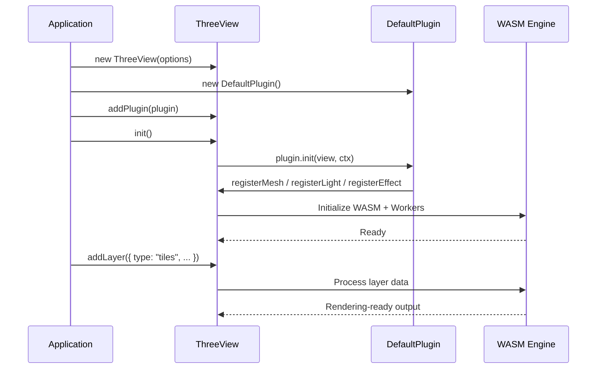
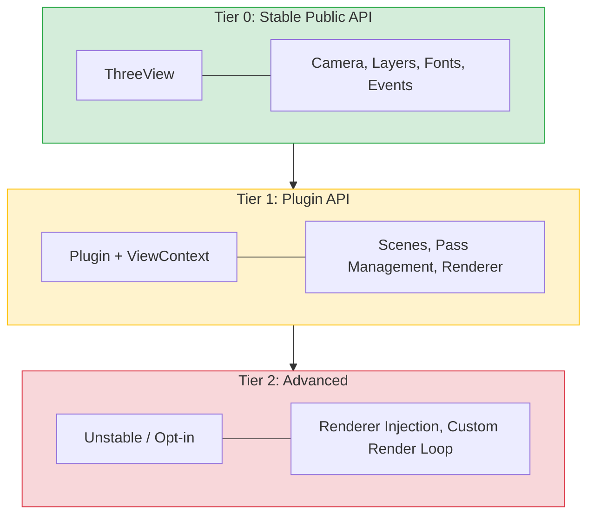

## プラグインベースアーキテクチャ

Navara はプラグインシステムを使用してレイヤータイプを登録します。`init()` を呼び出す前に、`ThreeView` インスタンスにプラグインを追加します。各プラグインは、提供するメッシュ、ライト、エフェクトのレイヤータイプを登録します。初期化後、登録されたタイプのレイヤーを追加できます。

[`DefaultPlugin`](../../../three_default_plugin/about/)（`@navara/three_default_plugin` から提供）は、ビルトインのメッシュ、ライト、エフェクトレイヤーを登録します。ほとんどのアプリケーションでは、`DefaultPlugin` を追加するだけで始められます。

独自のメッシュレイヤー、エフェクトレイヤー、ライトレイヤーを Three.js シーングラフへのフルアクセスを持って作成することもできます。これは Navara のビルトインレイヤーを支えるのと同じ仕組みです。詳細は [Custom Layer](../../../three/Core/custom-layer/) ドキュメントを参照してください。

これらに加えて、Navara は GeoJSON、MVT、3D Tiles などの地理データを読み込み・表示するための[リソースレイヤー](../../../three/Resource%20Layer/about/)を提供しています。リソースレイヤーは地物とその属性の複雑さ — パース、空間インデックス、[`FeatureEvaluator`](../../../three/API/feature-evaluator/) による属性ベースのスタイリング — を扱います。一方、メッシュレイヤーはジオメトリとレンダリングのみを扱うため、描画パフォーマンスに特化した最適化が可能で、大量のオブジェクトを効率的にレンダリングするのに適しています。この分離により、ユースケースに応じて適切なツールを選択できます。レイヤータイプの詳細は [About Layer](../../../three/Introduction/about-layer/) を参照してください。

## 階層型 API

Navara は API を異なる安定性保証を持つ階層に整理しています。一般ユーザーにはシンプルで安定したインターフェースを、プラグイン開発者には必要に応じてより深い機能へのアクセスを提供します。

**Tier 0: ThreeView** はすべてのユーザーの主要なエントリーポイントです。カメラ位置設定、レイヤー管理、プラグイン登録、ライフサイクル制御のための高レベルメソッドを提供します。この API 面は意図的にコンパクトかつ安定に保たれており、破壊的変更にはメジャーバージョンの更新が必要です。詳細は [ThreeView API リファレンス](../../../three/API/threeview-class/)を参照してください。

**Tier 1: Plugin + ViewContext** はプラグインおよびレイヤー開発者が利用できます。プラグインが初期化されると、シーン、パス管理、レンダラー参照などのレンダリング内部への制御されたアクセスを提供する `ViewContext` を受け取ります。このレベルはより多くの機能を提供しますが、マイナーバージョン間で破壊的変更が発生する可能性があります。詳細は [Plugin](../../../three/Core/plugin/) および [Custom Layer](../../../three/Core/custom-layer/) ドキュメントを参照してください。

**Tier 2: Advanced** は、外部レンダラーの注入やレンダーループの置き換えなど、より深い統合が必要な将来のユースケースのために計画されています。これらの API は明示的に不安定としてマークされます。

ほとんどのアプリケーションでは、Tier 0 — `ThreeView` クラスとのみやり取りすることになります。

## ライブラリ一覧

Navara は複数の npm パッケージに分かれています。一見複雑に見えるかもしれませんが、この分離はヘッドレス設計に直接由来します。GIS エンジンはいかなるレンダラーからも独立しており、レンダリングバックエンドは別のレイヤーであり、レイヤー実装はコアから分離されているため、必要なものだけを選択できます。

実際には、ほとんどのアプリケーションで必要なのは 2 つのパッケージだけです。コアエンジンの `@navara/three` と、ビルトインレイヤーの `@navara/three_default_plugin` です。

| Package | Role | When you need it |
|---------|------|-----------------|
| `@navara/three` | メインパッケージ — `ThreeView` クラス、レイヤー API、カメラ制御 | 常に必要 |
| `@navara/three_default_plugin` | `DefaultPlugin` — ビルトインのメッシュ、ライト、エフェクトレイヤー | ほぼ常に必要 |
| `@navara/three_default_layers` | 個別のレイヤークラス実装 | `DefaultPlugin` を使わず手動でレイヤーを登録する場合 |
| `@navara/three_api` | スタンドアロン GIS ユーティリティ（座標変換、測地線計算） | フルマップエンジンなしで GIS 計算が必要な場合 |

## ドキュメントの見方

このドキュメントは、システムの異なる部分に対応する複数のセクションで構成されています。

[**three** セクション](../../../three/Introduction/what-is-navara-three/)は `@navara/three` に関するすべてをカバーします — `ThreeView` API、カメラ制御、レイヤーの概念、ステップバイステップのチュートリアル。Navara でアプリケーションを構築する場合、最も多くの時間を費やすセクションです。

[**three_default_layers** セクション](../../../three_default_layers/about/)は、`@navara/three_default_layers` が提供するすべてのメッシュ、エフェクト、ライトレイヤータイプのリファレンスです。各レイヤータイプには、設定オプションと使用例を記載した専用ページがあります。

[**three_default_plugin** セクション](../../../three_default_plugin/about/)は、`DefaultPlugin` API のドキュメントで、一般的なセットアップのための便利なメソッドも含みます。

**guides** セクション（現在のセクション）には、このイントロダクション、コミュニティリソース、コントリビューター向けドキュメントが含まれています。

## 次のステップ

Navara を実際に動かしてみましょう。[Getting Started](../getting-started/) に進んで、動くコード例とともに最初のプロジェクトをセットアップしてください。
