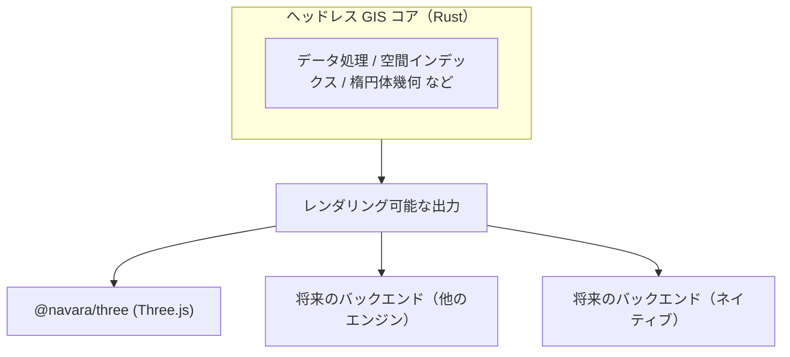

## Navara とは？

Navara はヘッドレス 3D マップエンジンです。GIS コアは Rust で書かれ WebAssembly にコンパイルされており、特定のレンダリング技術から意図的に分離されています。現在、Navara は Three.js ベースのレンダリングバックエンド（`@navara/three`）を提供していますが、将来的には他のレンダリングエンジンやネイティブプラットフォームもサポートできるよう設計されています。

## 主な特徴

Navara は GeoJSON、Mapbox Vector Tiles（MVT）、Cesium 3D Tiles、ラスタータイル、地形データなど、幅広い地理空間データフォーマットをサポートしています。これらのデータソースを 3D 地図上のレイヤーとして表示・スタイリングでき、[`FeatureEvaluator`](../../../three/api/feature-evaluator/) によるフィーチャー単位のスタイリングも可能です。

Three.js レンダリングバックエンドは、大気散乱、シャドウマッピング、ボリュメトリッククラウド、ポストプロセッシングエフェクトなど、フォトリアルな描画機能を備えています。これらはすべてプラグインシステムを通じて合成可能なエフェクトとして利用できます。

Rust/WASM GIS エンジンはレンダラーとは独立してすべての地理空間計算を処理し、CPU 負荷の高いタスクは Web Worker に分散されるため、大規模データセットでもレスポンシブなパフォーマンスを維持します。

## 他のマップエンジンとの比較

各 Web マップエンジンにはそれぞれの設計思想と強みがあります。これらを理解することで、Navara の立ち位置とそのトレードオフが明確になります。

**CesiumJS** は最も成熟した 3D 地理空間エンジンであり、3D Tiles 仕様の策定者でもあります。大規模 3D データの可視化において豊富な実績を持ちます。幅広い低レベル API を提供しており、開発者は多様な機能を比較的自由に実装できます。一方で、その API 面の広さゆえに学習コストが高く、カスタム機能を効果的に構築するにはエンジンの深い知識が求められます。

**MapLibre GL JS** は洗練された高レベル API を提供し、宣言的にマップスタイルを簡単にカスタマイズできます。活発なオープンソースコミュニティと成熟したエコシステムにより、2D ベクタータイルアプリケーションには優れた選択肢です。ただし、ビルトイン API の範囲を超えた機能拡張については、カスタマイズの選択肢はより限定的です。

**deck.gl** は MapLibre GL JS（または MapboxGL）に豊富な可視化レイヤーと明快な合成レイヤーモデルを追加します。この組み合わせは強力ですが、両方のライブラリとその統合パターンを学ぶ必要があります。

**Navara** はこれらのアプローチの強みを、階層化された単一の API のもとに統合することを目指しています。一般ユーザー向けには、レイヤーの追加や [`FeatureEvaluator`](../../../three/api/feature-evaluator/) によるフィーチャーのスタイリングを行える高レベルな宣言的 API を提供しています。プラグインによりワークフローをさらに簡素化することもできます。例えば、JSON からレイヤー定義を読み込んだり、MapLibre Style Plugin（開発中）を使用して馴染みのある JSON 形式でフィーチャースタイルを定義したりできます。カスタム機能を構築したい上級ユーザー向けには、プラグインシステム、カスタムメッシュ、カスタムエフェクトを通じて低レベル API へのアクセスを提供しています。これらは Navara 自身のビルトインオブジェクトを支えるのと同じ基盤です。さらに、マップエンジン本体とは独立して使用できる、座標変換や測地線計算のためのスタンドアロン GIS API も提供しています。

## 次のステップ

Navara がどのような構造になっているか、なぜ複数のパッケージがあるのかを理解するには、[How Navara Works](../how-navara-works/) に進んでください。
