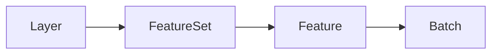

## レイヤーとは

navara_three では、3D シーンに表示される要素を「レイヤー」として管理します。地図データの描画、3D オブジェクトの配置、ポストプロセッシングエフェクト、照明など、すべてレイヤーとして追加・制御できます。

## レイヤーの種類

navara_three には 4 種類のレイヤーがあります：

| レイヤー種別           | 説明                                           | `type` の指定                                         |
| ---------------------- | ---------------------------------------------- | ----------------------------------------------------- |
| **リソースレイヤー**   | 外部データソースから地理データを読み込んで表示 | データフォーマット名（`"geojson"`, `"terrain"` など） |
| **メッシュレイヤー**   | 3D メッシュオブジェクトをシーンに追加          | `"mesh"`                                              |
| **エフェクトレイヤー** | ポストプロセッシングエフェクトを適用           | `"effect"`                                            |
| **ライトレイヤー**     | シーンの照明を管理                             | `"light"`                                             |

## リソースレイヤーのデータ構造

リソースレイヤーは、地理データを以下の階層構造で管理します：



- **Layer** — `addLayer()` で追加されるトップレベルのコンテナ。各レイヤーは一意の `LayerId` を持ちます。
- **FeatureSet** — レイヤー内の描画単位。フィーチャーイベント（`featureCreated`、`featureUpdated` など）はフィーチャーセットごとに発行され、それぞれ `FeatureSetId` を持ちます。1 つのフィーチャーセットは複数の LOD レベルにまたがる場合があります。
- **Feature** — プロパティを持つ概念的な単位。データソースが GIS データの場合、フィーチャーは個々の地理的エンティティ（建物、道路セグメントなど）に対応します。LOD レベルをまたいで特定のフィーチャーを識別するには、プロパティ内の値（`id` フィールドなど）を使用してください。
- **Batch** — 最下位の単位で、実際のジオメトリで構成されます。各バッチは `batchId` を持ちます。

:::tip
[`FeatureEvaluator`](../../api/feature-evaluator/) を使用する際、コールバックは `batchId`、`properties`、`layerId` を含む `FeatureInfo` オブジェクトを受け取ります。フィーチャーセット内の個々のフィーチャーを識別するには `properties` を使用してください。
:::

フィーチャーイベント（`featureCreated`、`featureUpdated` など）の詳細は [Layer Types](../../api/layer-types/#events) を参照してください。

## リソースレイヤーとその他のレイヤーの違い

リソースレイヤーは外部の地理データを扱うため、メッシュ・エフェクト・ライトレイヤーとは扱いが異なります。

### リソースレイヤー

リソースレイヤーは、GeoJSON、3D Tiles、地形データなどの外部データソースを読み込んで表示するレイヤーです。

**特徴:**

- `type` にはデータフォーマット名を指定（`"geojson"`, `"terrain"`, `"cesium3dtiles"`, `"tiles"`, `"mvt"` など）
- `data` プロパティでデータソースの URL やインラインデータを指定
- データフォーマットに応じて複数の Material を指定可能
- 指定できる Material はデータフォーマットによって異なる

```typescript
// GeoJSON レイヤーの例
const geoJsonLayer = view.addLayer({
  type: "geojson",
  data: { url: "https://example.com/data.geojson" },
  // GeoJSON では point, polyline, polygon など複数の Material を指定可能
  point: { color: 0xff0000, size: 10 },
  polyline: { color: 0x00ff00, width: 2 },
  polygon: { color: 0x0000ff, opacity: 0.5 },
});

// 地形レイヤーの例
const terrainLayer = view.addLayer({
  type: "terrain",
  data: { url: "https://example.com/terrain/{z}/{x}/{y}.png" },
  // 地形レイヤーでは rasterTerrain Material のみ指定可能
  rasterTerrain: { exaggeration: 1.5 },
});
```

### メッシュ・エフェクト・ライトレイヤー

メッシュレイヤー、エフェクトレイヤー、ライトレイヤーは、クライアントサイドで Three.js オブジェクトを直接作成するレイヤーです。

**特徴:**

- `addMesh()`, `addEffect()`, `addLight()` の専用メソッドで追加
- 1 つのレイヤーにつき 1 つの Material（設定オブジェクト）を持つ
- Material のキー名でレイヤーの種類が決まる
- **使用前にレイヤークラスの登録が必要**（`registerMesh`, `registerEffect`, `registerLight`）

```typescript
import { BoxMeshLayer, FXAAEffectLayer, SunLightLayer } from "@navara/three_default_layers";

// レイヤークラスを登録（addMesh/addEffect/addLight の前に必要）
view.registerMesh("box", BoxMeshLayer);
view.registerEffect("fxaa", FXAAEffectLayer);
view.registerLight("sun", SunLightLayer);

// メッシュレイヤーの例（BoxMeshLayer）
const boxLayer = view.addMesh<BoxMeshLayer>({
  box: {
    // box キーで BoxMeshLayer として認識される
    width: 100,
    height: 100,
  },
});

// エフェクトレイヤーの例（FXAAEffectLayer）
const fxaaLayer = view.addEffect<FXAAEffectLayer>({
  fxaa: {
    // fxaa キーで FXAAEffectLayer として認識される
  },
});

// ライトレイヤーの例（SunLightLayer）
const sunLayer = view.addLight<SunLightLayer>({
  sun: {
    // sun キーで SunLightLayer として認識される
    intensity: 1.0,
    castShadow: true,
  },
});
```

:::tip
[three_default_plugin](../../../three_default_plugin/about/) の `DefaultPlugin` を使用すると、すべてのデフォルトレイヤーを一括で登録できます。
:::

## 返却されるハンドルクラスの違い

`view.addLayer()` / `view.addMesh()` / `view.addEffect()` / `view.addLight()` から返されるハンドルクラスは、レイヤーの種類によって異なります：

| レイヤー種別                         | 返却されるクラス | 主な機能                                                                 |
| ------------------------------------ | ---------------- | ------------------------------------------------------------------------ |
| リソースレイヤー                     | `Layer`          | `update()`, `delete()`, `forceUpdate()`, 地物イベント                    |
| メッシュ・エフェクト・ライトレイヤー | `LayerHandle<T>` | `update()`, `delete()`, `visible`, `ref`（基底インスタンスへのアクセス） |

### Layer（リソースレイヤー用）

```typescript
const geoJsonLayer = view.addLayer({
  type: "geojson",
  data: { url: "https://example.com/data.geojson" },
});

// 設定を完全に上書きして更新
geoJsonLayer.update({
  type: "geojson",
  data: { url: "https://example.com/data.geojson" },
  point: { color: 0x00ff00 },
});

// 地物イベントを購読
geoJsonLayer.on("featureCreated", (evaluator) => {
  console.log("地物が作成されました");
});

// レイヤーを削除
geoJsonLayer.delete();
```

### LayerHandle（メッシュ・エフェクト・ライトレイヤー用）

```typescript
// BoxMeshLayer が登録済みであること
const boxLayer = view.addMesh<BoxMeshLayer>({
  box: { width: 100, height: 100, depth: 100 },
});

// 部分的な更新（指定したプロパティのみ変更）
boxLayer.update({ width: 200 });

// 表示/非表示の切り替え
boxLayer.visible = false;

// 基底の Three.js オブジェクトにアクセス
const boxMesh = boxLayer.ref;

// レイヤーを削除
boxLayer.delete();
```

詳細な API リファレンスは [Layer Types](../../../three/api-reference/layer-types/) を参照してください。

## まとめ

| 観点           | リソースレイヤー               | メッシュ・エフェクト・ライトレイヤー                        |
| -------------- | ------------------------------ | ----------------------------------------------------------- |
| 用途           | 外部データの読み込み・表示     | 3D オブジェクト・エフェクト・照明                           |
| `type` の指定  | データフォーマット名           | `"mesh"`, `"effect"`, `"light"`                             |
| 事前登録       | 不要                           | 必要（`registerMesh` / `registerEffect` / `registerLight`） |
| Material 数    | データに応じて複数可           | 1 レイヤー 1 Material                                       |
| ハンドルクラス | `Layer`                        | `LayerHandle<T>`                                            |
| 更新方法       | 完全な設定オブジェクトで上書き | 部分的な更新が可能                                          |

## 関連リソース

- [Resource Layer](../../../three/resource-layer/about/) - リソースレイヤーの詳細
- [three_default_layers](../../../three_default_layers/about/) - デフォルトレイヤーの詳細
