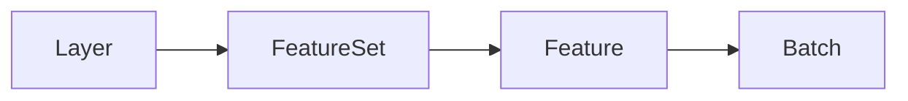

## レイヤーとは

navara_three では、3D シーンに表示される要素を「レイヤー」や「Descriptor」として管理します。地図データの描画には**レイヤー**を使用します。レイヤーは [Source](../../../three/source/about/)（データの取得元）を参照し、それをどのように描画するかを記述します。一方、3D オブジェクトの配置、ポストプロセッシングエフェクト、照明は Descriptor として追加・制御します。

## Descriptor の種類

navara_three には 4 種類の Descriptor があります：

| Descriptor の種類 | 説明                                                          | メソッド                                                          |
| ----------------- | ------------------------------------------------------------- | ----------------------------------------------------------------- |
| **Layer**         | [Source](../../../three/source/about/) の地理データを描画     | レイヤータイプ（`"vector"`, `"raster"`, `"terrain"`, `"3d-tiles"`）と `source` を指定して `addLayer()` |
| **Mesh Desc**     | 3D メッシュオブジェクトをシーンに追加                         | `addMesh()`                                                       |
| **Effect Desc**   | ポストプロセッシングエフェクトを適用                         | `addEffect()`                                                     |
| **Light Desc**    | シーンの照明を管理                                           | `addLight()`                                                      |

## レイヤーのデータ構造

レイヤーは、地理データを以下の階層構造で管理します：


```mermaid
graph LR
  Layer --> FeatureSet
  FeatureSet --> Feature
  Feature --> Batch
```

- **Layer** — `addLayer()` で追加されるトップレベルのコンテナ。各レイヤーは一意の `LayerId` を持ちます。
- **FeatureSet** — レイヤー内の描画単位。フィーチャーイベント（`featureCreated`、`featureUpdated` など）はフィーチャーセットごとに発行され、それぞれ `FeatureSetId` を持ちます。1 つのフィーチャーセットは複数の LOD レベルにまたがる場合があります。
- **Feature** — プロパティを持つ概念的な単位。データソースが GIS データの場合、フィーチャーは個々の地理的エンティティ（建物、道路セグメントなど）に対応します。LOD レベルをまたいで特定のフィーチャーを識別するには、プロパティ内の値（`id` フィールドなど）を使用してください。
- **Batch** — 最下位の単位で、実際のジオメトリで構成されます。各バッチは `batchId` を持ちます。

:::tip
[`FeatureEvaluator`](../../api/feature-evaluator/) を使用する際、コールバックは `batchId`、`properties`、`layerId` を含む `FeatureInfo` オブジェクトを受け取ります。フィーチャーセット内の個々のフィーチャーを識別するには `properties` を使用してください。
:::

フィーチャーイベント（`featureCreated`、`featureUpdated` など）の詳細は [Layer Types](../../api/desc-types/#events) を参照してください。

## Source とレイヤー

レイヤー自身はデータを取得しません。レイヤーは **Source** を参照します。Source はデータが*どこ*にあり、どのように取得・デコードされるか（URL、ズーム範囲、タイリングスキーム、標高デコーダー）を記述し、レイヤーは*どのように*描画するか（Material）を記述します。1 つの Source は複数のレイヤーで共有できます。

```typescript
// 1. Register a source (the data)
const imagery = view.addSource({
  type: "raster-tile",
  url: "https://example.com/{z}/{x}/{y}.png",
  maxZoom: 19,
});

// 2. Add a layer that renders it (the styling)
view.addLayer({ type: "raster", source: imagery, raster: { opacity: 0.8 } });
```

Source の種類については [About Source](../../../three/source/about/) を、レイヤーの種類と描画オプションについては [About Layer (types)](../../../three/layer/about/) を参照してください。

## レイヤーと他の Descriptor の違い

レイヤーは外部の地理データを描画するため、メッシュ・エフェクト・ライトの Descriptor とは扱いが異なります。

### Layer

レイヤーは、GeoJSON、ベクタタイル、ラスタ画像、地形、3D Tiles などの Source を描画します。

**特徴:**

- `type` にはレイヤータイプを指定（`"vector"`, `"raster"`, `"terrain"`, `"3d-tiles"`）
- `source` プロパティでデータを参照（`Source` ハンドルまたはその `id`）
- レイヤータイプに応じて複数の Material を指定可能
- 指定できる Material はレイヤータイプによって異なる

```typescript
// Vector layer example (a geojson / vector-tile source)
const features = view.addSource({
  type: "geojson",
  data: { type: "FeatureCollection", features: [] },
});
const vectorHandle = view.addLayer({
  type: "vector",
  source: features,
  // A vector layer can take several materials at once
  point: { color: 0xff0000, size: 10 },
  polyline: { color: 0x00ff00, width: 2 },
  polygon: { color: 0x0000ff, opacity: 0.5 },
});

// Terrain layer example (a raster-dem / quantized-mesh source)
const dem = view.addSource({
  type: "raster-dem",
  url: "https://example.com/dem/{z}/{x}/{y}.png",
  maxZoom: 15,
});
const terrainHandle = view.addLayer({
  type: "terrain",
  source: dem,
  terrain: { castShadow: true, receiveShadow: true },
});
```

### Mesh・Effect・Light Desc

メッシュ Descriptor、エフェクト Descriptor、ライト Descriptor は、クライアントサイドで Three.js オブジェクトを直接作成します。

**特徴:**

- 種類ごとの専用メソッドを使用：`addMesh()`, `addEffect()`, `addLight()`
- 1 つの Descriptor につき 1 つの Material（設定オブジェクト）を持つ
- Material のキー名で Descriptor の種類が決まる
- **使用前に Descriptor クラスの登録が必要**（`registerMesh`, `registerEffect`, `registerLight`）

```typescript
import { BoxMeshDesc, FXAAEffectDesc, SunLightDesc } from "@navara/three_default_descs";

// Register descriptor classes (required before addMesh/addEffect/addLight)
view.registerMesh("box", BoxMeshDesc);
view.registerEffect("fxaa", FXAAEffectDesc);
view.registerLight("sun", SunLightDesc);

// Mesh descriptor example (BoxMeshDesc)
const boxHandle = view.addMesh<BoxMeshDesc>({
  box: {
    // Recognized as BoxMeshDesc by the box key
    width: 100,
    height: 100,
  },
});

// Effect descriptor example (FXAAEffectDesc)
const fxaaHandle = view.addEffect<FXAAEffectDesc>({
  fxaa: {
    // Recognized as FXAAEffectDesc by the fxaa key
  },
});

// Light descriptor example (SunLightDesc)
const sunHandle = view.addLight<SunLightDesc>({
  sun: {
    // Recognized as SunLightDesc by the sun key
    intensity: 1.0,
    castShadow: true,
  },
});
```

:::tip
[three_default_plugin](../../../three_default_plugin/about/) の `DefaultPlugin` を使用すると、すべてのデフォルト Descriptor を一括で登録できます。
:::

## 返却されるハンドルクラスの違い

`view.addLayer()` / `view.addMesh()` / `view.addEffect()` / `view.addLight()` から返されるハンドルクラスは、Descriptor の種類によって異なります：

| Descriptor の種類            | 返却されるクラス | 主な機能                                                                 |
| ---------------------------- | ---------------- | ------------------------------------------------------------------------ |
| Layer                        | `Layer`          | `update()`, `delete()`, `forceUpdate()`, フィーチャーイベント            |
| Mesh・Effect・Light Desc     | `BaseHandle<T>`  | `update()`, `delete()`, `visible`, `ref`（基底インスタンスへのアクセス） |

### Layer

```typescript
const source = view.addSource({
  type: "geojson",
  url: "https://example.com/data.geojson",
});
const layerHandle = view.addLayer({ type: "vector", source });

// Update by fully overwriting the configuration
layerHandle.update({ type: "vector", source, point: { color: 0x00ff00 } });

// Subscribe to feature events
layerHandle.on("featureCreated", (evaluator) => {
  console.log("A feature was created");
});

// Delete the layer
layerHandle.delete();
```

### BaseHandle（Mesh・Effect・Light Desc 用）

```typescript
// BoxMeshDesc must be registered
const boxHandle = view.addMesh<BoxMeshDesc>({
  box: { width: 100, height: 100, depth: 100 },
});

// Partial update (only the specified properties are changed)
boxHandle.update({ box: { width: 200 } });

// Toggle visibility
boxHandle.visible = false;

// Access the underlying Three.js object
const boxMesh = boxHandle.ref;

// Delete the object
boxHandle.delete();
```

詳細な API リファレンスは [Descriptor Types](../../../three/api/desc-types/) を参照してください。

## まとめ

| 観点           | Layer                                    | Mesh・Effect・Light Desc                                    |
| -------------- | ---------------------------------------- | ----------------------------------------------------------- |
| 用途           | Source のデータを描画                     | 3D オブジェクト・エフェクト・照明                           |
| メソッド       | レイヤータイプ + `source` で `addLayer()` | `addMesh()`, `addEffect()`, `addLight()`                    |
| 事前登録       | 不要                                     | 必要（`registerMesh` / `registerEffect` / `registerLight`） |
| Material 数    | レイヤータイプに応じて複数可             | 1 Descriptor 1 Material                                     |
| ハンドルクラス | `Layer`                                  | `BaseHandle<T>`                                             |
| 更新方法       | 完全な設定オブジェクトで上書き           | 部分的な更新が可能                                          |

## 関連リソース

- [About Source](../../../three/source/about/) - レイヤーのデータの取得元
- [About Layer (types)](../../../three/layer/about/) - レイヤーの種類と描画オプション
- [Materials](../../../three/material/about/) - スタイル設定（Material）のリファレンス
- [three_default_descs](../../../three_default_descs/about/) - デフォルト Descriptor の詳細
