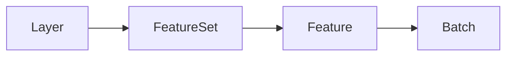

## What is a Layer?

In navara_three, elements displayed in the 3D scene are managed as "layers" and "Descriptors." Map data rendering uses resource layers, while 3D object placement, post-processing effects, and lighting are added and controlled as Descriptors.

## Descriptor Types

navara_three has 4 types of Descriptors:

| Descriptor Type           | Description                                            | Method                                                   |
| -------------------- | ------------------------------------------------------ | -------------------------------------------------------- |
| **Resource Layer**   | Loads and displays geographic data from external data sources | `addLayer()` with data format name (`"geojson"`, `"terrain"`, etc.) |
| **Mesh Desc**       | Adds 3D mesh objects to the scene                      | `addMesh()`                                              |
| **Effect Desc**     | Applies post-processing effects                        | `addEffect()`                                            |
| **Light Desc**      | Manages scene lighting                                 | `addLight()`                                             |

## Resource Layer Data Structure

Resource layers organize geographic data in a hierarchical structure:



- **Layer** — The top-level container added via `addLayer()`. Each layer has a unique `LayerId`.
- **FeatureSet** — A rendering unit within a layer. Feature events (`featureCreated`, `featureUpdated`, etc.) are emitted per feature set, and each carries a `FeatureSetId`. A single feature set may span multiple LOD levels.
- **Feature** — A conceptual unit that has properties. If the data source is GIS data, a feature corresponds to an individual geographic entity (e.g. a building, a road segment). To identify a specific feature across LOD levels, use a property value (such as an `id` field) from the feature's properties.
- **Batch** — The lowest-level unit, consisting of actual geometries. Each batch has a `batchId`.

:::tip
When working with [`FeatureEvaluator`](../../api/feature-evaluator/), the callback receives a `FeatureInfo` object containing `batchId`, `properties`, and `layerId`. Use `properties` to identify individual features within a feature set.
:::

For details on feature events (`featureCreated`, `featureUpdated`, etc.), see [Layer Types](../../api/desc-types/#events).

## Differences Between Resource Layers and Other Descriptors

Resource layers handle external geographic data, so they differ from mesh, effect, and light descriptors in how they are used.

### Resource Layer

Resource layers load and display external data sources such as GeoJSON, 3D Tiles, and terrain data.

**Characteristics:**

- Specify the data format name for `type` (`"geojson"`, `"terrain"`, `"cesium3dtiles"`, `"tiles"`, `"mvt"`, etc.)
- Specify the data source URL or inline data with the `data` property
- Multiple Materials can be specified depending on the data format
- Available Materials vary by data format

```typescript
// GeoJSON layer example
const geoJsonHandle = view.addLayer({
  type: "geojson",
  data: { url: "https://example.com/data.geojson" },
  // For GeoJSON, you can specify multiple Materials such as point, polyline, polygon
  point: { color: 0xff0000, size: 10 },
  polyline: { color: 0x00ff00, width: 2 },
  polygon: { color: 0x0000ff, opacity: 0.5 },
});

// Terrain layer example
const terrainHandle = view.addLayer({
  type: "terrain",
  data: { url: "https://example.com/terrain/{z}/{x}/{y}.png" },
  // For terrain layers, only the rasterTerrain Material can be specified
  rasterTerrain: { exaggeration: 1.5 },
});
```

### Mesh, Effect, and Light Descs

Mesh descriptors, effect descriptors, and light descriptors create Three.js objects directly on the client side.

**Characteristics:**

- Use the dedicated method for each type: `addMesh()`, `addEffect()`, or `addLight()`
- Each descriptor has a single Material (configuration object)
- The Material key name determines the descriptor type
- **Descriptor class registration is required before use** (`registerMesh`, `registerEffect`, `registerLight`)

```typescript
import { BoxMeshDesc, FXAAEffectDesc, SunLightDesc } from "@navara/three_default_descs";

// Register descriptor classes (required before addMesh/addEffect/addLight)
view.registerMesh("box", BoxMeshDesc);
view.registerEffect("fxaa", FXAAEffectDesc);
view.registerLight("sun", SunLightDesc);

// Mesh descriptor example (BoxMeshDesc)
const boxHandle = view.addMesh<BoxMeshDesc>({
  box: {
    // Recognized as BoxMeshDesc by the box key
    width: 100,
    height: 100,
  },
});

// Effect descriptor example (FXAAEffectDesc)
const fxaaHandle = view.addEffect<FXAAEffectDesc>({
  fxaa: {
    // Recognized as FXAAEffectDesc by the fxaa key
  },
});

// Light descriptor example (SunLightDesc)
const sunHandle = view.addLight<SunLightDesc>({
  sun: {
    // Recognized as SunLightDesc by the sun key
    intensity: 1.0,
    castShadow: true,
  },
});
```

:::tip
Using `DefaultPlugin` from [three_default_plugin](../../../three_default_plugin/about/), you can register all default descriptors at once.
:::

## Differences in Returned Handle Classes

The handle class returned from `view.addLayer()` / `view.addMesh()` / `view.addEffect()` / `view.addLight()` differs depending on the descriptor type:

| Descriptor Type                       | Returned Class   | Main Features                                                                    |
| -------------------------------- | ---------------- | -------------------------------------------------------------------------------- |
| Resource Layer                   | `Layer`          | `update()`, `delete()`, `forceUpdate()`, feature events                          |
| Mesh / Effect / Light Desc      | `BaseHandle<T>` | `update()`, `delete()`, `visible`, `ref` (access to the base instance)           |

### Layer (for Resource Layers)

```typescript
const geoJsonHandle = view.addLayer({
  type: "geojson",
  data: { url: "https://example.com/data.geojson" },
});

// Update by fully overwriting the configuration
geoJsonHandle.update({
  type: "geojson",
  data: { url: "https://example.com/data.geojson" },
  point: { color: 0x00ff00 },
});

// Subscribe to feature events
geoJsonHandle.on("featureCreated", (evaluator) => {
  console.log("A feature was created");
});

// Delete the layer
geoJsonHandle.delete();
```

### BaseHandle (for Mesh / Effect / Light Descs)

```typescript
// BoxMeshDesc must be registered
const boxHandle = view.addMesh<BoxMeshDesc>({
  box: { width: 100, height: 100, depth: 100 },
});

// Partial update (only the specified properties are changed)
boxHandle.update({ width: 200 });

// Toggle visibility
boxHandle.visible = false;

// Access the underlying Three.js object
const boxMesh = boxHandle.ref;

// Delete the object
boxHandle.delete();
```

For detailed API reference, see [Descriptor Types](../../../three/api-reference/desc-types/).

## Summary

| Aspect              | Resource Layer                     | Mesh / Effect / Light Desc                                 |
| ------------------- | ---------------------------------- | ----------------------------------------------------------- |
| Purpose             | Loading and displaying external data | 3D objects, effects, lighting                              |
| Method               | `addLayer()` with data format name | `addMesh()`, `addEffect()`, `addLight()`                   |
| Pre-registration    | Not required                       | Required (`registerMesh` / `registerEffect` / `registerLight`) |
| Number of Materials | Multiple depending on the data     | 1 Material per Descriptor                                   |
| Handle Class        | `Layer`                            | `BaseHandle<T>`                                            |
| Update Method       | Overwrite with a complete configuration object | Partial updates are possible                       |

## Related Resources

- [Resource Layer](../../../three/resource-layer/about/) - Resource layer details
- [three_default_descs](../../../three_default_descs/about/) - Default Descriptor details
