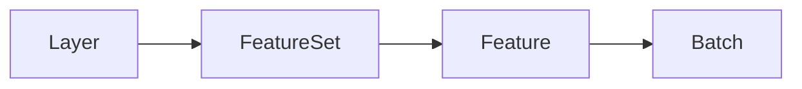

## What is a Layer?

In navara_three, elements displayed in the 3D scene are managed as "layers" and "Descriptors." Map data rendering uses **layers** — a layer references a [Source](../../../three/source/about/) (where the data comes from) and describes how it is rendered — while 3D object placement, post-processing effects, and lighting are added and controlled as Descriptors.

## Descriptor Types

navara_three has 4 types of Descriptors:

| Descriptor Type   | Description                                                    | Method                                                            |
| ----------------- | ------------------------------------------------------------- | ----------------------------------------------------------------- |
| **Layer**         | Renders geographic data from a [Source](../../../three/source/about/) | `addLayer()` with a layer type (`"vector"`, `"raster"`, `"terrain"`, `"3d-tiles"`) + a `source` |
| **Mesh Desc**     | Adds 3D mesh objects to the scene                             | `addMesh()`                                                       |
| **Effect Desc**   | Applies post-processing effects                               | `addEffect()`                                                     |
| **Light Desc**    | Manages scene lighting                                        | `addLight()`                                                      |

## Layer Data Structure

Layers organize geographic data in a hierarchical structure:


```mermaid
graph LR
  Layer --> FeatureSet
  FeatureSet --> Feature
  Feature --> Batch
```

- **Layer** — The top-level container added via `addLayer()`. Each layer has a unique `LayerId`.
- **FeatureSet** — A rendering unit within a layer. Feature events (`featureCreated`, `featureUpdated`, etc.) are emitted per feature set, and each carries a `FeatureSetId`. A single feature set may span multiple LOD levels.
- **Feature** — A conceptual unit that has properties. If the data source is GIS data, a feature corresponds to an individual geographic entity (e.g. a building, a road segment). To identify a specific feature across LOD levels, use a property value (such as an `id` field) from the feature's properties.
- **Batch** — The lowest-level unit, consisting of actual geometries. Each batch has a `batchId`.

:::tip
When working with [`FeatureEvaluator`](../../api/feature-evaluator/), the callback receives a `FeatureInfo` object containing `batchId`, `properties`, and `layerId`. Use `properties` to identify individual features within a feature set.
:::

For details on feature events (`featureCreated`, `featureUpdated`, etc.), see [Layer Types](../../api/desc-types/#events).

## Sources and Layers

A layer does not fetch data itself — it references a **Source**. The source describes *where* the data is and how it is fetched/decoded (URL, zoom range, tiling scheme, elevation decoder); the layer describes *how* it renders (materials). One source can be shared by several layers.

```typescript
// 1. Register a source (the data)
const imagery = view.addSource({
  type: "raster-tile",
  url: "https://example.com/{z}/{x}/{y}.png",
  maxZoom: 19,
});

// 2. Add a layer that renders it (the styling)
view.addLayer({ type: "raster", source: imagery, raster: { opacity: 0.8 } });
```

See [About Source](../../../three/source/about/) for source types and [About Layer (types)](../../../three/layer/about/) for the layer types and their render options.

## Differences Between Layers and Other Descriptors

Layers render external geographic data, so they differ from mesh, effect, and light descriptors in how they are used.

### Layer

Layers render a source such as GeoJSON, vector tiles, raster imagery, terrain, or 3D Tiles.

**Characteristics:**

- Specify the layer type for `type` (`"vector"`, `"raster"`, `"terrain"`, `"3d-tiles"`)
- Reference the data with the `source` property (a `Source` handle or its `id`)
- Multiple Materials can be specified depending on the layer type
- Available Materials vary by layer type

```typescript
// Vector layer example (a geojson / vector-tile source)
const features = view.addSource({
  type: "geojson",
  data: { type: "FeatureCollection", features: [] },
});
const vectorHandle = view.addLayer({
  type: "vector",
  source: features,
  // A vector layer can take several materials at once
  point: { color: 0xff0000, size: 10 },
  polyline: { color: 0x00ff00, width: 2 },
  polygon: { color: 0x0000ff, opacity: 0.5 },
});

// Terrain layer example (a raster-dem / quantized-mesh source)
const dem = view.addSource({
  type: "raster-dem",
  url: "https://example.com/dem/{z}/{x}/{y}.png",
  maxZoom: 15,
});
const terrainHandle = view.addLayer({
  type: "terrain",
  source: dem,
  terrain: { castShadow: true, receiveShadow: true },
});
```

### Mesh, Effect, and Light Descs

Mesh descriptors, effect descriptors, and light descriptors create Three.js objects directly on the client side.

**Characteristics:**

- Use the dedicated method for each type: `addMesh()`, `addEffect()`, or `addLight()`
- Each descriptor has a single Material (configuration object)
- The Material key name determines the descriptor type
- **Descriptor class registration is required before use** (`registerMesh`, `registerEffect`, `registerLight`)

```typescript
import { BoxMeshDesc, FXAAEffectDesc, SunLightDesc } from "@navara/three_default_descs";

// Register descriptor classes (required before addMesh/addEffect/addLight)
view.registerMesh("box", BoxMeshDesc);
view.registerEffect("fxaa", FXAAEffectDesc);
view.registerLight("sun", SunLightDesc);

// Mesh descriptor example (BoxMeshDesc)
const boxHandle = view.addMesh<BoxMeshDesc>({
  box: {
    // Recognized as BoxMeshDesc by the box key
    width: 100,
    height: 100,
  },
});

// Effect descriptor example (FXAAEffectDesc)
const fxaaHandle = view.addEffect<FXAAEffectDesc>({
  fxaa: {
    // Recognized as FXAAEffectDesc by the fxaa key
  },
});

// Light descriptor example (SunLightDesc)
const sunHandle = view.addLight<SunLightDesc>({
  sun: {
    // Recognized as SunLightDesc by the sun key
    intensity: 1.0,
    castShadow: true,
  },
});
```

:::tip
Using `DefaultPlugin` from [three_default_plugin](../../../three_default_plugin/about/), you can register all default descriptors at once.
:::

## Differences in Returned Handle Classes

The handle class returned from `view.addLayer()` / `view.addMesh()` / `view.addEffect()` / `view.addLight()` differs depending on the descriptor type:

| Descriptor Type            | Returned Class  | Main Features                                                          |
| -------------------------- | --------------- | --------------------------------------------------------------------- |
| Layer                      | `Layer`         | `update()`, `delete()`, `forceUpdate()`, feature events               |
| Mesh / Effect / Light Desc | `BaseHandle<T>` | `update()`, `delete()`, `visible`, `ref` (access to the base instance) |

### Layer

```typescript
const source = view.addSource({
  type: "geojson",
  url: "https://example.com/data.geojson",
});
const layerHandle = view.addLayer({ type: "vector", source });

// Update by fully overwriting the configuration
layerHandle.update({ type: "vector", source, point: { color: 0x00ff00 } });

// Subscribe to feature events
layerHandle.on("featureCreated", (evaluator) => {
  console.log("A feature was created");
});

// Delete the layer
layerHandle.delete();
```

### BaseHandle (for Mesh / Effect / Light Descs)

```typescript
// BoxMeshDesc must be registered
const boxHandle = view.addMesh<BoxMeshDesc>({
  box: { width: 100, height: 100, depth: 100 },
});

// Partial update (only the specified properties are changed)
boxHandle.update({ width: 200 });

// Toggle visibility
boxHandle.visible = false;

// Access the underlying Three.js object
const boxMesh = boxHandle.ref;

// Delete the object
boxHandle.delete();
```

For detailed API reference, see [Descriptor Types](../../../three/api/desc-types/).

## Summary

| Aspect              | Layer                                          | Mesh / Effect / Light Desc                                     |
| ------------------- | ---------------------------------------------- | -------------------------------------------------------------- |
| Purpose             | Rendering data from a source                   | 3D objects, effects, lighting                                  |
| Method              | `addLayer()` with a layer type + `source`      | `addMesh()`, `addEffect()`, `addLight()`                       |
| Pre-registration    | Not required                                   | Required (`registerMesh` / `registerEffect` / `registerLight`) |
| Number of Materials | Multiple depending on the layer type           | 1 Material per Descriptor                                      |
| Handle Class        | `Layer`                                         | `BaseHandle<T>`                                               |
| Update Method       | Overwrite with a complete configuration object | Partial updates are possible                                   |

## Related Resources

- [About Source](../../../three/source/about/) - where layer data comes from
- [About Layer (types)](../../../three/layer/about/) - layer types and render options
- [Materials](../../../three/material/about/) - styling (materials) reference
- [three_default_descs](../../../three_default_descs/about/) - Default Descriptor details
