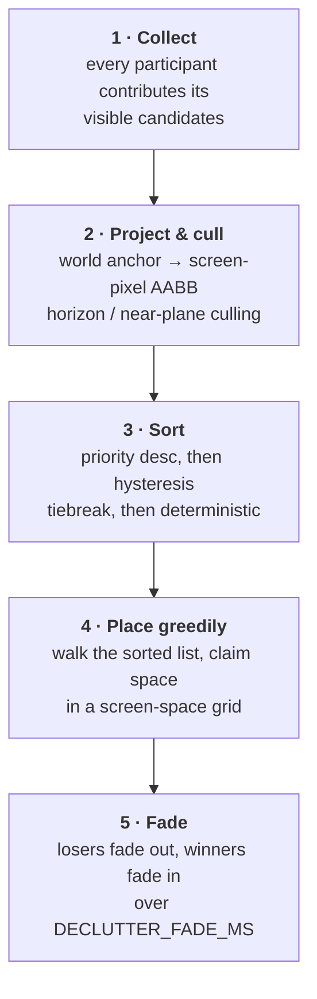
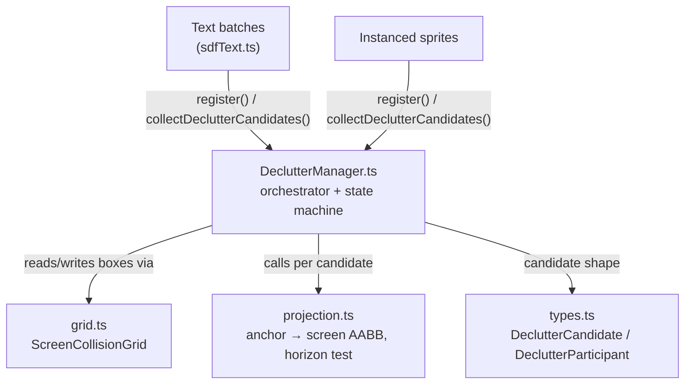
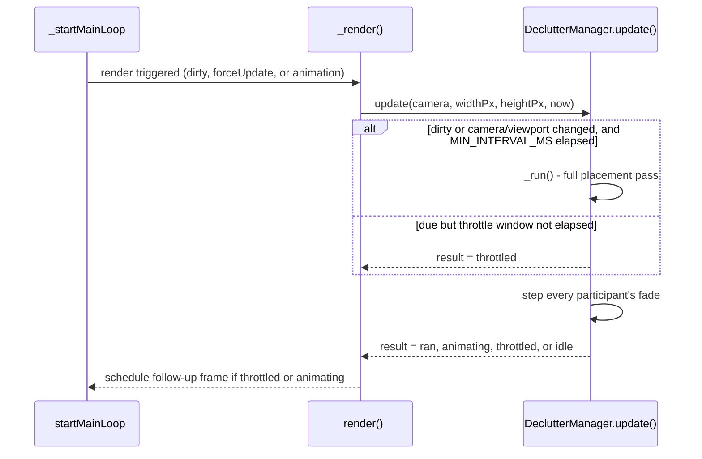

# Label Decluttering

How `@navaramap/three` decides which text labels and icon sprites get to stay
visible when they overlap on screen, and how it avoids the classic failure
mode of naive collision systems: labels flickering on and off as the camera
moves. For the broader rendering pipeline this slots into, see
[ARCHITECTURE.md](ARCHITECTURE.md).

## Overview

Map labels are placed in **world space** (an ECEF anchor point), but collision
is a **screen-space** problem: two features far apart on the ground can sit
right next to each other on screen once projected through the camera. A
building's name and a POI icon's name might both want the same patch of
pixels. Something has to decide, every frame, which labels actually get drawn
and which get hidden.

That "something" is the `DeclutterManager` — one shared instance per
`ThreeView` (`web/navara_three/src/index.ts:447`). It is **entirely
TypeScript**: there is no Rust-side collision algorithm. Rust only carries two
config fields per label material — `declutter: bool` and
`declutter_priority: f32` (`crates/navara_material/src/appearance.rs`) — through
to the WASM bindings. Everything else — projecting labels to screen space,
detecting overlaps, and deciding a winner — runs client-side, once per frame,
right before rendering.

Naively, you could sort labels by priority and hide whichever ones overlap a
higher-priority label already placed. That works for a single frame, but as
soon as the camera moves by a pixel, two near-tied labels can swap places
every frame — a visible flicker. The `DeclutterManager` adds **hysteresis** on
top of the basic algorithm specifically to prevent this. This document covers
both: the base placement algorithm, and the hysteresis mechanism layered onto
it.

## The pipeline

Each placement pass takes every currently-visible, declutter-enabled label as
a **candidate**, and ends with each one marked shown or hidden:



1. **Collect** — every registered participant (a text batch or a sprite mesh)
   appends its candidates. → [Candidates and participants](#1-candidates-and-participants)
2. **Project & cull** — each candidate's world anchor becomes a screen-pixel
   box; labels behind the camera or beyond the horizon are excluded.
   → [Projecting to screen space](#2-projecting-to-screen-space)
3. **Sort** — by priority, then by a hysteresis-aware tiebreak, then
   deterministically. → [Sorting: priority and hysteresis](#3-sorting-priority-and-hysteresis)
4. **Place** — walk the sorted list, greedily claiming space in a uniform
   screen-space grid. → [Placing greedily: the collision grid](#4-placing-greedily-the-collision-grid)
5. **Fade** — the placement result becomes a fade *target*; visibility itself
   animates smoothly toward it. → [Fading, not popping](#5-fading-not-popping)

The whole pass is throttled and only reruns when something actually changed —
see [Running in the frame loop](#running-in-the-frame-loop).

Source lives entirely under `web/navara_three/src/declutter/`:



## 1. Candidates and participants

A `DeclutterCandidate` (`declutter/types.ts:10-37`) is one label or sprite
competing for space in a single pass:

```ts
export type DeclutterCandidate = {
  anchorX: number; anchorY: number; anchorZ: number; // ECEF meters, f64
  addHeight: number;               // surface-normal height offset (meters)
  minX: number; maxX: number; minY: number; maxY: number; // local box, px or meters
  sizeInMeters: boolean;
  priority: number;    // higher wins an overlap
  isShown: boolean;    // currently visible — feeds hysteresis
  owner: DeclutterParticipant;
  handle: number;      // mesh index (text) or instance index (sprites)
};
```

Any mesh type that wants to participate — batched SDF text, instanced sprites
— implements `DeclutterParticipant` (`types.ts:43-61`): three methods the
manager calls every pass:

| Method | Called | Purpose |
| --- | --- | --- |
| `collectDeclutterCandidates(out)` | once, at pass start | append this mesh's visible, declutter-enabled labels |
| `applyDeclutter(handle, hidden)` | once per candidate, every pass | set the fade *target* for this label |
| `stepDeclutterFade(deltaMs)` | every `update()` call | advance actual visibility toward the target; returns `true` while still fading |

This keeps the manager itself geometry-agnostic — it never touches a
`BufferGeometry` or a Three.js `Mesh` directly, only these three hooks.

## 2. Projecting to screen space

`projection.ts` computes each candidate's screen-pixel bounding box **on the
CPU**, deliberately mirroring the vertex shaders (`sdfText.vert.glsl` /
`instancedSprite.vert.glsl`) so the collision box matches what actually gets
drawn:

1. **Height offset** — `addHeight` is applied along the anchor's own
   direction from the ellipsoid center (a cheap stand-in for the true surface
   normal), matching `mvr_getMvHeightOffset` on the GPU side.
2. **View + projection transform** — the anchor is transformed by the camera's
   view and projection matrices by hand (not through Three.js's `Vector3`
   helpers), because this runs every frame for every candidate and needs to
   stay allocation-free.
3. **Near-plane clip** — `vz >= -near` (view space looks down -Z) means the
   anchor is behind the camera; `projectCandidateInto` returns `false` and the
   candidate is excluded rather than placed with garbage coordinates.
4. **Pixel sizing** — when the material uses `sizeInMeters`, the local box is
   scaled by pixels-per-meter at the anchor's view depth
   (`nvr_pxToWorld`, mirrored exactly — including its `|viewZ|` approximation
   of distance, not true range — so the CPU box doesn't drift from the
   rendered quad toward the screen edges).

Separately, `isBeyondHorizon` (`projection.ts:35-51`) mirrors
`horizon_culling_pars_vertex.glsl`: a cheap ellipsoid test for whether the
anchor is geometrically hidden behind the Earth from the camera's viewpoint.
This matters because **a label the GPU will cull must not claim screen
space** — otherwise a label on the far side of the planet could sit at the
same projected pixel as a real, visible label and evict it.

Both checks feed a `_placeable` flag per candidate (`DeclutterManager.ts:174-186`).
Non-placeable candidates skip the grid entirely and are simply marked
not-hidden, so they show immediately the moment they become visible again —
they never get stuck hidden by a stale placement decision.

## 3. Sorting: priority and hysteresis

Before placement, candidates are sorted (`DeclutterManager.ts:197-206`) by:

1. **`priority` descending** — the layer's `declutterPriority` (or a
   per-feature override). Higher always wins an overlap.
2. **`isShown` — currently-shown labels sort first** on an exact priority tie.
   This is the first half of hysteresis: an "incumbent" label keeps its claim
   over a brand-new competitor at equal priority, instead of losing a coin
   flip every frame.
3. **Anchor position** (`anchorX`, then `anchorY`, then `anchorZ`) — a
   deterministic, **camera-independent** tiebreak for genuinely fresh ties.
   Without this, ties would resolve by array order, which reshuffles as tiles
   load asynchronously — an easy way to make labels flicker for a completely
   different reason than the one hysteresis targets.
4. **Candidate index** — a final fallback, never actually reached in practice
   since anchors are distinct.

## 4. Placing greedily: the collision grid

Placement itself is the simplest part: walk the sorted list and greedily
claim space, exactly like MapLibre's symbol placement. What makes it fast is
`ScreenCollisionGrid` (`declutter/grid.ts`) — a **uniform grid over screen
space**, not an R-tree or quadtree:

```
Screen (CSS px), divided into 64px cells, plus a 128px margin ring:

 ┌╌╌╌╌╌╌╌╌╌╌╌╌╌╌╌╌╌╌╌╌╌╌╌╌╌╌╌╌╌╌╌╌╌╌╌╌╌╌╌╌╌╌╌-┐  ← margin (128px)
 ╎ ┌───┬───┬───┬───┬───┬───┬───┬───┬───┬───┐  ╎
 ╎ │   │███│███│   │   │   │   │   │   │   │  ╎ ███ = cells a 
 ╎ ├───┼───┼───┼───┼───┼───┼───┼───┼───┼───┤  ╎ label's box   
 ╎ │   │███│███│   │▓▓▓│▓▓▓│   │   │   │   │  ╎ overlaps and  
 ╎ ├───┼───┼───┼───┼───┼───┼───┼───┼───┼───┤  ╎ registers into
 ╎ │   │   │   │   │▓▓▓│▓▓▓│   │   │   │   │  ╎               
 ╎ └───┴───┴───┴───┴───┴───┴───┴───┴───┴───┘  ╎ each 64px cell
 ╎                     viewport               ╎
 └╌╌╌╌╌╌╌╌╌╌╌╌╌╌╌╌╌╌╌╌╌╌╌╌╌╌╌╌╌╌╌╌╌╌╌╌╌╌╌╌╌╌╌╌┘
```

- Each cell holds a list of indices into a flat `_boxes` array (4 numbers per
  box: `minX, minY, maxX, maxY`).
- `insertIfFree(minX, minY, maxX, maxY, testShrinkPx)` (`grid.ts:68-127`) is
  the one operation the manager needs: test the box against every box already
  registered in the cells it spans; if nothing overlaps, register it into
  those same cells and return `true` (claimed); otherwise return `false`
  (collision, don't claim) and leave the grid untouched.
- Boxes are tested with **strict inequalities**, so two boxes that exactly
  touch edges do not count as colliding.
- A box entirely outside `viewport ± margin` is reported free **without
  touching the grid** — nothing it could occlude is on screen anyway, so
  skipping the cell math is a pure win.
- The **128px margin** exists so labels just outside the visible viewport
  still compete for space. Without it, panning would let an off-screen label
  "win" the instant it crosses into view, immediately popping out its
  on-screen neighbor — a second, unrelated source of flicker that the margin
  heads off before hysteresis even comes into play.

Each candidate's box is padded by `PADDING_PX = 2` on every side before the
test (`DeclutterManager.ts:225-230`), so two placed labels never end up
sitting pixel-adjacent.

## Hysteresis: why labels don't flicker

This is the mechanism the recent `feat: hysteresis` work added, and the part
worth understanding in the most depth. The problem it solves:

> Two labels have equal (or very close) priority and their boxes just barely
> overlap. As the camera drifts by a sub-pixel amount frame to frame, the
> overlap toggles in and out of existence — and with a naive "first past the
> post" placement, the *winner* toggles with it. The result is visible
> flicker, exactly at the boundary where it's most noticeable.

Hysteresis fixes this with two cooperating rules, both centered on
`isShown` — "is this label's fade target currently visible":

**Rule 1 — incumbents win ties.** Covered above in
[sorting](#3-sorting-priority-and-hysteresis): at equal priority, a
currently-shown label sorts ahead of a not-yet-shown one, so it gets first
claim on the grid.

**Rule 2 — a shown label's collision test shrinks.** This is the subtler
half, and it's what actually damps flicker rather than just biasing a
one-time tiebreak. `DeclutterManager.HYSTERESIS_PX = 6`
(`DeclutterManager.ts:55`) is passed as `insertIfFree`'s `testShrinkPx` — but
**only** for candidates where `c.isShown` is true (`DeclutterManager.ts:230`):

```ts
const free = grid.insertIfFree(
  this._boxes[o] - pad, this._boxes[o + 1] - pad,
  this._boxes[o + 2] + pad, this._boxes[o + 3] + pad,
  c.isShown ? DeclutterManager.HYSTERESIS_PX : 0,
);
```

Inside `insertIfFree` (`grid.ts:85-96`), that shrink applies **only to the box
used for the overlap test** — the box actually registered into the grid (what
future candidates collide against) is still the full, unshrunk box:

```
              full box (claimed into grid, still blocks others)
        ┌─────────────────────────────┐
        │   ┌─────────────────────┐   │ ← shrunk test box (6px/side)
        │   │                     │   │   only used for THIS label's
        │   │      "Springfield"  │   │   own overlap check
        │   │                     │   │
        │   └─────────────────────┘   │
        └─────────────────────────────┘
```

So a label that's already shown tolerates a competitor grazing up to 6px into
its padded box without losing its spot — the marginal overlap that camera
drift causes literally cannot flip its own test result. But that same label's
*full* box is still claimed against everyone else, so it doesn't start
stealing extra space from its neighbors. A label that is currently **hidden**
gets `testShrinkPx = 0` — it must clear its entire padded box before it's
allowed to appear, which is the strict, "prove you deserve it" side of the
asymmetry.

Put together: **sticky when shown, strict when hidden.** That asymmetry is
the whole mechanism — no timers, no frame counters, no separately-tracked
"cooldown" state. It falls directly out of one boolean (`isShown`) read twice:
once in the sort comparator, once as the shrink toggle.

## 5. Fading, not popping

A placement decision is applied as a fade **target**, not an instant
visibility flip: `applyDeclutter(handle, hidden)` sets the target, and
`stepDeclutterFade(deltaMs)` advances the actual hide-factor toward it by
`deltaMs / DECLUTTER_FADE_MS` (300ms, `types.ts:40`) every call. This runs
through a channel separate from user-driven `show` — a `uDeclutterHide`
shader uniform for text, an `instanceDeclutterHide` attribute for sprites —
so a label a user explicitly hid via `evaluate()` and one temporarily hidden
by decluttering are independent and don't fight each other.

Fades are stepped on **every** `update()` call, whether or not a placement
pass ran that frame — placement only ever sets *where the fade is heading*;
the animation itself is a separate, continuous process.

## Running in the frame loop

`DeclutterManager.update(camera, widthPx, heightPx, nowMs)` runs from
`ThreeView._render()`, **before** the render passes, so a placement change
lands in the same frame it was decided in
(`web/navara_three/src/index.ts:1786-1801`):



Two guards keep this cheap on an otherwise-idle camera:

- **Change detection** (`_snapshotChanged`, `DeclutterManager.ts:238-250`) —
  a pass only reruns when the label set changed (`markDirty()` was called —
  new/removed labels, text changes) **or** the camera's `matrixWorld` /
  `projectionMatrix` / viewport size differ from a cached snapshot. A
  perfectly still camera with an unchanged label set does no placement work
  at all.
- **Throttling** — even when something changed, a full pass runs at most
  once per `MIN_INTERVAL_MS = 150`. Fast camera movement (drag, zoom) would
  otherwise trigger a full re-placement every single frame.

Both a throttled pass and an active fade need a **guaranteed future frame** —
but the render loop only renders when something requests it
(`_startMainLoop`, `index.ts:2456-2459`):

```ts
const updated = this._update(time);
if (updated || this._renderFlag.forceUpdate || this._renderFlag.animation)
  this._render(time);
this._renderFlag.forceUpdate = false;   // cleared immediately, every tick
```

Setting `forceUpdate` synchronously from inside `_render()` is a no-op — it
gets cleared on the very next line after `_render()` returns, before another
tick can observe it. So `_scheduleDeclutterFrame(delayMs)`
(`index.ts:1762-1772`) instead arms a `setTimeout` that sets the flag *later*,
landing between ticks:

- A `"throttled"` result schedules a retry after `MIN_INTERVAL_MS` — enough
  time for the throttle window to clear.
- An `"animating"` result schedules a retry after `16ms` — roughly one frame,
  to keep the fade animating smoothly.
- A pending timer is only replaced by a **shorter** one
  (`if (delayMs >= this._declutterRetryDelay) return;`) — a fade's tight 16ms
  cadence must never be starved by a 150ms throttle retry that got scheduled
  first.

## Public API

Three material types carry the two config fields consumed by this pass —
`text`, `point`, and `billboard` — generated via wasm-bindgen from
`PointMaterial` / `BillboardMaterial` / `TextMaterial`
(`crates/navara_wasm_types/src/appearance.rs`):

| Field | Type | Default | Meaning |
| --- | --- | --- | --- |
| `declutter` | `boolean` | `false` | opt this label/sprite into the shared placement pass |
| `declutterPriority` | `number` | `0` | layer-level priority; higher wins an overlap |

```ts
const layer = view.addLayer({
  type: "mvt",
  data: { url: someVectorTileUrl },
  text: { /* font, color, size, ... */ declutter: true, declutterPriority: 1 },
  vectorTile: { maxZoom: 16, layers: ["symbol", "label"] },
});
```

`declutterPriority` can be overridden **per feature** through
`FeatureEvaluator.evaluate()` — e.g. ranking city labels above village labels,
or using a POI's confidence score directly as its priority:

```ts
layer.on("featureUpdated", ({ evaluator }) => {
  evaluator.evaluate(({ properties }) => ({
    text: properties?.["name"] as string,
    declutterPriority: TIER_PRIORITY[properties?.["tier"] as number] ?? 0,
  }));
});
```

A few things worth knowing before enabling it:

- **Decluttering only hides at render time** — it never reduces the number of
  features fetched, evaluated, or uploaded to the GPU. It's a screen-space
  visibility decision, not a data-volume optimization.
  (`example/pages/pmtiles-overture/run.ts:172`)
- **An icon and its own name label should not both opt in** if they share an
  anchor: the declutter pass has no notion that two candidates "belong"
  together, so it can't guarantee they stay paired. Typically only the text
  label sets `declutter: true`; the icon renders unconditionally.
  (`example/pages/pmtiles-overture/run.ts:561-563`)

Working examples: `example/pages/styling/mvt-text` (basic per-feature-code
priority), `example/pages/instanced-sprites` (sprite decluttering), and
`example/pages/pmtiles-overture` (tiered name-label priority + POI
confidence-driven priority, at real-world label density).

## Key files

| File | Role |
| --- | --- |
| `web/navara_three/src/declutter/DeclutterManager.ts` | Orchestrator — collect, sort, place, fade, throttling/dirty state |
| `web/navara_three/src/declutter/grid.ts` | `ScreenCollisionGrid` — uniform grid spatial index, `insertIfFree` |
| `web/navara_three/src/declutter/projection.ts` | Anchor → screen-pixel AABB, horizon/near-plane culling (CPU mirror of the vertex shaders) |
| `web/navara_three/src/declutter/types.ts` | `DeclutterCandidate`, `DeclutterParticipant`, `DECLUTTER_FADE_MS` |
| `web/navara_three/src/index.ts` | Registers the shared `DeclutterManager`, drives `update()` from `_render()`, `_scheduleDeclutterFrame` / `forceUpdate` scheduling |
| `crates/navara_material/src/appearance.rs` | `declutter` / `declutter_priority` fields on `PointMaterial` / `BillboardMaterial` / `TextMaterial` |
| `crates/navara_wasm_types/src/appearance.rs` | wasm-bindgen mirrors exposed to TypeScript |
