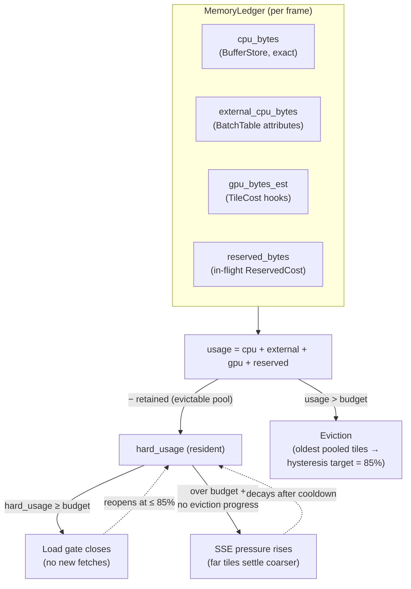

# Memory Management

How Navara keeps the WASM heap and GPU memory bounded while streaming an
unbounded world: a byte-accurate memory ledger, LRU-style tile retention with
budget-driven eviction, dispatch-time reservations for in-flight fetches, a
load gate, and a memory-pressure LOD degrade as the last resort. This document
covers the mechanism end to end — the `navara_memory` crate, its integration
into every tile pipeline, and the TypeScript-side configuration. For the
traversals the degrade plugs into, see
[TILE_TERRAIN_TRAVERSAL.md](TILE_TERRAIN_TRAVERSAL.md); for the surrounding
architecture see [ARCHITECTURE.md](ARCHITECTURE.md).

## Overview

A browser tab gets no swap and no mercy: once the WASM heap plus the GPU
allocations of a map session outgrow what the device tolerates, performance
collapses and (especially on iOS) the tab is killed. Before this mechanism, a
tile that left the view was destroyed immediately and refetched on pan-back,
while nothing bounded the *visible* working set at all — a tilted view over
Tokyo could simply allocate until the tab died.

The system replaces this with a **budget** and three escalating layers of
defense:

1. **Retain instead of destroy (LRU cache).** A tile that leaves the view is
   *deactivated* into a per-pipeline retention pool, not destroyed. As long as
   the budget has room, panning back reactivates it with zero refetch.
2. **Evict old to load new.** When usage crosses the budget, eviction destroys
   pooled tiles — least-recently-visited first, farthest first among equals —
   until usage falls to a hysteresis target below the budget. New loads
   *reserve* their estimated cost at dispatch time, so making room happens
   before the bytes land, not after.
3. **Stop loading / degrade LOD.** If eviction cannot get under the budget
   (the pools are empty — the *visible* set alone exceeds the budget), a
   **load gate** closes so no new tile fetch is dispatched, and a
   memory-pressure **SSE multiplier** rises so far tiles settle coarser,
   shrinking the visible set itself — something eviction alone can never do.

Everything is driven by one resource, the `MemoryLedger`
(`navara_memory`), and is **disabled by default**: with `budget_bytes: None`
tiles keep the original destroy-on-unvisited lifecycle. The web side enables it
with a device-derived budget at startup (see
[Configuration](#configuration-typescript-side)).



## The ledger: what is counted

GPU memory cannot be measured from WASM and CPU memory is spread across the
WASM heap and JS-side copies, so the ledger combines one exact count with
per-tile estimates that are corrected by JS-side measurements:

| Field | Source | Accuracy |
| --- | --- | --- |
| `cpu_bytes` | `BufferStore::total_bytes()` — every tile payload, geometry, and DEM buffer in the WASM heap | exact, incrementally maintained (`navara_buffer_store`), verified against a full recount every 256 frames in debug builds |
| `external_cpu_bytes` | CPU bytes the store can't see — chiefly the MVT feature-attribute tables in `BatchTable`, synced each frame by `sync_batch_table_bytes` (`navara_feature`) | exact; for attribute-rich data (e.g. Overture) this term *dominates*, so counting it is what makes the budget bind |
| `gpu_bytes_est` | sum of per-tile `TileCost::gpu_est` components | estimated, JS-corrected (below) |
| `reserved_bytes` | sum of live `ReservedCost` components (in-flight fetches) | estimated (EMA of past landed costs) |

`TileCost { cpu, gpu_est }` is a component with **lifecycle hooks**: inserting
it adds `gpu_est` to the ledger, replacing/removing/despawning subtracts it.
Every destroy path — eviction, layer removal, entity despawn — stays accounted
without manual bookkeeping. `ReservedCost` uses the same hook pattern, so an
aborted request (requester despawned while pending) releases its reservation
automatically.

Two derived views drive different consumers:

- **`usage`** = `cpu + external + gpu_est + reserved` — what **eviction** caps
  at the budget. Reservations are included, so dispatching new fetches
  proactively evicts old pooled tiles to make room ("evict old to load new").
- **`hard_usage`** = `usage − retained_evictable_bytes` — the *resident*
  footprint that cannot be freed without touching visible/protected/in-flight
  tiles. The **load gate** and the **pressure controller** key off this:
  a full-but-healthy LRU cache is reclaimable on demand and must not read as
  memory exhaustion (which would stall all new loads and block terrain from
  ever refining). `retained_evictable_bytes` is summed across every pipeline's
  pool each frame by `sync_retained_bytes` (`navara_ecs/src/memory.rs`).

### GPU estimates and JS-side correction

The Rust side seeds each tile's `gpu_est` from what it can know, and the JS
side (which owns the actual Three.js allocations) reports corrections:

| Tile kind | Rust-side seed | JS correction |
| --- | --- | --- |
| Terrain mesh | mesh buffer byte lengths + one composite-atlas cost (`CostHints::atlas_tile_bytes` — every `TileMesh` acquires an atlas eagerly), attached by `attach_terrain_mesh_cost` | `reportTerrainDrapeGpuBytes` replaces the drape term with the measured render-target footprint (clamp-to-ground vector drapes allocate one target per layer per tile) |
| Raster texture | `CostHints::raster_tile_bytes` (w×h×4 + ~33% mipmaps) per fragment, attached eagerly by `attach_texture_fragment_cost` | — (dimensions are known) |
| Vector (MVT) geometry | geometry buffer bytes at mesh transfer | — |
| 3D Tiles content | compressed payload bytes | `reportModelGpuBytes` replaces the estimate with the decoded size summed over the Three.js object tree — Draco content decodes to many times its payload, so the seed can badly undercount |

One subtlety makes `gpu_est ≈ 1×` the buffer length a valid model
(`GPU_GEOMETRY_RESIDENCY_FACTOR = 1`): the web side installs an `onUpload`
callback on every `BufferAttribute`
(`releaseGeometryArraysAfterUpload`, `web/navara_three`) that drops the
CPU-side `.array` right after the first GPU upload, so no JS-heap clone of the
WASM buffer survives.

Costs that only the JS side knows precisely (atlas dimensions depend on device
options) arrive as `CostHints` via `Core.setMemoryCostHints` at init. The
hints must match the real allocation sizes — if the ledger overestimates, the
map settles far too coarse; if it underestimates, the budget stops binding.

## Tile retention: the LRU cache

Each pipeline keeps a retention pool of deactivated tiles, all storing the
same `RetainedEntry { retained_at, cost }`:

| Pipeline | Pool | Deactivation point |
| --- | --- | --- |
| Terrain | `TileCacheManager::retained` (resource) — `navara_tile/src/tile/` | `clear_caches` |
| Raster | `RasterTileCacheManager::retained` (resource) — `navara_tile/src/raster/` | `clear_raster_caches` |
| Vector (MVT) | `TileCacheManager::retained` (component, one per layer) — `navara_vector_tile` | `clear_caches` |
| 3D Tiles | `Cesium3dTilesRetentionPool::entries` (resource) — `navara_cesium3dtiles/src/cleanup_system.rs` | `remove_invisible_rendered_tiles` |

With the budget disabled these systems destroy unvisited tiles exactly as
before; with it enabled they *deactivate* into the pool instead (the entity and
its buffers stay alive, rendering stops). A pooled tile that is visited again
is simply purged from the pool and reactivated — no refetch, no re-decode.
`eviction::survives_purge` gives this a one-frame grace so a tile that flickers
out of the traversal for a single frame survives an immediate pan-back.

## Eviction

Each pipeline has an `enforce_memory_budget` system, but they share one policy
via the pure helpers in `navara_memory::eviction` (so the four copies cannot
drift):

1. **Trigger** — `MemoryLedger::needs_eviction`: run when `usage > budget`;
   additionally, while the load gate is closed, run anywhere above the reopen
   target. Without that second arm, usage stranded inside the hysteresis band
   would keep the gate closed forever with eviction dormant — no new tile
   could ever load again.
2. **Candidates** — pooled tiles retained at least `MIN_RETAIN_FRAMES` (10)
   frames (`eviction::is_evictable`), so a tile that just left the view
   survives an immediate pan-back.
3. **Order** — `eviction::order`: oldest `visited_at` first; among equals, the
   farthest tile from the camera first. Raster carries no per-entity distance
   and degrades to a pure LRU sort.
4. **Loop** — destroy candidates one by one, crediting each tile's `gpu_est`
   plus the CPU bytes its destroy synchronously freed from the `BufferStore`
   (`eviction::EvictBudget`), and stop as soon as usage drops to the
   **hysteresis target** `budget × HYSTERESIS_RATIO` (0.85). Evicting to a
   target below the budget — instead of stopping exactly at it — prevents
   evict ↔ refetch thrashing right at the budget line.

## In-flight reservations

Eviction and the gate would still overshoot if they only saw *landed* bytes: a
camera move dispatches dozens of fetches whose decode/upload peaks arrive
seconds later. So every pipeline reserves a tile's estimated cost **at
dispatch time**, in the same `filter_requestable_*` system that admits the
request:

```text
dispatch fetch  →  insert ReservedCost { bytes: estimate }   (counts in usage & hard_usage)
fetch resolves  →  release_landed_reservations removes it    (one frame BEFORE TileCost lands)
fetch aborted   →  requester despawn fires the hook          (reservation released automatically)
```

`release_landed_reservations` (`navara_data_requester`) removes the component
the frame the request leaves `Pending`, before the measured `TileCost` is
attached — so a reservation and its real cost never systematically
double-count.

The estimate comes from `ReserveEstimates`: a per-key exponentially-weighted
mean + variance of the **actual costs of previously landed tiles**, queried as
`mean + 0.5·stddev` and clamped to [64 KB, 16 MB] (one freak 30 MB tile must
not inflate every future reservation; a run of empty ocean tiles must not zero
them). Until a key has 4 samples it returns a caller-provided cold-start seed.
Keys and seeds per pipeline:

| Pipeline | `ReserveKey` | Cold-start seed | Landed cost recorded from |
| --- | --- | --- | --- |
| Vector (MVT) | per source-layer entity | 512 KB | finalized geometry bytes (`navara_vector_tile/src/tile/system.rs`) |
| 3D Tiles | per tileset (layer) entity | 2 MB | constructed content bytes (`construct_system.rs`) |
| Hillshade DEM | single shared pool | `raster_tile_bytes + 1/64` edge-strip overhead | decoded payload + stored edge strips (`hillshade/system.rs`) |
| Terrain (RasterDEM / quantized mesh) | single shared pool | `raster_tile_bytes + atlas_tile_bytes` | full landed mesh cost — geometry + atlas seed — at `attach_terrain_mesh_cost` |
| Raster texture | — (no reservation) | — | — (`attach_texture_fragment_cost` charges the full `raster_tile_bytes` the moment the fragment spawns, pre-accounting the fetch even earlier than a reservation would) |

Per-layer pooling matters because different MVT sources and tilesets have
wildly different tile sizes; the fast EMA (α = 0.08, ≈ last 25 samples) matters
because tile cost varies systematically with zoom band and a camera burst
fetches from a narrow band — a recency-weighted mean tracks the band currently
being fetched.

Terrain's pool has two quirks. It is a *single* pool (`ReserveKey::Terrain`)
because there is exactly one terrain source per session — a per-source split
would buy nothing. And the recorded sample is the full mesh cost (geometry
plus the ~3 MB composite-atlas seed — the dominant term), not the fetch
payload: the reservation stands in for what the tile will eventually cost the
ledger, and quantized-mesh geometry varies with vertex count (terrain
roughness), which is exactly why an adaptive estimate replaced the earlier
fixed raster-tile hint that undercounted the resident cost roughly 10× and
let camera-move terrain bursts slip past the gate.

## The load gate

`SsePressure::load_gate_closed` is the binary "memory is exhausted" signal,
computed from the *resident* footprint with hysteresis:

- **closes** when `hard_usage ≥ budget`,
- **reopens** when `hard_usage ≤ budget × 0.85` (eviction's target),
- holds its previous state in between.

While closed, every pipeline's `filter_requestable_*` system dispatches **zero
new fetches** (terrain DEM, raster, hillshade, vector, 3D Tiles alike).
Traversal-wise the effect is that children never become ready, so traversals
settle on the currently-loaded tiles: the working set is **frozen**, not
coarsened. Already-loaded tiles keep rendering. An over-tight budget therefore
degrades to "stops refining" rather than an endless evict → refetch loop. The
gate-open transition is change-detected so the traversals re-run and resume the
descent that was cut short.

## Memory-pressure SSE degrade

Freezing the working set is not enough when the *visible* set itself exceeds
the budget (nothing left to evict, gate closed, still over). The last layer
shrinks the visible set: `update_sse_pressure` (`navara_memory`) maintains a
pressure multiplier applied to every traversal's `max_sse` threshold — a
higher threshold means tiles tolerate more screen-space error, stay coarser,
and stop subdividing earlier.

The controller:

- **Raise** — over budget with no eviction progress for a full stall window
  (`PRESSURE_STALL_FRAMES` = 15 frames): multiply by 1.25, capped at the
  device ceiling. One step per window gives eviction (and the retain
  protection) a chance to catch up between steps.
- **Decay** — back under the hysteresis target: decay ×0.98 per frame toward
  the device's resting base — but only after a post-raise **cooldown**.
  Decaying immediately would re-refine, refetch the just-evicted children,
  re-blow the budget, and raise again — an endless coarsen/reload
  oscillation. The cooldown starts at ~5 s and **doubles** on every
  decay → re-raise round trip (up to ~60 s), so a scene whose refined working
  set simply does not fit converges to a rare probe instead of a perpetual
  reload loop.
- **Publish** — traversals don't read the ledger (which is written every
  frame); they read `SsePressure`, a quantized copy written only when the
  value changes by more than 0.25. Its change detection is what triggers a
  re-traversal.

### Distance weighting (`SseDegrade`)

The multiplier is not applied uniformly — that would visibly blur what the
user is looking at. Each traversal builds an `SseDegrade` from the published
pressure and applies it per tile as
`effective_max_sse(max_sse, distance_from_camera)`:

- tiles nearer than **2× camera height** keep full resolution,
- tiles beyond **10× camera height** get the full multiplier,
- smoothstep in between (camera height floored at 100 m so the band stays
  sane at street level).

The near band's protection is itself pressure-dependent: it is exempt only
while the multiplier rests at the device's base (`min`), and degrades
progressively as pressure climbs toward the ceiling (`max`) — so even a
top-down view whose entire visible set sits in the near band is eventually
degraded once nothing else can free memory. Call sites:
`navara_tile/src/tile/traverse.rs` (terrain), `raster/traverse.rs`,
`navara_vector_tile/src/tile/traverse.rs`, and
`navara_cesium3dtiles/.../traversal.rs`.

The `min`/`max` range is per-device policy (`Core.setSseMultiplierRange`): a
resting `min > 1` makes far tiles permanently coarser (mobile shrinks its
working set from the start), a larger `max` lets the degrade shed more of the
visible set before the tab is killed.

### LOD fog: the always-on companion

Independent of memory pressure, **LOD fog** (`navara_fog`) relaxes the SSE
threshold with distance every frame:
`sse -= fog(distance, density) × sse_factor` where
`fog(d, ρ) = 1 − exp(−(d·ρ)²)` — zero at the camera, saturating at 1. Terrain
applies it in `TerrainTile::calc_sse` (`navara_tile_component`), 3D Tiles in
its traversal; despite the name it never affects visual fog rendering. Where
the pressure degrade is a *feedback* controller reacting to measured usage,
LOD fog is a *feed-forward* device preset: low-memory devices ship a stronger
curve so the working set stays small before pressure ever builds.

## Configuration (TypeScript side)

The budget is chosen per device at init (`web/navara_three/src/device.ts`) and
applied through `Core` APIs — one derivation (`getDefaultMemoryBudgets`) so
the main-thread tile cache, the tile-worker pool, and the font worker share a
single view of the device's memory:

| Setting | Desktop | Mobile ≥ 4 GB (or iOS, which never reports `deviceMemory`) | Mobile < 4 GB |
| --- | --- | --- | --- |
| Tile-cache budget (`setCacheBytes`) | ¼ of device memory, capped at 2 GB | 512 MB | 256 MB |
| Per-worker WASM heap cap (pool recycles above it) | ¼ of device memory ÷ pool size, clamped to [64, 256] MB | 64 MB (pinned) | 64 MB (pinned) |
| Font-worker budget | 64 MB | 32 MB | 16 MB |
| In-flight fetch cap per pipeline (`setMaxPendingRequests`) | 50 | 16 | 8 |
| SSE multiplier range (`setSseMultiplierRange`) | 1.0 – 16.0 | 4.0 – 32.0 | 8.0 – 64.0 |
| LOD fog (`setLodFog`) | density 2.0e-4, factor 2.0 | 1.0e-2, 6.0 | 1.0e-1, 12.0 |

(The unknown-`deviceMemory` mobile case takes the *conservative* column for
pending requests, SSE range, and fog, but the 512 MB cache tier — modern
iPhones have 4–8 GB, and starving exactly the devices the budget matters most
for would defeat it.)

`Core.setMemoryCostHints` passes the atlas (512² × RGBA × 3 MRT attachments
≈ 3 MB/tile) and raster (256² × RGBA × 1.33 ≈ 349 KB) costs.
`Core.getMemoryStats` exposes the full ledger — buffer bytes/count, GPU
estimate, external CPU bytes, reserved bytes, budget, eviction count, current
SSE multiplier, and per-pipeline retained-tile counts — for the debug overlay
and tests.

## Scheduling

Everything runs in `PostUpdate`, ordered so each frame's decisions see that
frame's bytes:

1. **`MemoryAccountingSet`** — contributors fold external bytes into the
   ledger: `sync_batch_table_bytes` (attribute tables),
   `sync_retained_bytes` (evictable-pool total).
2. **`sync_cpu_bytes` → `update_sse_pressure`** (chained, after the set) —
   mirror the exact `BufferStore` count, then update gate + pressure and
   publish `SsePressure`.
3. **Per-pipeline `clear_*` / `enforce_memory_budget`** — deactivate unvisited
   tiles into the pools; evict down to the target when needed.
4. **`DataRequesterSet::SendRequests`** — `filter_requestable_*` applies the
   load gate and inserts `ReservedCost` on dispatched requesters;
   `release_landed_reservations` drops reservations whose fetch resolved.

## Key constants

All in `navara_memory/src/lib.rs`, each with a doc comment explaining its
derivation:

| Constant | Value | Role |
| --- | --- | --- |
| `HYSTERESIS_RATIO` | 0.85 | eviction target / gate-reopen line, as a fraction of the budget |
| `MIN_RETAIN_FRAMES` | 10 | pooled tiles younger than this are never evicted |
| `PRESSURE_RAISE_STEP` / `PRESSURE_STALL_FRAMES` | 1.25 / 15 | one multiplier step per stall window |
| `PRESSURE_DECAY` | 0.98 | per-frame decay toward the resting base |
| `PRESSURE_DECAY_COOLDOWN_MIN/MAX_FRAMES` | 300 / 3600 | adaptive post-raise decay block (~5 s doubling to ~60 s) |
| `PRESSURE_PUBLISH_DELTA` | 0.25 | quantization step for `SsePressure` (each publish re-traverses) |
| `DEGRADE_NEAR/FAR_HEIGHTS` | 2 / 10 | camera-height multiples bounding the degrade ramp |
| `RESERVE_EMA_ALPHA` / `RESERVE_K_STDDEV` | 0.08 / 0.5 | reservation estimator: recency window and safety margin |
| `RESERVE_MIN/MAX_BYTES` | 64 KB / 16 MB | sample & estimate clamps against degenerate/outlier tiles |
| `GPU_GEOMETRY_RESIDENCY_FACTOR` | 1 | geometry survives only as the GPU copy (JS drops the CPU array after upload) |
