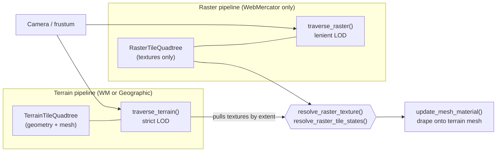
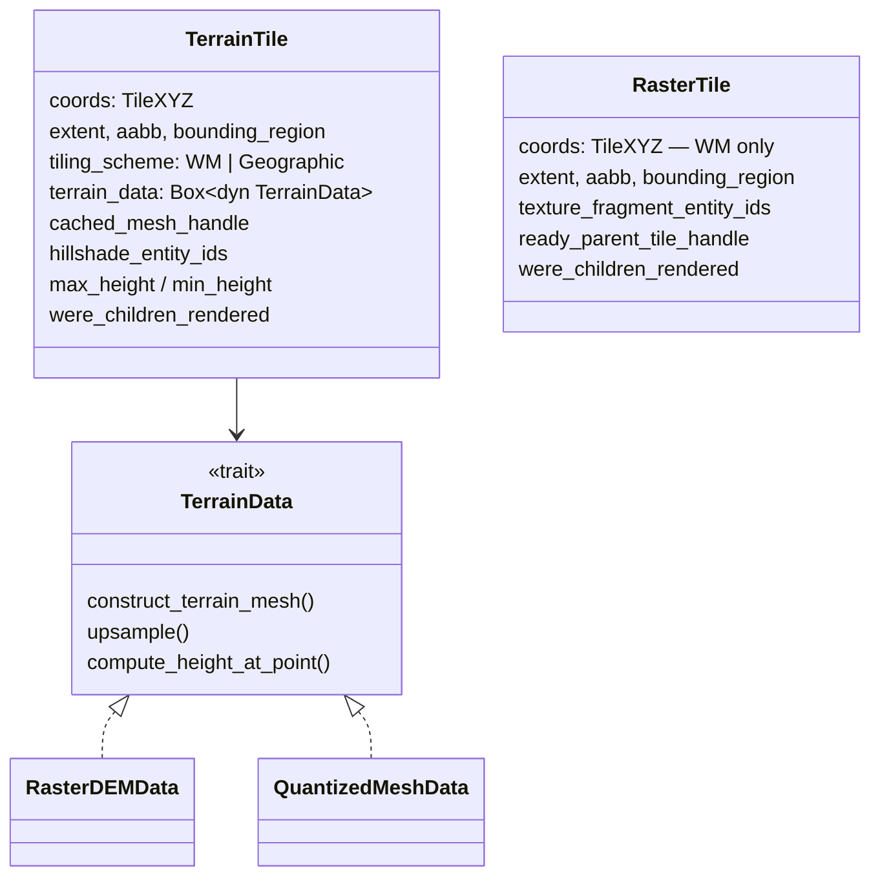
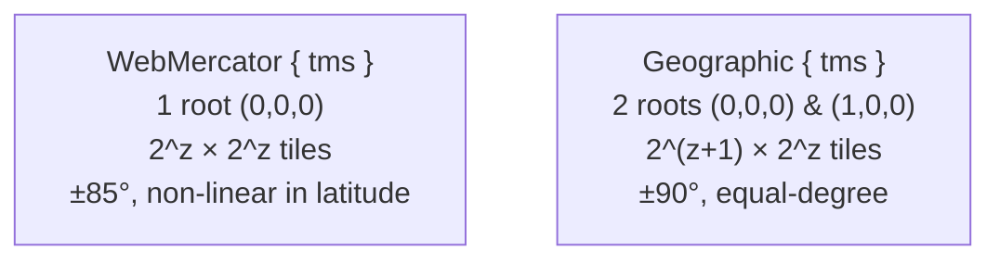
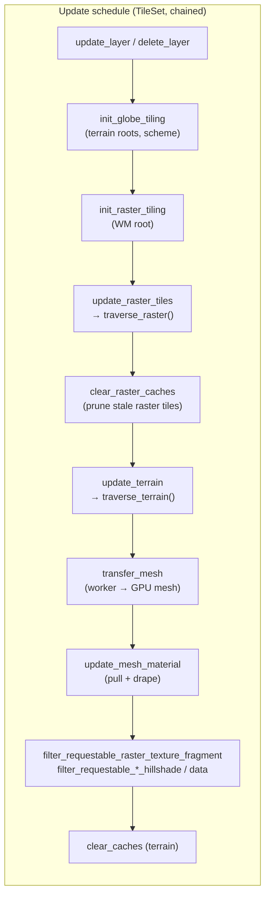
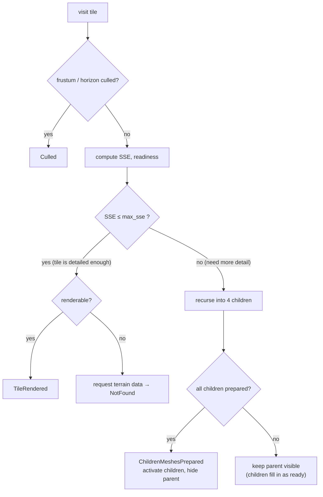
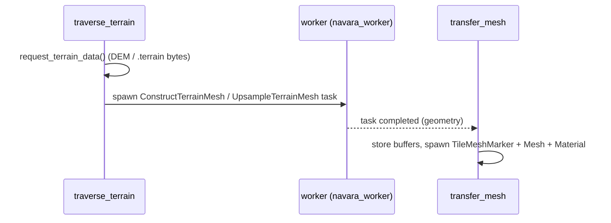
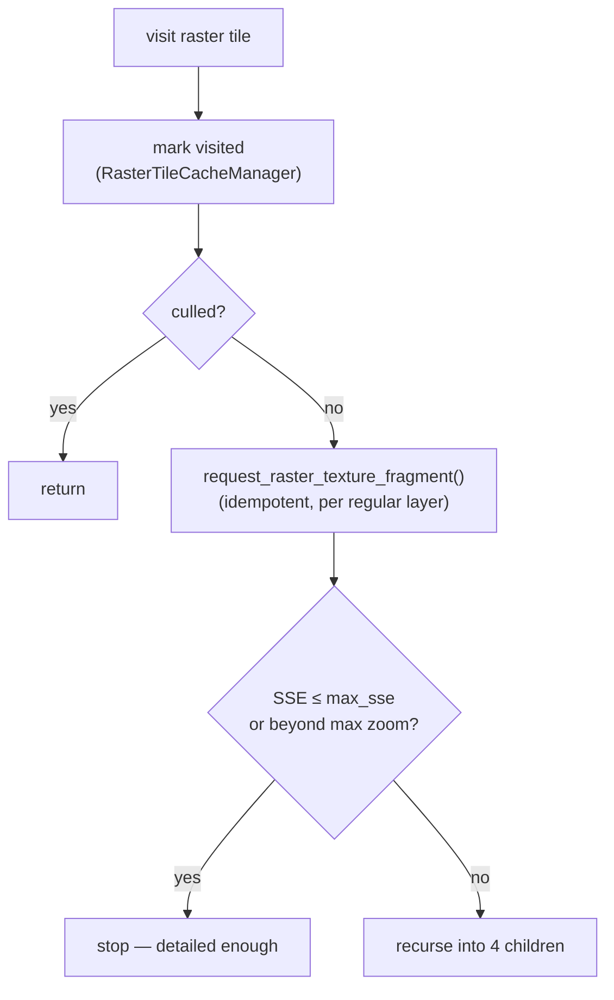
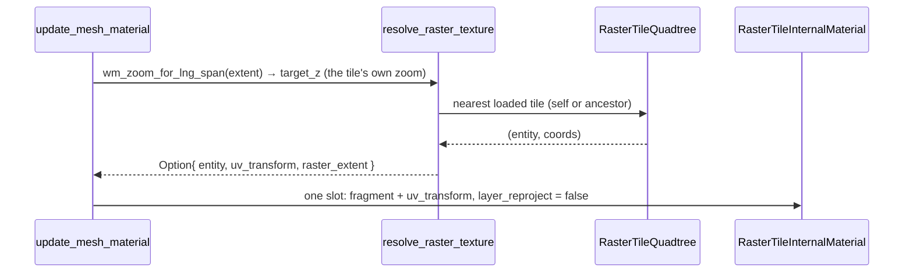
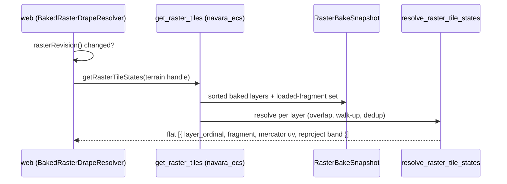
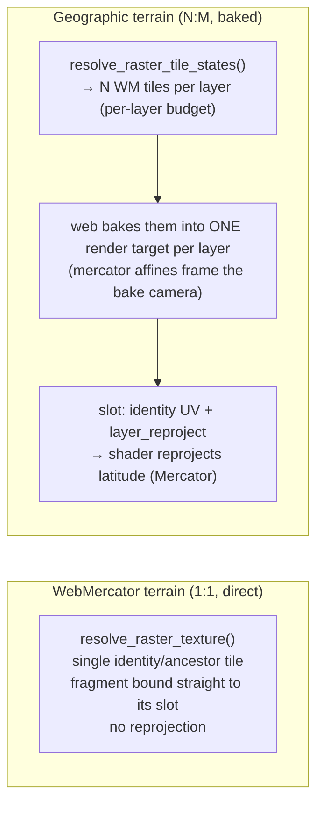

# Tile & Terrain Traversal

How Navara streams a 3D globe: how terrain geometry and raster imagery are
selected per frame, kept at the right level of detail, and stitched together.
This document covers the **Rust engine side** (the `navara_tile` crate and the
quadtrees it walks). For how the resolved textures are then baked onto a single
mesh on the **TypeScript/GPU side**, see
[TILE_TEXTURE_COMPOSITING.md](TILE_TEXTURE_COMPOSITING.md). For the surrounding
architecture see [ARCHITECTURE.md](ARCHITECTURE.md). Clamp-to-ground **vector**
layers run a third quadtree/traversal of the same shape and drape via the raster
composite path — see [VECTOR_TILE_DRAPING.md](VECTOR_TILE_DRAPING.md).

## Overview

A globe is rendered as a pyramid of tiles. As the camera moves, the engine must
decide, every frame:

- which **terrain** tiles to mesh (the 3D surface), and
- which **raster** tiles to drape on them (satellite, OSM, … imagery).

These two questions look similar but pull in different directions:

| | Terrain | Raster imagery |
| --- | --- | --- |
| Provides | 3D geometry (the mesh) | a texture draped on geometry |
| Tiling scheme | WebMercator **or** Geographic | WebMercator only |
| LOD transition | **strict** — swap parent → children only when _all_ children are ready (no holes in the surface) | **lenient** — show the parent immediately, refine children as they load |
| Count | exactly one terrain source | any number of raster layers |

Because the schemes can differ (Cesium quantized-mesh terrain defaults to
**Geographic**, while raster tiles are **WebMercator**), a single tile pyramid
cannot represent both: one Geographic terrain tile overlaps **several**
WebMercator raster tiles (an N:M relationship — the grids do not nest).

So Navara runs **two independent quadtrees with two independent traversals**,
and joins them by geographic extent:

The terrain traversal owns the **render unit** (the mesh that actually gets
drawn). The raster traversal only loads and tracks textures; the terrain side
**pulls** the matching raster textures as it builds its material. When the
schemes agree the pull is a single identity tile bound straight to a material
slot; when they differ, the **set** of overlapping WebMercator tiles is
resolved by a separate per-terrain-tile query and baked into one render target
per layer on the web side (see [the pull](#joining-the-two--the-pull)).

## The two tile types

Both quadtrees are instances of the generic `Quadtree<usize, T>`
(`navara_quadtree`), so a second lightweight tile type is cheap to add.

- **`TerrainTile`** (`crates/navara_tile_component/src/terrain_tile.rs`) carries
  the geometry: a `TerrainData` implementation (raster-DEM, quantized-mesh, or
  ellipsoid), the built GPU mesh handle, terrain heights, and the per-layer
  **hillshade** entities. Hillshade stays on the terrain side because it is
  derived from the terrain DEM and needs neighbour-tile edges.
- **`RasterTile`** (`crates/navara_tile_component/src/raster_tile.rs`) is
  deliberately tiny: it owns only the per-layer texture-fragment entities and a
  parent-fallback handle. It has no mesh, no heights, no terrain data — it is
  never drawn directly.

`TileXYZ` plus the `TilingScheme` fully determine a tile's geographic extent
(`crates/navara_core/src/tiles.rs`):

## Per-frame system pipeline

All of this runs as an ordered chain of Bevy systems registered by `TilePlugin`
(`crates/navara_tile/src/lib.rs`). The raster systems run **before** the terrain
systems so the freshly-requested textures are available to pull from:

The `filter_requestable_*` systems are rate limiters: they cap how many texture
/ DEM requests are in flight at once and reject the overflow so it is retried
next frame.

## Terrain traversal — strict LOD

`traverse_terrain()` (`crates/navara_tile/src/tile/traverse.rs`) walks the terrain
quadtree from each root and decides, recursively, whether a tile renders, its
children render, or nothing renders yet. It is a screen-space-error (SSE)
refinement with a **strict swap**: a parent is only hidden once **all** of its
children have a prepared mesh, so the surface never shows a hole.

Two subtleties make terrain + imagery work together:

- **Upsampling to follow imagery.** A terrain tile keeps subdividing past its own
  data's max zoom by **upsampling** the parent mesh (`overscaled_max_zoom`). This
  is what lets fine raster (e.g. OSM z23) sit on coarse terrain (e.g.
  quantized-mesh z18): the terrain geometry is subdivided to z23 so there is a
  surface to drape the z23 texture onto. Keeping the terrain subdivided to the
  finest raster layer's depth also keeps the N:M overlap small (≈1 raster tile
  per terrain tile).
- **Geometry-first rendering.** A terrain tile is "ready" to render as soon as
  its **geometry** is ready — it does not wait for textures. Textures are
  requested lazily and pulled in as they arrive (see below). Terrain-side
  texture readiness (`is_texture_ready`) therefore only gates on **hillshade**,
  which is terrain-owned.

The mesh itself is built off the main thread: `traverse_terrain` requests the DEM /
quantized-mesh bytes, a worker constructs the mesh, and `transfer_mesh` moves the
result onto a `TileMeshMarker` entity.

## Raster traversal — lenient LOD

`traverse_raster()` (`crates/navara_tile/src/raster/traverse.rs`) is much
simpler than the terrain traversal because raster tiles own no mesh and are never
drawn directly. Its only jobs are to **select** the right LOD by SSE, **request**
the textures along the path, and keep visited tiles alive so the terrain can fall
back to a parent while children load.

There is no "swap" logic and no "all children ready" barrier: the lenient
behaviour ("show the parent while waiting for children") is handled entirely at
**pull time** by walking up to the nearest ready ancestor.

Stale raster tiles (not visited recently) are pruned by `clear_raster_caches`,
which keeps the live set bounded. Visited ancestors stay alive, so a fallback
texture is always available while zooming.

**Borrowing terrain height.** A raster tile owns no geometry, so on its own it
sits flat at sea level. But SSE depends on the camera-to-tile distance, so a
flat tile over elevated terrain measures itself as farther away than it really
is and stops subdividing too early — leaving coarse imagery on a detailed
(upsampled) surface. To avoid this, the raster traversal looks up the tile's
elevation with `terrain_height_for_extent(terrain_qt, &extent)` and calls
`update_heights` before computing SSE, so the imagery refines in step with the
terrain. A terrain-mesh change therefore also re-triggers the raster traversal
even when the camera is still.

`terrain_height_for_extent` walks the **`TerrainTileQuadtree`** and reads the
heights of the deepest *rendered* terrain tile covering the raster extent's
**center point**. Looking up by extent (point-in-tile) rather than by `x/y/z`
makes it scheme-independent: a WebMercator raster tile can borrow the height of
the **Geographic** quantized-mesh tile beneath it, where a coordinate-identity
lookup would find nothing. (This replaced an earlier coordinate-climb against a
separate `TerrainInformationQuadtree`.)

## Joining the two — the pull

When `update_mesh_material` (`crates/navara_tile/src/tile/system.rs`) builds a
terrain tile's material, it resolves each layer. Every branch emits **exactly
one composite slot per layer** (`max_slots = sorted_layers.len()`):

- **hillshade layers** → from the terrain tile's own `hillshade_entity_ids`
  (with the terrain-side parent fallback),
- **regular raster layers on WebMercator terrain** → **pulled** from the raster
  quadtree by `resolve_raster_texture()`
  (`crates/navara_tile/src/raster/resolve.rs`). The drape is same-scheme, so it
  is 1:1 by construction: the slot binds the terrain tile's own identity WM
  tile, or its nearest loaded ancestor while that loads. Never reprojects.
- **regular raster layers on Geographic terrain** (elevation heatmaps included)
  → a **baked slot**: the material carries no fragment at all
  (`layer_fragments = None`, identity UV, `layer_reproject = true`). The N:M
  overlap is resolved by a separate per-terrain-tile pull
  (`getRasterTileStates` → `resolve_raster_tile_states`) and the overlapping WM
  tiles are baked into **one render target per layer** on the TypeScript side —
  mirroring the texturized-vector drape
  ([VECTOR_TILE_DRAPING.md](VECTOR_TILE_DRAPING.md)).

### WebMercator terrain: the direct resolve

`wm_zoom_for_lng_span(lng_span, max_zoom)` picks the WM zoom whose tiles match
the terrain tile's longitude span (`z ≈ round(log2(2π / span))`) — for
WebMercator terrain that is the tile's own zoom, so this is the historical
identity lookup. A tile whose own texture isn't loaded climbs to its nearest
loaded ancestor, carrying a `uv_transform` sub-rect
(`uv_rect_from_extents`, `navara_geometry::tile`). This ancestor fallback is
why decoupling render-readiness from texture-readiness never produces a blank
tile — there is almost always _some_ ancestor texture to show while the exact
tile loads. `uv_rect_from_extents` is computed in geographic lng/lat, which is
exact when both sides share the scheme, so `layer_reproject` is `false` and the
composite shader's reprojection branch is skipped entirely.

### Geographic terrain: the baked resolve

One Geographic terrain tile overlaps **several** WM raster tiles (N:M, growing
toward the poles). Formerly each overlapping tile consumed one composite
material slot, splitting a fixed slot budget across the draped layers — with
3+ layers each coarsened to a single tile, and the per-tile slot count could
still overflow the GPU sampler budget. Now the overlap never reaches the
material: the web bakes every overlapping tile of a layer into that layer's
**one** render target, so a layer costs one slot no matter its overlap, and the
overlap budget (`RASTER_DRAPE_OVERLAP_BUDGET`, 5) is **per layer** rather than
divided across layers.

The pull is a second, revision-gated WASM boundary:

- **`resolve_raster_tile_states`** (`raster/resolve.rs`) is a pure function
  over the quadtree (unit-testable without an `App`). Per baked layer it picks
  `target_z = wm_zoom_for_lng_span(span, source max_zoom)`, enumerates
  `overlapping_tiles_within_budget` (coarsening the zoom until the count fits
  the per-layer budget), climbs each gap to its nearest loaded ancestor
  (deduplicated — a shared ancestor is baked once), and emits one
  `ResolvedRasterTileState` per source tile. The UV affine is **Mercator**
  (`uv_rect_from_extents_mercator`) because it frames the offscreen **bake**
  camera, not the composite paste.
- **Ordinal pairing.** `layer_ordinal` is the layer's position among the baked
  (non-hillshade) layers in sorted order. `update_mesh_material` emits its k-th
  fragment-less baked slot from the same sorted, filtered layer list, so the
  web pairs slot k with ordinal k without any id plumbing. The sort and filter
  in `snapshot_raster_bake_inputs` MUST stay in lockstep with
  `update_mesh_material`. An unloaded layer leaves a hole rather than shifting
  the ordinals after it.
- **`RasterResolveRevision`** (mirrors `VectorResolveRevision`) gates the
  per-tile pull: it bumps on fragment load completions, bake-relevant layer
  changes, raster tile destruction (cache prune / memory eviction), and globe
  scheme flips — **not** on camera movement (an existing tile's resolve depends
  only on the loaded-fragment set; bumping per traverse made every visible tile
  re-resolve every frame, an FPS killer). Layer changes are filtered through a
  **bake-config fingerprint** (hillshade/heatmap flags + source id, kept on
  `RasterTileCacheManager`) so appearance-only mutations — e.g. a per-frame
  opacity animation — don't bump. The web reads `rasterRevision()` once per
  frame and skips `getRasterTileStates` while it is unchanged.
- **`RasterBakeSnapshot`** caches the resolve inputs (the sorted baked-layer
  list + the loaded-fragment set), refreshed by `snapshot_raster_bake_inputs`
  only when the revision changed, registered at the end of the raster chain so
  every same-frame bump (traverse, prune, eviction) is captured.
  `get_raster_tiles` runs per visible terrain tile, so it must only read
  resources and walk the quadtree — re-scanning fragments and re-sorting layers
  per tile per frame was the cost this removes. The snapshot stays empty on
  non-Geographic globes (nothing bakes there).

A baked slot's identity UV plus `layer_reproject = true` and the tile-wide
`terrain_lat_range = [south, north]` (radians) tell the composite shader to
remap the latitude axis through Mercator per fragment — the baked render target
spans the terrain tile's Mercator-projected extent. The bake and paste are
continued in [TILE_TEXTURE_COMPOSITING.md](TILE_TEXTURE_COMPOSITING.md).

## Texture fragment ownership

Both pipelines spawn texture-fragment entities that carry a
`TileTextureFragmentMarker(handle)`. The handle indexes **different quadtrees**
depending on the pipeline, so the two are kept apart by component type rather
than by the marker alone:

| | Component | Marker handle indexes | Rate-limited by |
| --- | --- | --- | --- |
| Raster texture | `TextureFragment` | `RasterTileQuadtree` | `filter_requestable_raster_texture_fragment` |
| Hillshade | `DataRequester` (+ `HillshadeTextureMarker`) | `TerrainTileQuadtree` | `filter_requestable_hillshade_data_requester` |

Each rate limiter clears rejected slots against its **own** quadtree. Mixing them
up (interpreting a raster handle against the terrain quadtree) corrupts unrelated
tiles, so the queries are scoped precisely: the raster filter matches
`With<TextureFragment>`, the hillshade filter matches `With<HillshadeTextureMarker>`.

## Scheme support

Both cases pick their zoom with `wm_zoom_for_lng_span` and fall back through
the same ancestor walk-up, but they drape through different material paths:

- **WebMercator terrain** (including WebMercator quantized-mesh) and
  terrain-less raster maps resolve to the single tile at the terrain tile's own
  coordinates — the historical identity lookup, with ancestor fallback.
  `layer_reproject` is `false`, so the shader's reprojection branch is skipped
  entirely.
- **Geographic terrain** (the quantized-mesh default) overlaps several
  WebMercator raster tiles per layer. The resolved set (capped **per layer** by
  `RASTER_DRAPE_OVERLAP_BUDGET`) is mosaicked into the layer's render target;
  the composite shader corrects the latitude non-linearity per fragment. The
  web picks the baked resolver once at tile-mesh creation from
  `Globe.isGeographicTiling` — a runtime scheme flip drains and rebuilds every
  tile, and bumps `RasterResolveRevision` so a stale snapshot cannot survive
  the flip.

> **Polar caps.** WebMercator imagery stops at ~±85.05° while Geographic terrain
> reaches ±90°. `web_mercator_overlapping_tiles` clamps a polar extent onto the
> band-edge tile row, `uv_rect_from_extents_mercator` clamps the bake framing
> onto the WM band (a fully-polar tile becomes a minimal sliver hugging the
> edge), and the composite shader stretches the band-edge imagery row across
> the cap, so the surface near the poles is covered rather than blank.

## Key files

| Concern | Path |
| --- | --- |
| Terrain tile | `crates/navara_tile_component/src/terrain_tile.rs` |
| Terrain height by extent | `crates/navara_tile_component/src/terrain_tile.rs` (`terrain_height_for_extent`) |
| Raster tile | `crates/navara_tile_component/src/raster_tile.rs` |
| Tiling scheme / extents | `crates/navara_core/src/tiles.rs` |
| Cross-scheme overlap | `crates/navara_core/src/tiles.rs` (`web_mercator_overlapping_tiles`, `web_mercator_lnglat_to_world_pos`) |
| Cross-scheme UV rect | `crates/navara_geometry/src/tile.rs` (`uv_rect_from_extents`) |
| Terrain traversal | `crates/navara_tile/src/tile/traverse.rs` |
| Raster traversal | `crates/navara_tile/src/raster/traverse.rs` |
| Raster texture request | `crates/navara_tile/src/raster/request.rs` |
| Pull / resolve | `crates/navara_tile/src/raster/resolve.rs` (`resolve_raster_texture`, `resolve_raster_tile_states`, `RASTER_DRAPE_OVERLAP_BUDGET`) |
| Baked-resolve gate + snapshot | `crates/navara_tile/src/raster/mod.rs` / `raster/system.rs` (`RasterResolveRevision`, `RasterBakeSnapshot`, `snapshot_raster_bake_inputs`) |
| Baked-resolve wasm boundary | `crates/navara_ecs/src/lib.rs` (`get_raster_tiles`, `raster_revision`), `crates/navara_wasm/src/raster_tile.rs` (`getRasterTileStates`, `rasterRevision`) |
| Mercator bake-camera UV | `crates/navara_geometry/src/tile.rs` (`uv_rect_from_extents_mercator`) |
| Material drape (one slot per layer) | `crates/navara_tile/src/tile/system.rs` (`update_mesh_material`) |
| Hillshade request | `crates/navara_tile/src/texture_fragment/helpers.rs` |
| Plugin / system order | `crates/navara_tile/src/lib.rs` |
