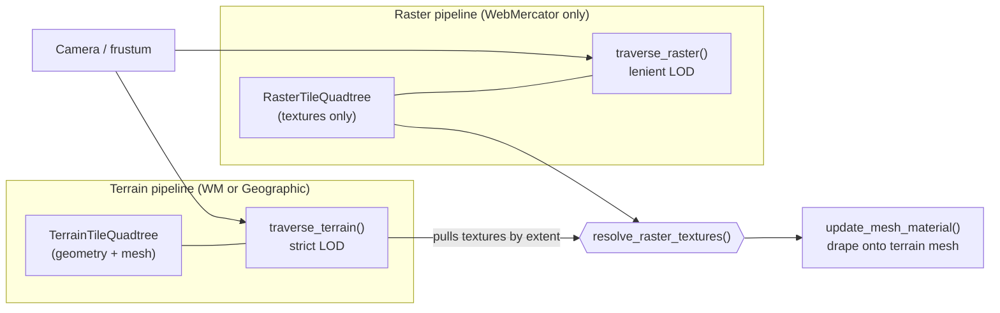
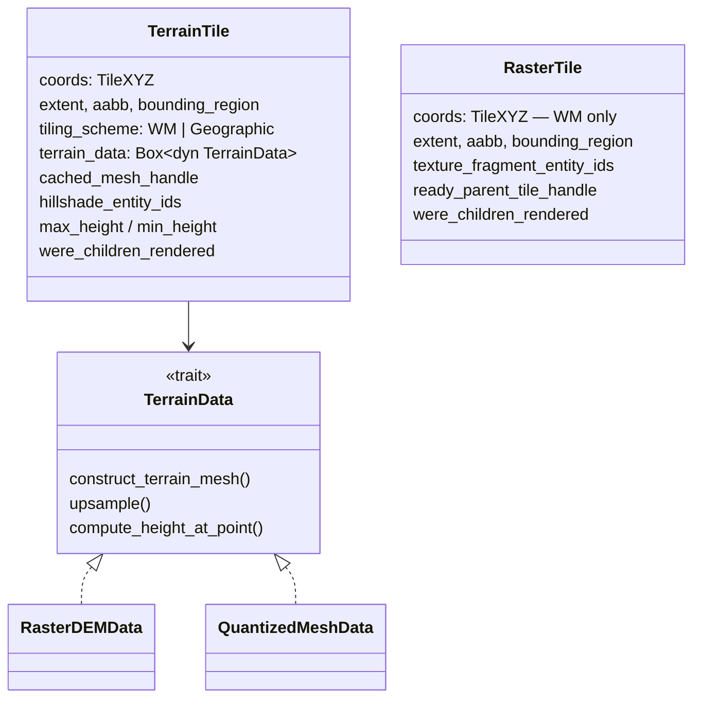
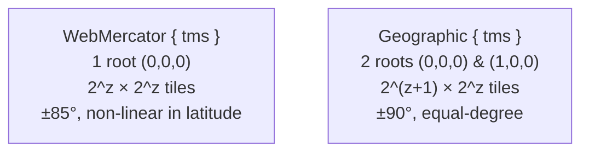
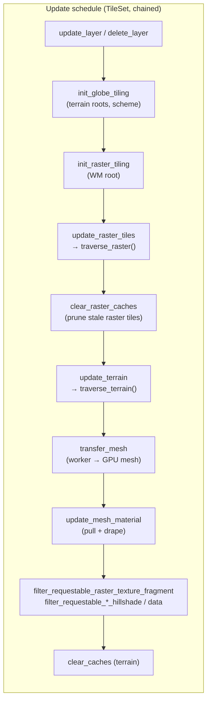
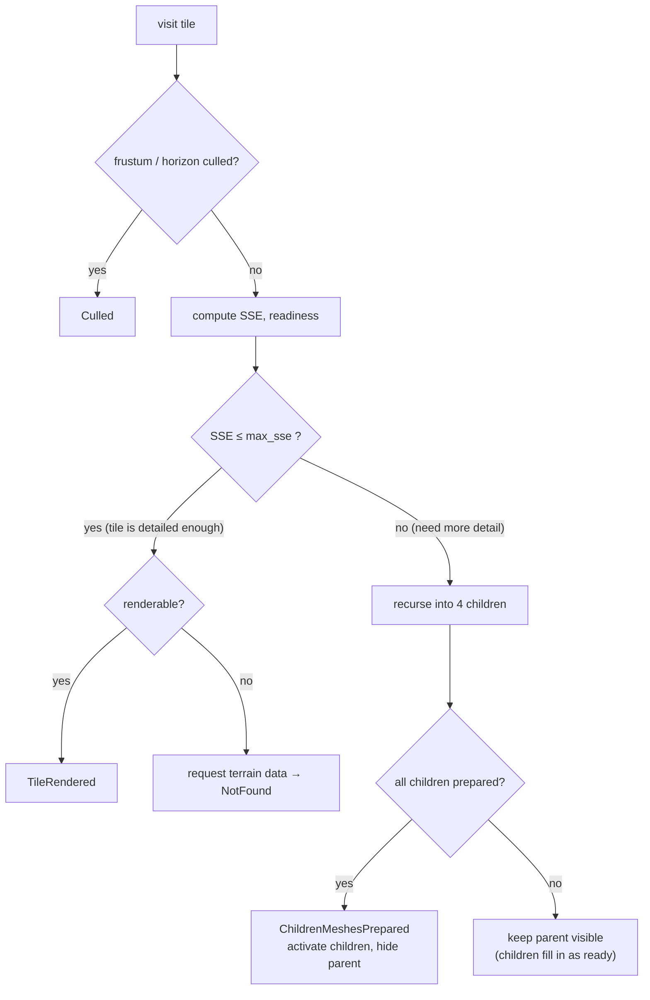
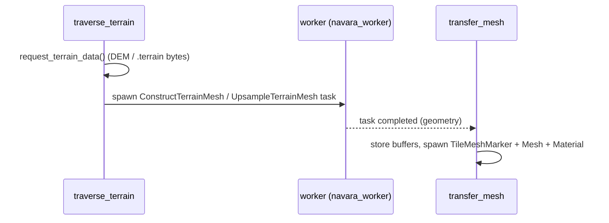
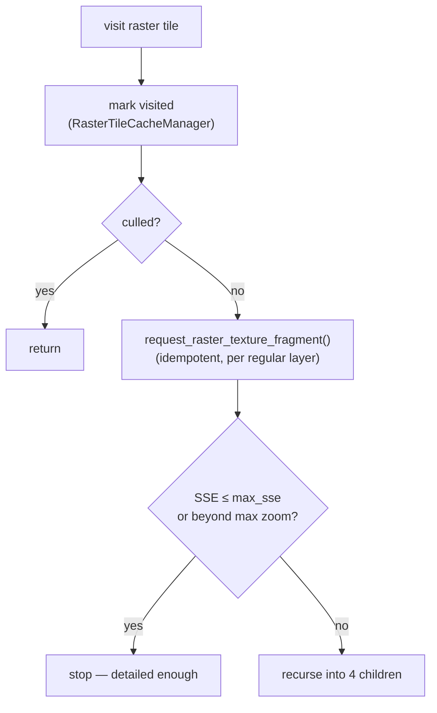
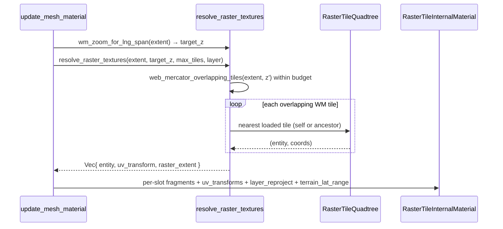
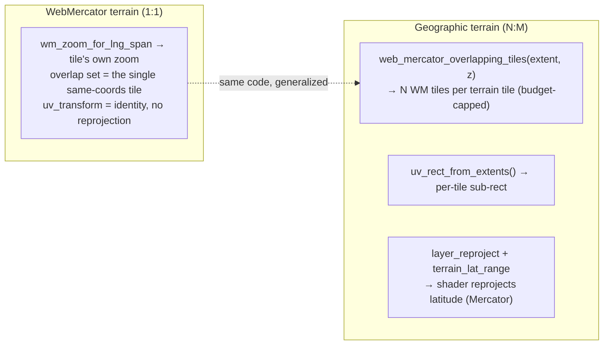

# Tile & Terrain Traversal

How Navara streams a 3D globe: how terrain geometry and raster imagery are
selected per frame, kept at the right level of detail, and stitched together.
This document covers the **Rust engine side** (the `navara_tile` crate and the
quadtrees it walks). For how the resolved textures are then baked onto a single
mesh on the **TypeScript/GPU side**, see
[TILE_TEXTURE_COMPOSITING.md](TILE_TEXTURE_COMPOSITING.md). For the surrounding
architecture see [ARCHITECTURE.md](ARCHITECTURE.md).

## Overview

A globe is rendered as a pyramid of tiles. As the camera moves, the engine must
decide, every frame:

- which **terrain** tiles to mesh (the 3D surface), and
- which **raster** tiles to drape on them (satellite, OSM, … imagery).

These two questions look similar but pull in different directions:

| | Terrain | Raster imagery |
| --- | --- | --- |
| Provides | 3D geometry (the mesh) | a texture draped on geometry |
| Tiling scheme | WebMercator **or** Geographic | WebMercator only |
| LOD transition | **strict** — swap parent → children only when _all_ children are ready (no holes in the surface) | **lenient** — show the parent immediately, refine children as they load |
| Count | exactly one terrain source | any number of raster layers |

Because the schemes can differ (Cesium quantized-mesh terrain defaults to
**Geographic**, while raster tiles are **WebMercator**), a single tile pyramid
cannot represent both: one Geographic terrain tile overlaps **several**
WebMercator raster tiles (an N:M relationship — the grids do not nest).

So Navara runs **two independent quadtrees with two independent traversals**,
and joins them by geographic extent:

The terrain traversal owns the **render unit** (the mesh that actually gets
drawn). The raster traversal only loads and tracks textures; the terrain tile
**pulls** the matching raster textures (one tile when the schemes agree, the
**set** of overlapping WebMercator tiles when they differ) as it builds its
material.

## The two tile types

Both quadtrees are instances of the generic `Quadtree<usize, T>`
(`navara_quadtree`), so a second lightweight tile type is cheap to add.

- **`TerrainTile`** (`crates/navara_tile_component/src/terrain_tile.rs`) carries
  the geometry: a `TerrainData` implementation (raster-DEM, quantized-mesh, or
  ellipsoid), the built GPU mesh handle, terrain heights, and the per-layer
  **hillshade** entities. Hillshade stays on the terrain side because it is
  derived from the terrain DEM and needs neighbour-tile edges.
- **`RasterTile`** (`crates/navara_tile_component/src/raster_tile.rs`) is
  deliberately tiny: it owns only the per-layer texture-fragment entities and a
  parent-fallback handle. It has no mesh, no heights, no terrain data — it is
  never drawn directly.

`TileXYZ` plus the `TilingScheme` fully determine a tile's geographic extent
(`crates/navara_core/src/tiles.rs`):

## Per-frame system pipeline

All of this runs as an ordered chain of Bevy systems registered by `TilePlugin`
(`crates/navara_tile/src/lib.rs`). The raster systems run **before** the terrain
systems so the freshly-requested textures are available to pull from:

The `filter_requestable_*` systems are rate limiters: they cap how many texture
/ DEM requests are in flight at once and reject the overflow so it is retried
next frame.

## Terrain traversal — strict LOD

`traverse_terrain()` (`crates/navara_tile/src/tile/traverse.rs`) walks the terrain
quadtree from each root and decides, recursively, whether a tile renders, its
children render, or nothing renders yet. It is a screen-space-error (SSE)
refinement with a **strict swap**: a parent is only hidden once **all** of its
children have a prepared mesh, so the surface never shows a hole.

Two subtleties make terrain + imagery work together:

- **Upsampling to follow imagery.** A terrain tile keeps subdividing past its own
  data's max zoom by **upsampling** the parent mesh (`overscaled_max_zoom`). This
  is what lets fine raster (e.g. OSM z23) sit on coarse terrain (e.g.
  quantized-mesh z18): the terrain geometry is subdivided to z23 so there is a
  surface to drape the z23 texture onto. Keeping the terrain subdivided to the
  finest raster layer's depth also keeps the N:M overlap small (≈1 raster tile
  per terrain tile).
- **Geometry-first rendering.** A terrain tile is "ready" to render as soon as
  its **geometry** is ready — it does not wait for textures. Textures are
  requested lazily and pulled in as they arrive (see below). Terrain-side
  texture readiness (`is_texture_ready`) therefore only gates on **hillshade**,
  which is terrain-owned.

The mesh itself is built off the main thread: `traverse_terrain` requests the DEM /
quantized-mesh bytes, a worker constructs the mesh, and `transfer_mesh` moves the
result onto a `TileMeshMarker` entity.

## Raster traversal — lenient LOD

`traverse_raster()` (`crates/navara_tile/src/raster/traverse.rs`) is much
simpler than the terrain traversal because raster tiles own no mesh and are never
drawn directly. Its only jobs are to **select** the right LOD by SSE, **request**
the textures along the path, and keep visited tiles alive so the terrain can fall
back to a parent while children load.

There is no "swap" logic and no "all children ready" barrier: the lenient
behaviour ("show the parent while waiting for children") is handled entirely at
**pull time** by walking up to the nearest ready ancestor.

Stale raster tiles (not visited recently) are pruned by `clear_raster_caches`,
which keeps the live set bounded. Visited ancestors stay alive, so a fallback
texture is always available while zooming.

**Borrowing terrain height.** A raster tile owns no geometry, so on its own it
sits flat at sea level. But SSE depends on the camera-to-tile distance, so a
flat tile over elevated terrain measures itself as farther away than it really
is and stops subdividing too early — leaving coarse imagery on a detailed
(upsampled) surface. To avoid this, the raster traversal looks up the tile's
elevation with `terrain_height_for_extent(terrain_qt, &extent)` and calls
`update_heights` before computing SSE, so the imagery refines in step with the
terrain. A terrain-mesh change therefore also re-triggers the raster traversal
even when the camera is still.

`terrain_height_for_extent` walks the **`TerrainTileQuadtree`** and reads the
heights of the deepest *rendered* terrain tile covering the raster extent's
**center point**. Looking up by extent (point-in-tile) rather than by `x/y/z`
makes it scheme-independent: a WebMercator raster tile can borrow the height of
the **Geographic** quantized-mesh tile beneath it, where a coordinate-identity
lookup would find nothing. (This replaced an earlier coordinate-climb against a
separate `TerrainInformationQuadtree`.)

## Joining the two — the pull

When `update_mesh_material` (`crates/navara_tile/src/tile/system.rs`) builds a
terrain tile's material, it resolves each layer:

- **hillshade layers** → from the terrain tile's own `hillshade_entity_ids`
  (with the terrain-side parent fallback), and
- **regular raster layers** → **pulled** from the raster quadtree by
  `resolve_raster_textures()` (`crates/navara_tile/src/raster/resolve.rs`).

A single raster layer no longer maps to a single slot. Because one terrain tile
can overlap several WebMercator raster tiles (the N:M case), `resolve_raster_textures`
returns a **`Vec<ResolvedRasterTexture>`** — one entry per overlapping source
tile — and `update_mesh_material` pushes **one material slot per entry**. So the
per-slot vectors (`shows`, `colors`, `layer_fragments`, `layer_uv_transforms`,
`layer_reproject`, …) are generally **longer than the layer count**.

Inside `resolve_raster_textures`:

- **Pick the zoom.** `wm_zoom_for_lng_span(lng_span, max_zoom)` picks the WM zoom
  whose tiles roughly match the terrain tile's longitude span (`z ≈
  round(log2(2π / span))`). For WebMercator terrain this returns the tile's own
  zoom, so the whole path degenerates to the old identity lookup.
- **Find the overlapping set within budget.** `web_mercator_overlapping_tiles(extent, z)`
  (`navara_core::tiles`) returns the WM tiles overlapping the terrain extent.
  The resolver coarsens `z` (halving the grid each step) until the count fits
  `max_tiles`, so the fan-out is bounded.
- **Per tile, fall back to a ready ancestor.** For each overlapping tile whose
  own texture isn't loaded, the resolver climbs to its nearest loaded ancestor
  (de-duplicated — a shared ancestor is emitted once). Each entry carries a
  `uv_transform` sub-rect (from `uv_rect_from_extents`, `navara_geometry::tile`)
  plus the source tile's `raster_extent`. This ancestor fallback is why
  decoupling render-readiness from texture-readiness never produces a blank tile
  — there is almost always _some_ ancestor texture to show while the exact tile
  loads.

`uv_rect_from_extents` is computed in geographic lng/lat, so its **longitude**
(x) mapping is exact even across schemes, but the **latitude** (y) mapping is
only affine — wrong for a WebMercator texture draped on equal-degree Geographic
terrain. So when the terrain tile is Geographic the material also carries, per
slot, `layer_reproject = true` and, once for the tile, `terrain_lat_range =
[south, north]` (radians). The TypeScript composite shader uses these to
reproject the latitude axis through Mercator per fragment — see
[TILE_TEXTURE_COMPOSITING.md](TILE_TEXTURE_COMPOSITING.md). For WebMercator
terrain `layer_reproject` is all `false` and `terrain_lat_range` is `None`.

The resulting per-slot `(entity, uv_transform, reproject)` lists are handed to
the material, and the TypeScript side bakes them into the tile's atlas —
continued in [TILE_TEXTURE_COMPOSITING.md](TILE_TEXTURE_COMPOSITING.md).

## Texture fragment ownership

Both pipelines spawn texture-fragment entities that carry a
`TileTextureFragmentMarker(handle)`. The handle indexes **different quadtrees**
depending on the pipeline, so the two are kept apart by component type rather
than by the marker alone:

| | Component | Marker handle indexes | Rate-limited by |
| --- | --- | --- | --- |
| Raster texture | `TextureFragment` | `RasterTileQuadtree` | `filter_requestable_raster_texture_fragment` |
| Hillshade | `DataRequester` (+ `HillshadeTextureMarker`) | `TerrainTileQuadtree` | `filter_requestable_hillshade_data_requester` |

Each rate limiter clears rejected slots against its **own** quadtree. Mixing them
up (interpreting a raster handle against the terrain quadtree) corrupts unrelated
tiles, so the queries are scoped precisely: the raster filter matches
`With<TextureFragment>`, the hillshade filter matches `With<HillshadeTextureMarker>`.

## Scheme support

The join is **extent-based**, so a single pull path covers both the same-scheme
and the cross-scheme case — the WebMercator-on-WebMercator drape is just its
degenerate (1:1) form:

- **WebMercator terrain** (including WebMercator quantized-mesh) and
  terrain-less raster maps resolve to a single overlapping tile at the terrain
  tile's own coordinates — the historical identity lookup, with ancestor
  fallback. `layer_reproject` is `false`, so the shader's reprojection branch is
  skipped entirely.
- **Geographic terrain** (the quantized-mesh default) overlaps several
  WebMercator raster tiles. The pull resolves the **set** (capped by
  `RASTER_DRAPE_SLOT_BUDGET`), gives each a `uv_rect_from_extents` sub-rect for
  longitude, and flags `layer_reproject` so the composite shader corrects the
  latitude non-linearity per fragment. A Geographic terrain tile now drapes
  imagery correctly — it is no longer skipped.

> **Polar caps.** WebMercator imagery stops at ~±85.05° while Geographic terrain
> reaches ±90°. `web_mercator_overlapping_tiles` clamps a polar extent onto the
> band-edge tile row, and the composite shader stretches that edge tile's last
> imagery row across the cap, so the surface near the poles is covered rather
> than blank.

## Key files

| Concern | Path |
| --- | --- |
| Terrain tile | `crates/navara_tile_component/src/terrain_tile.rs` |
| Terrain height by extent | `crates/navara_tile_component/src/terrain_tile.rs` (`terrain_height_for_extent`) |
| Raster tile | `crates/navara_tile_component/src/raster_tile.rs` |
| Tiling scheme / extents | `crates/navara_core/src/tiles.rs` |
| Cross-scheme overlap | `crates/navara_core/src/tiles.rs` (`web_mercator_overlapping_tiles`, `web_mercator_lnglat_to_world_pos`) |
| Cross-scheme UV rect | `crates/navara_geometry/src/tile.rs` (`uv_rect_from_extents`) |
| Terrain traversal | `crates/navara_tile/src/tile/traverse.rs` |
| Raster traversal | `crates/navara_tile/src/raster/traverse.rs` |
| Raster texture request | `crates/navara_tile/src/raster/request.rs` |
| Pull / resolve | `crates/navara_tile/src/raster/resolve.rs` (`resolve_raster_textures`, `wm_zoom_for_lng_span`) |
| Material drape / slot budget | `crates/navara_tile/src/tile/system.rs` (`update_mesh_material`, `RASTER_DRAPE_SLOT_BUDGET`) |
| Hillshade request | `crates/navara_tile/src/texture_fragment/helpers.rs` |
| Plugin / system order | `crates/navara_tile/src/lib.rs` |
