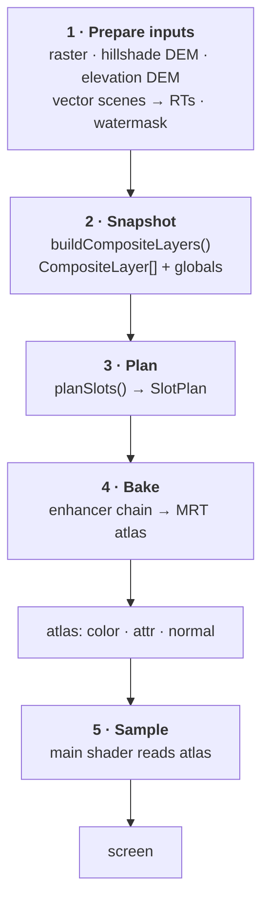
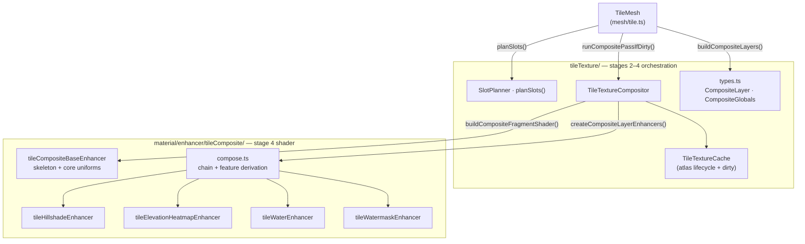
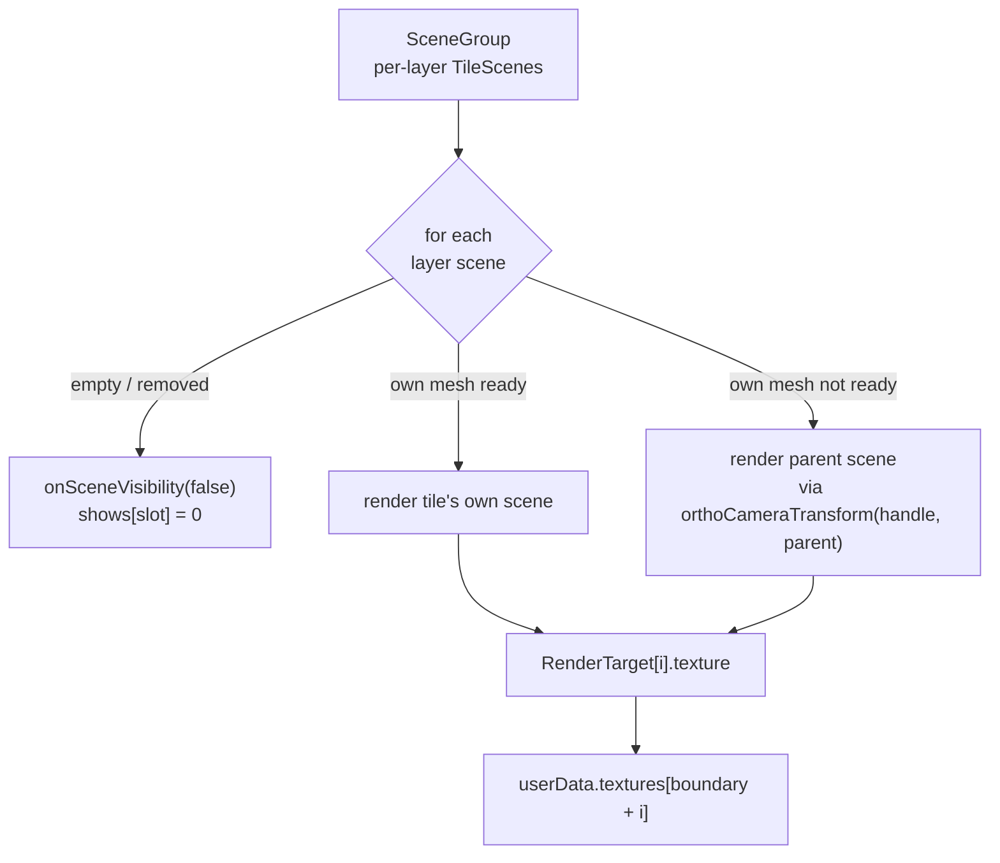
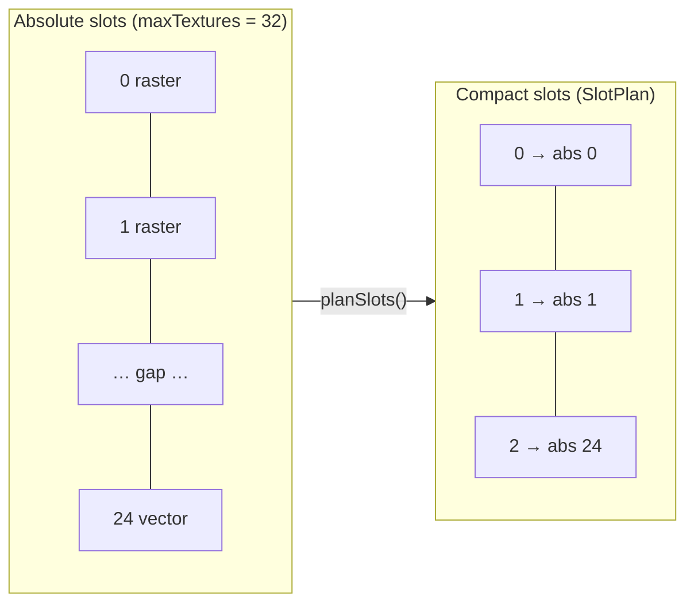
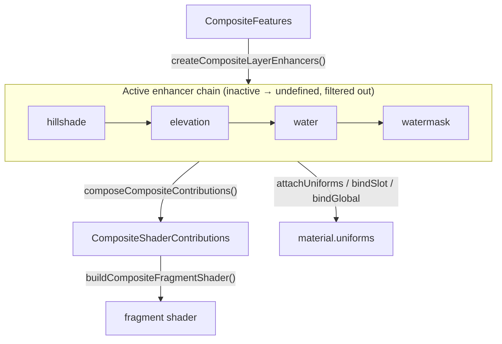
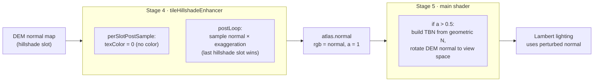
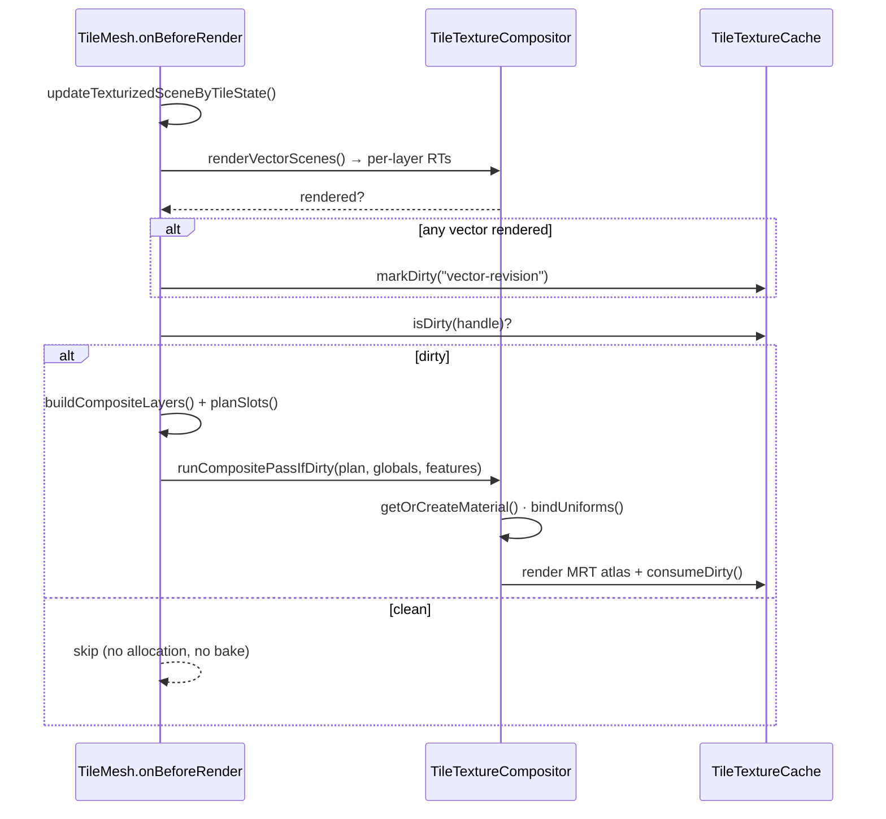

# Tile Texture Compositing

How `@navara/three` composites many overlays — hillshade normals, elevation
heatmaps, multiple raster tiles, and texturized vector tiles — onto a single
terrain mesh. For how those tiles are selected and resolved on the Rust side
(the terrain/raster quadtree traversals that feed this stage) see
[TILE_TERRAIN_TRAVERSAL.md](TILE_TERRAIN_TRAVERSAL.md). For the broader rendering
pipeline see [ARCHITECTURE.md](ARCHITECTURE.md); for the enhancer pattern reused
here see
[material/enhancer/DESIGN.md](../web/navara_three/src/material/enhancer/DESIGN.md).

## Overview

Every terrain tile can carry several overlays at once. Compositing them **per
fragment, every frame** would cost N texture lookups for each pixel of every
tile. Instead the overlays are baked **once, off-screen**, into a small per-tile
atlas whenever something changes; the terrain's main shader then samples just
that atlas (3 lookups) no matter how many overlays the tile has.

So two shaders are involved, and the rest of this document follows one tile's
overlays through them, end to end:

- **Composite pass** — an off-screen full-screen-quad pass that bakes N source
  textures into the tile's MRT atlas. Runs only when the tile is _dirty_.
- **Main TileMesh shader** — the on-screen terrain material. Samples the atlas's
  three attachments once per fragment and applies lighting / water / picking.

## The pipeline

A composite pass is a short pipeline from the tile's raw sources to the lit
pixel. The sections below walk it in order; this diagram is the spine they hang
off.

1. **Prepare inputs** — raster and DEM tiles are already textures; vector tiles
   must first be rendered off-screen into textures. → [Preparing inputs](#1-preparing-inputs)
2. **Snapshot** the tile's active slots into a typed layer list. → [Snapshotting the tile](#2-snapshotting-the-tile)
3. **Plan** how those layers map onto compact shader slots. → [Planning the slots](#3-planning-the-slots)
4. **Bake** the layers into the per-tile MRT atlas. → [Baking the atlas](#4-baking-the-atlas)
5. **Sample** the atlas in the terrain's main shader. → [Sampling on screen](#5-sampling-on-screen)

The whole pipeline runs only when the tile is dirty — see
[Scheduling](#scheduling-per-frame-and-dirty-tracking).

Those stages map onto two code areas: the **orchestration + data model** under
`tileTexture/`, and the **per-expression shader + uniform modules** under
`material/enhancer/tileComposite/`.

## 1. Preparing inputs

Before anything can be composited, every source has to be a plain texture bound
to a slot. What each source is, and how much prep it needs:

- **Raster tiles** — ordinary RGBA imagery. Sampled straight and tinted by the
  slot's color / opacity. No prep.
- **Hillshade DEM** — a tangent-space normal map. Contributes no color, only a
  surface normal; decoded during the bake (see [Hillshade](#hillshade-a-worked-example)).
  No prep as an input.
- **Elevation DEM** — encoded heights. Decoded and mapped through the shared
  colormap during the bake by the elevation heatmap enhancer. No prep as an input.
- **Watermask** — a single-channel land/water mask (quantized-mesh). A tile-wide
  *global*, not a per-slot layer; see [Quantized-mesh](#quantized-mesh-and-watermask).
- **Vector tiles** — the exception. These are Three.js scenes, not textures, so
  they must be rendered off-screen first; the rest of this section covers that.

Vector tiles are draped meshes (`PolygonMesh` / `PolylineMesh`, themselves
Material-Enhancer materials). Each tile reserves a block of **vector-region**
slots — the upper half of its slot range — and a dedicated render target per
slot:

- `numTexturizedVector = floor(maxTextures / 2) − additionalTextures`, so the
  region begins at `texturizedSceneIndexFrom = maxTextures − numTexturizedVector`.
- One `WebGLRenderTarget` (512×512) per vector slot, kept in
  `texturizedSceneRenderTargets[]`. Each RT's `.texture` is bound to
  `userData.textures[texturizedSceneIndexFrom + i]` — always present, even when
  empty, because GLSL requires every declared sampler-array entry to be valid.

`TexturizedSceneByTileCoordinates` holds a `SceneGroup` of per-layer
`TileScene`s per handle. `renderVectorScenes()` (run from `onBeforeRender`, only
when the group's `needsUpdate` is set) renders each layer's scene into its RT:

The **parent-tile fallback** is what keeps vector layers from flickering as data
streams in: while a tile's own mesh for a layer isn't ready (`!isRendered`, or
no own mesh), the parent's scene is rendered through an orthographic camera
transformed by `orthoCameraTransform(handle, parentHandle)` so the parent
content lands in this tile's footprint. Any render marks the RT `needsUpdate`
and flags the atlas dirty with `vector-revision`.

`renderVectorScenes()` also calls `updateTexturizedSceneTextureVisibility()`,
which copies each vector mesh's enhancer state (reflectivity, roughness, water,
shininess, emissive, effect id, …) into the **main** shader's per-slot uniform
arrays. Keep this split in mind for the rest of the pipeline: **the composite
pass only ever bakes a layer's color plus a few flags; precision-sensitive
material attributes stay in per-slot uniforms** and are looked up later by the
main shader.

With that, every slot — raster, DEM, or vector RT — is just a texture, and the
pipeline treats them uniformly from here.

## 2. Snapshotting the tile

Each pass starts by snapshotting the material's current slot state into a typed
list, rather than threading raw parallel arrays through the compositor.
`TileMesh.buildCompositeLayers()` walks the slots and emits a layer for each one
that is **shown AND bound to a texture**:

- **`CompositeLayer`** — a discriminated union: `raster` (a raster tile *or* a
  texturized vector scene), `hillshade`, or `elevationHeatmap`. Each carries its
  `absSlot`, `region` (`raster` | `vector`), `texture`, and UV transform; raster
  layers also carry color / opacity / water.
- **`CompositeGlobals`** — tile-wide, non-per-slot inputs: watermask, colormap +
  elevation decoder params, hillshade exaggeration.

Which expressions are active (`CompositeFeatures`) is then **derived** from the
layers + globals via `deriveCompositeFeatures()` — there are no hand-maintained
feature flags to keep in sync.

## 3. Planning the slots

The layer list is sparse and split across two regions (raster overlays in the
low indices, vector scenes up high), so feeding it to the shader directly would
waste slots. `planSlots()` compacts it: it maps the active layers into a dense
index space, emitting blocks only for slots actually in use, and
power-of-two-quantizes each region's count so the shader/material cache stays
small.

The **absolute** slot index is carried through and baked into the composite
shader as `winningSlot`, so the main shader can still index its per-slot uniform
arrays (reflectivity, water speed, …) by the winner decoded from the atlas. The
`SlotPlan` and the derived `CompositeFeatures` are everything the bake needs.

## 4. Baking the atlas

Given a `SlotPlan` and a feature set, `TileTextureCompositor.runCompositePassIfDirty()`
assembles the off-screen shader, binds the uniforms, and renders one full-screen
quad into the tile's MRT atlas.

### Assembling the shader

The shader is composed, not hand-written. `createCompositeLayerEnhancers()`
turns the feature set into a chain of **composite layer enhancers** (inactive
ones return `undefined` and drop out). `composeCompositeContributions()` folds
the chain's GLSL fragments onto the base enhancer's skeleton, while each
enhancer also attaches and binds its own uniforms:

Each enhancer is self-contained, mirroring the project's
[Material Enhancer](../web/navara_three/src/material/enhancer/DESIGN.md) file
layout (`shader.ts` = pure GLSL, `mutates.ts` = uniform refs, `index.ts` =
factory). The base enhancer owns the `main()` skeleton, the core per-slot
uniforms, the alpha-over blend, and the MRT output writes; each layer enhancer
plugs into named hooks:

| Hook | Purpose |
| --- | --- |
| `slotUniformDecls(n)` | per-slot uniform declarations |
| `globalUniformDecls()` | slot-independent declarations |
| `includes()` | GLSL chunks inlined before `main()` |
| `sampleProducer(ctx)` | override the per-slot sampler (e.g. heatmap colormap) |
| `perSlotPostSample(ctx)` | transform `texColor` after sampling (e.g. zero hillshade) |
| `perSlotOnWinner(ctx)` | update attrs when a slot wins the blend (e.g. water flag) |
| `postLoop(n)` | code after the slot loop (e.g. normal pass, watermask) |
| `defines` | material `#define`s |
| `attachUniforms` / `bindSlot` / `bindGlobal` | create + sync the enhancer's own uniforms |

So **adding a new overlay type is a local change**: write one enhancer module
under `material/enhancer/tileComposite/`, add a `CompositeLayer` variant in
`tileTexture/types.ts`, classify it in `buildCompositeLayers()`, and slot the
factory into `createCompositeLayerEnhancers()`. Nothing else changes.

### What the bake produces

The atlas is one `WebGLRenderTarget` with three RGBA8 attachments (512×512),
owned per tile by `TileTextureCache`. The single quad draw writes all three:

| Attachment | Channels | Meaning |
| --- | --- | --- |
| `color` | rgba | Alpha-over composited diffuse (last opaque writer wins) |
| `attr` | r / g / b / a | `isWater` / `isTexturized` / `0` / `(winningSlot+1)/255` |
| `normal` | rgb / a | Hillshade normal in `[0,1]` / `1` when present else `0` |

That `attr.a` is how the absolute winning slot survives into the main shader,
and `attr.g` is how raster and vector pixels stay distinguishable — both used in
the next stage.

## 5. Sampling on screen

The terrain's main shader (injected via `material/macro/tileShader.ts`) is now
thin: it samples the three atlas attachments once at `vOrigUv` and reads
per-slot uniforms by the decoded winner instead of looping over every slot.

- **Color** — `color` is composited over the base via a premultiplied "over".
- **Winner lookup** — `winIdx = round(attr.a * 255) − 1`; the shader indexes its
  per-slot uniform arrays (reflectivity, roughness, water params, emissive, …)
  at `winIdx`, recovering the full-precision attributes the bake left behind.
- **`attr.g` (isTexturized)** — separates raster from vector: vector pixels carry
  the batch id for picking, and emissive / effect output is gated to them.
- **`attr.r` (isWater)** — drives a specular / water reflection on that pixel.
- **`normal`** — applied as a hillshade perturbation (next section).

## Hillshade: a worked example

Hillshade is the clearest case of one source spanning the whole pipeline — its
input is a DEM **tangent-space normal map** that contributes *no color*, only a
surface normal that drives Lambert shading.

It touches three places that must agree:

- **Material type** — `shouldUseNormal()` selects `MeshLambertMaterial` (instead
  of the cheaper `MeshBasicMaterial`) and sets the `USE_HILLSHADE` define when
  any hillshade slot is active; normal-based lighting needs Lambert.
- **Bake (stage 4)** — `tileHillshadeEnhancer` zeroes the slot's color, then in
  `postLoop` unpacks each hillshade slot's normal, applies
  `uHillshadeExaggeration`, and writes the last one into the normal attachment
  with `a = 1` (neutral `0.5,0.5,1`, `a = 0` when none).
- **Sample (stage 5)** — `generateTileNormalFragmentMaps` samples `uNormalAtlas`;
  when `a > 0.5` it rebuilds a TBN basis from the geometric normal `N` (with a
  pole fallback), rotates the stored DEM normal into view space, and replaces
  `normal` so lighting reacts to the terrain micro-relief.

The composite feature set (`deriveCompositeFeatures`, layer-derived) and the main
shader's `USE_HILLSHADE` (define-derived) stay consistent: an active hillshade
layer implies the define, and when no hillshade slot wins a pixel the normal
attachment's `a = 0` short-circuits the main-shader branch anyway.

## Scheduling: per-frame and dirty tracking

Stages 1–4 are expensive, so the whole bake is gated: `onBeforeRender` does the
cheap upkeep every frame but only snapshots and bakes when the tile is dirty.

Dirty reasons are coalesced per tile (`DirtyReason`: `material`,
`texture-binding`, `vector-revision`, `hillshade`) so one bake services many
changes, and the atlas Textures persist across passes — only `needsUpdate` flips
when a new bake overwrites them.

## Quantized-mesh and watermask

Quantized-mesh terrain adds per-vertex normals (which force a Lambert material,
like hillshade) and an optional **watermask** extension. The watermask is a
slot-independent global rather than a per-slot layer: `tileWatermaskEnhancer`
declares it in `globalUniformDecls`, samples it once in `postLoop`, and OR's the
result into `isWater`. So even an open-ocean tile with no raster/vector overlays
still bakes water into `attr.r` for the main shader's reflection — which is why
the bake runs for a watermask-only tile even though it has zero slots.

## Extending: the stitching seam

Today one `CompositeLayer` maps to exactly one slot. Stitching multiple raster
textures onto one terrain tile (e.g. several source tiles covering one
quantized-mesh tile) is the intended next step: expand a layer into several
consecutive `SlotBinding`s inside `planSlots()`. Everything downstream already
binds per `SlotBinding`, so the bake, the atlas, and the main shader need no
changes.

## Key files

| File | Stage | Role |
| --- | --- | --- |
| `mesh/tile.ts` | 1–2, 5 | `TileMesh` — vector RTs, layer snapshot, drives the pass, main shader |
| `tileTexture/SlotPlanner.ts` | 3 | `planSlots()` — compact slot layout + quantization |
| `tileTexture/TileTextureCompositor.ts` | 1, 4 | vector-scene render, material cache, MRT bake |
| `tileTexture/TileTextureCache.ts` | 4 | per-tile atlas lifecycle + dirty tracking |
| `tileTexture/types.ts` | 2 | `CompositeLayer`, `CompositeGlobals` domain model |
| `material/enhancer/tileComposite/tileCompositeBaseEnhancer/` | 4 | shader skeleton + core uniforms |
| `material/enhancer/tileComposite/tile{Hillshade,ElevationHeatmap,Water,Watermask}Enhancer/` | 4 | per-expression modules |
| `material/enhancer/tileComposite/compose.ts` | 4 | enhancer chain, contributions, feature derivation |
| `material/macro/tileShader.ts` | 5 | main TileMesh shader injections (atlas sampling) |
