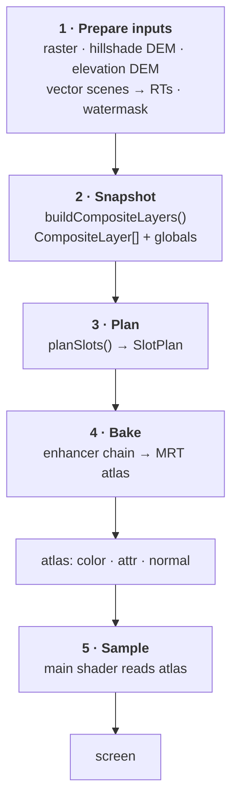
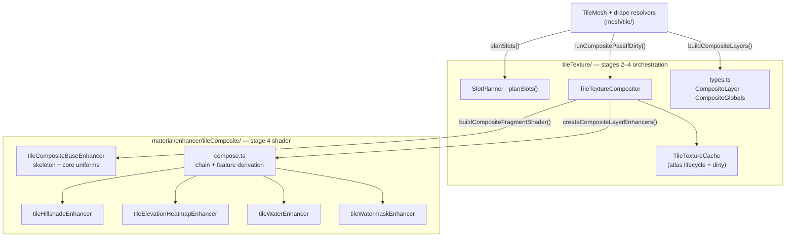
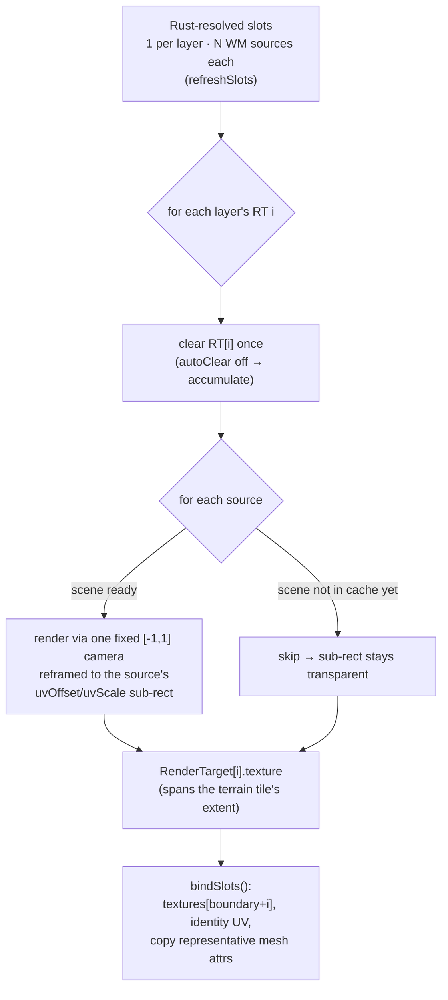
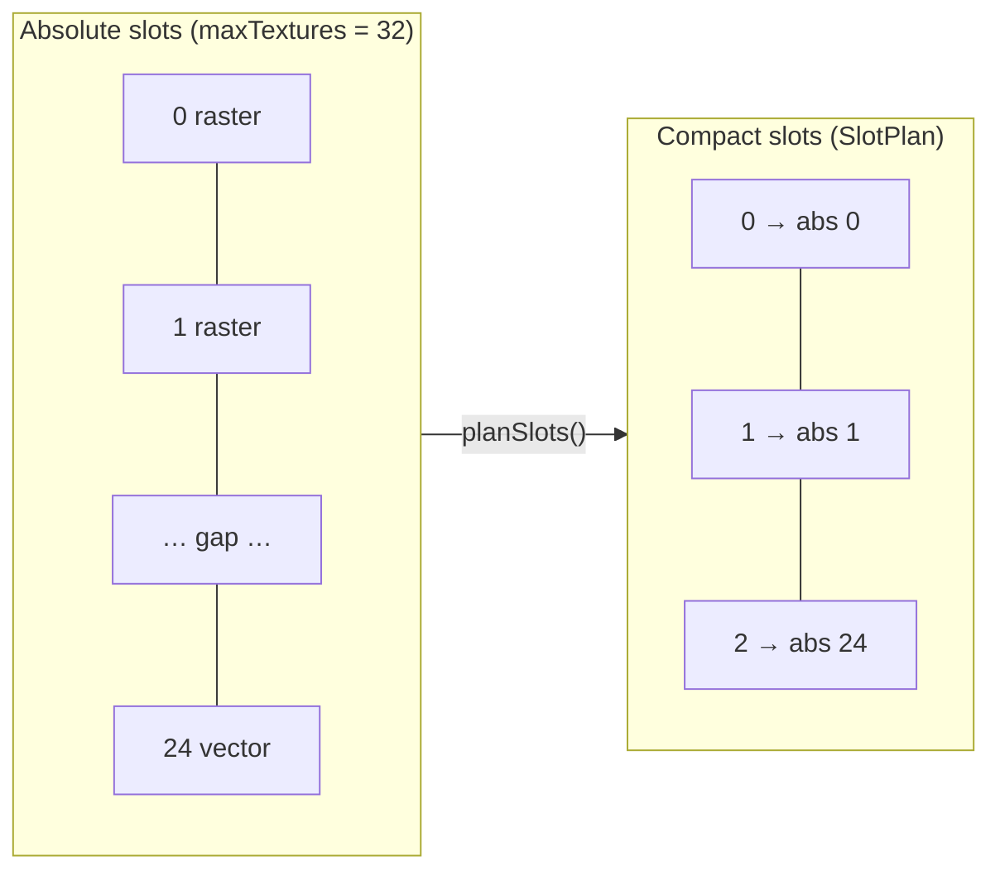
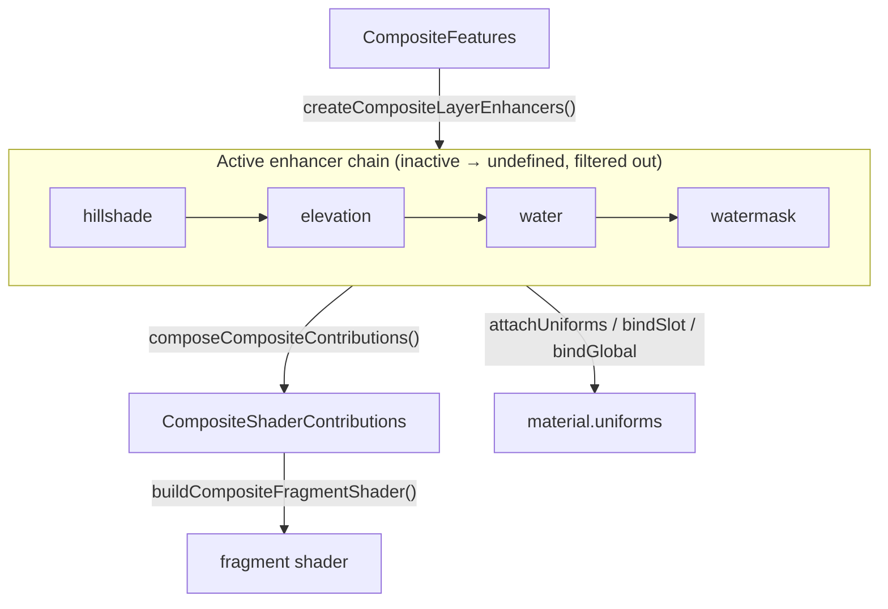
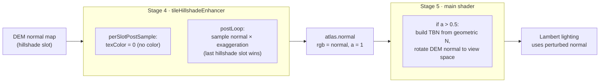
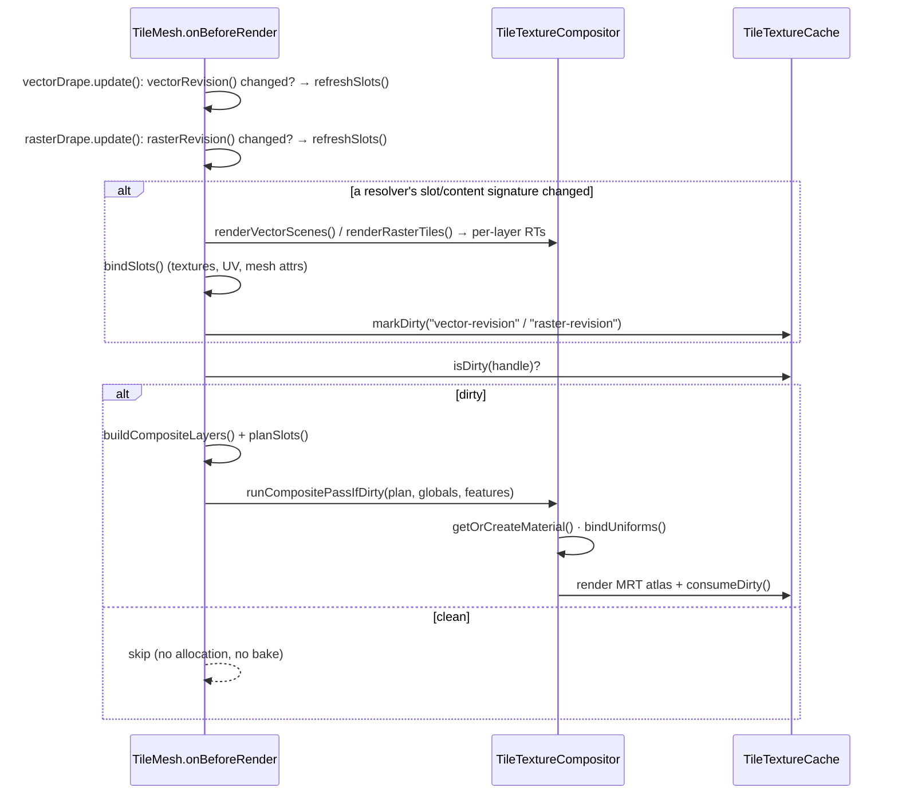
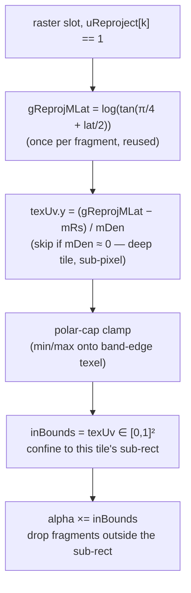

# Tile Texture Compositing

How `@navaramap/three` composites many overlays — hillshade normals, elevation
heatmaps, multiple raster tiles, and texturized vector tiles — onto a single
terrain mesh. For how those tiles are selected and resolved on the Rust side
(the terrain/raster quadtree traversals that feed this stage) see
[TILE_TERRAIN_TRAVERSAL.md](TILE_TERRAIN_TRAVERSAL.md). For the broader rendering
pipeline see [ARCHITECTURE.md](ARCHITECTURE.md); for the enhancer pattern reused
here see
[material/enhancer/DESIGN.md](../web/navara_three/src/material/enhancer/DESIGN.md).

## Overview

Every terrain tile can carry several overlays at once. Compositing them **per
fragment, every frame** would cost N texture lookups for each pixel of every
tile. Instead the overlays are baked **once, off-screen**, into a small per-tile
atlas whenever something changes; the terrain's main shader then samples just
that atlas (3 lookups) no matter how many overlays the tile has.

So two shaders are involved, and the rest of this document follows one tile's
overlays through them, end to end:

- **Composite pass** — an off-screen full-screen-quad pass that bakes N source
  textures into the tile's MRT atlas. Runs only when the tile is _dirty_.
- **Main TileMesh shader** — the on-screen terrain material. Samples the atlas's
  three attachments once per fragment and applies lighting / water / picking.

## The pipeline

A composite pass is a short pipeline from the tile's raw sources to the lit
pixel. The sections below walk it in order; this diagram is the spine they hang
off.

1. **Prepare inputs** — raster and DEM tiles are already textures; vector tiles
   must first be rendered off-screen into textures. → [Preparing inputs](#1-preparing-inputs)
2. **Snapshot** the tile's active slots into a typed layer list. → [Snapshotting the tile](#2-snapshotting-the-tile)
3. **Plan** how those layers map onto compact shader slots. → [Planning the slots](#3-planning-the-slots)
4. **Bake** the layers into the per-tile MRT atlas. → [Baking the atlas](#4-baking-the-atlas)
5. **Sample** the atlas in the terrain's main shader. → [Sampling on screen](#5-sampling-on-screen)

The whole pipeline runs only when the tile is dirty — see
[Scheduling](#scheduling-per-frame-and-dirty-tracking).

Those stages map onto two code areas: the **orchestration + data model** under
`tileTexture/`, and the **per-expression shader + uniform modules** under
`material/enhancer/tileComposite/`.

## 1. Preparing inputs

Before anything can be composited, every source has to be a plain texture bound
to a slot. What each source is, and how much prep it needs:

- **Raster tiles** — ordinary RGBA imagery. Sampled straight and tinted by the
  slot's color / opacity. On WebMercator terrain the fetched texture binds
  directly to its slot (no prep); on Geographic terrain the layer's overlapping
  WM tiles are first mosaicked into one render target (see
  [Baked raster mosaics](#baked-raster-mosaics-geographic-terrain)).
- **Hillshade DEM** — a tangent-space normal map. Contributes no color, only a
  surface normal; decoded during the bake (see [Hillshade](#hillshade-a-worked-example)).
  No prep as an input.
- **Elevation DEM** — encoded heights. Decoded and mapped through the shared
  colormap during the bake by the elevation heatmap enhancer. On Geographic
  terrain it runs through the same raster mosaic first, copied
  value-preserving so the encoded texels survive.
- **Watermask** — a single-channel land/water mask (quantized-mesh). A tile-wide
  *global*, not a per-slot layer; see [Quantized-mesh](#quantized-mesh-and-watermask).
- **Vector tiles** — Three.js scenes, not textures, so they are always rendered
  off-screen first; the next subsection covers that.

Which prep path a slot family takes is owned by the tile's two **drape
resolvers** (`mesh/tile/drapeResolver.ts`), created per `TileMesh`:

- **`VectorDrapeResolver`** — clamp-to-ground vector layers. Always the baked
  path on every tiling scheme (WebMercator terrain is the degenerate
  single-source identity case of the Geographic N:M mosaic).
- **`DirectRasterDrapeResolver`** — raster layers on WebMercator terrain.
  Every hook is a no-op: the fetched texture binds straight to its slot.
- **`BakedRasterDrapeResolver`** — raster layers on Geographic (quantized-mesh)
  terrain, chosen at tile-mesh creation from `Globe.isGeographicTiling` (a
  runtime scheme flip rebuilds every tile, so the choice never changes
  mid-life).

Each resolver refreshes its Rust-resolved slots when its resolve revision
(`vectorRevision()` / `rasterRevision()`) moved, and re-bakes when its
slot/content signature changed.

Vector tiles are draped meshes (`PolygonMesh` / `PolylineMesh`, themselves
Material-Enhancer materials). Each tile reserves a block of **vector-region**
slots — the upper half of its slot range — and a dedicated render target per
slot:

- `numTexturizedVector = floor(maxTextures / 2) − additionalTextures`, so the
  region begins at `texturizedSceneIndexFrom = maxTextures − numTexturizedVector`.
- One `WebGLRenderTarget` (512×512) per vector slot, kept in the
  `VectorDrapeResolver`'s render-target pool (lazily sized to the draped-layer
  count). `userData.textures[texturizedSceneIndexFrom + i]` is bound to the
  RT's `.texture`, or to a shared 1×1 empty texture while the slot has no RT —
  GLSL requires every declared sampler-array entry to be valid.

`TexturizedSceneByTileCoordinates` (`scene.ts`) holds a `SceneGroup` of per-layer
`TileScene`s per handle — one `TileScene` per `(tileHandle, layerId)`, each with a
`revision` counter and a `removed` flag. The **which-source-backs-this-tile**
decision no longer lives here: Rust resolves it (see
[VECTOR_TILE_DRAPING.md](VECTOR_TILE_DRAPING.md)) and hands each terrain tile a slot
per layer, where a slot carries the set of WebMercator source tiles covering it (one
on WM terrain, **several** on Geographic — N:M) each with a mercator affine
`uvOffset`/`uvScale`. `VectorDrapeResolver.refreshSlots`
(`mesh/tile/vectorDrapeResolver.ts`) pulls those (gated by the vector revision)
into `vectorSlots`; `renderVectorScenes()` then bakes each layer's sources into
that layer's render target:

The **LOD fallback** (rendered self / finer descendants / coarser ancestor) that
keeps vector layers from flickering as data streams in is resolved **entirely in
Rust** and baked into the `uvOffset`/`uvScale` of each source. TypeScript no longer
walks a parent chain or transforms a per-tile camera — it uses a single shared
`[-1, 1]` orthographic camera, reframed per source to that source's sub-rect
(`camera.left = 2·ox − 1`, etc.), and draws additively so several sources mosaic
into one RT. A source whose scene hasn't reached the cache yet is skipped; its
sub-rect stays transparent (a coarser ancestor already covers it via the Rust
resolve). Because every source is framed to land in the terrain tile's footprint,
the RT ends up spanning the terrain tile's extent, so the composite paste samples it
with **identity UV** (the WM→Geographic latitude reproject happens in the paste, not
here).

Re-baking is gated per tile by the resolver's `signature()` — a string folding
each slot's sources plus each backing scene's `revision` and child count — not
by a scene `needsUpdate` flag; when it changes, the resolver re-renders the RTs
and marks the atlas dirty with `vector-revision`.

After the RTs are baked, `bindSlots()` points each vector slot's texture at its
RT, sets identity UV, sets `shows`, and — via `copyMeshAttrs` — copies a
**representative** source mesh's enhancer state (reflectivity, roughness, water,
shininess, emissive, effect id, …) into the **main** shader's per-slot uniform
arrays. Any source mesh of a layer is a faithful representative because these
attributes are uniform across a clamp-to-ground layer's tiles. Keep this split in
mind for the rest of the pipeline: **the composite pass only ever bakes a layer's
color plus a few flags; precision-sensitive material attributes stay in per-slot
uniforms** and are looked up later by the main shader.

### Baked raster mosaics (Geographic terrain)

On Geographic (quantized-mesh) terrain a raster layer needs the same prep as
vector: one terrain tile overlaps several WebMercator tiles (N:M), and Rust
emits one **fragment-less** material slot per baked layer instead of one slot
per overlapping tile (see
[TILE_TERRAIN_TRAVERSAL.md](TILE_TERRAIN_TRAVERSAL.md)). The
`BakedRasterDrapeResolver` (`mesh/tile/rasterDrapeResolver.ts`):

- pairs the material's k-th fragment-less non-hillshade slot with
  `layer_ordinal == k` from `getRasterTileStates` — both sides derive k from
  the same sorted layer list;
- keeps one render target per baked layer (lazily allocated per active
  ordinal, disposed when the layer vanishes or flips kind);
- refreshes on a `rasterRevision()` bump and re-bakes on a slot+texture
  signature change — which also catches a texture landing in `loadedTexs`
  after the resolve (decode is async). Once every resolved texture is baked,
  the per-frame signature hashing is skipped (`signatureSettled`) until the
  next refresh; a vanished texture always comes with a Rust-side destroy bump.

`TileTextureCompositor.renderRasterTiles` then mosaics each layer's loaded
source textures into its render target through the same shared bake loop and
windowing camera as the vector bake (`bakeSlotTargets` / `frameBakeCamera`),
with two raster-specific rules:

- **Coarse-first painter's order.** Sources are drawn by ascending `uvScale`:
  an ancestor fallback spans the whole terrain rect, so it must be painted
  first and let the finer tiles overwrite it.
- **Value-preserving copy.** The bake quad renders with `toneMapped: false`,
  `transparent: true` + `NoBlending` (straight-alpha replace — an opaque
  material's `OPAQUE` define would force alpha to 1) and per-kind color
  spaces: color imagery is declared sRGB end to end so the composite decodes
  the same linear values as the direct path; **heatmap DEM** uses
  `NoColorSpace` + nearest filtering everywhere so the encoded texels survive
  bit-faithfully and the composite's decode-then-interpolate keeps working.
  This is also why a heatmap and a color layer cannot share a pooled render
  target: the color space is fixed at GL allocation.

**Heatmap no-data.** Before its sources, a baked heatmap target is painted with
the decoder's **no-data (boundary) color** (`demNoDataColorBytes`,
`utils/demNoDataColor.ts` — solves `dot(rgb, scaler) == boundary` for RGB
bytes), so regions no source covers decode as "no elevation" instead of
decoding the cleared black as a height. The composite's elevation sampler
reports validity (`sampleElevationBilinear`'s `out bool valid`,
`shaders/glsl/chunks/elevation_pars_fragment.glsl`) and the heatmap enhancer
sets the texel's alpha to 0 on no-data, rendering it transparent. The DEM
texel's **alpha channel is never used for coverage** — it is not part of any
elevation encoding and stays reserved for future RGBA ones; the no-data story
lives entirely in the encoded-elevation domain. The underlay is drawn as a 1×1
texture through the same value-preserving pipeline rather than as a clear
color, which would pass through the renderer's color management and could land
one byte off — fatal for positional encodings where the high byte weighs 65536
in the decoded value.

With that, every slot — raster (direct or baked), DEM, or vector RT — is just a
texture, and the pipeline treats them uniformly from here.

## 2. Snapshotting the tile

Each pass starts by snapshotting the material's current slot state into a typed
list, rather than threading raw parallel arrays through the compositor.
`TileMesh.buildCompositeLayers()` walks the slots and emits a layer for each one
that is **shown AND bound to a texture**:

- **`CompositeLayer`** — a discriminated union: `raster` (a raster tile *or* a
  texturized vector scene), `hillshade`, or `elevationHeatmap`. Each carries its
  `absSlot`, `region` (`raster` | `vector`), `texture`, and UV transform; raster
  layers also carry color / opacity / water. On Geographic terrain, `raster`
  **and** `elevationHeatmap` layers carry a `reproject` `[south, north]`
  latitude range, supplied by the slot's drape resolver (`slotReproject`) —
  hillshade is terrain-side and never reprojects (see
  [N:M draping](#nm-draping-stitching-and-mercator-reprojection)).
- **`CompositeGlobals`** — tile-wide, non-per-slot inputs: watermask, colormap +
  elevation decoder params, hillshade exaggeration.

Which expressions are active (`CompositeFeatures`) is then **derived** from the
layers + globals via `deriveCompositeFeatures()` — there are no hand-maintained
feature flags to keep in sync.

## 3. Planning the slots

The layer list is sparse and split across two regions (raster overlays in the
low indices, vector scenes up high), so feeding it to the shader directly would
waste slots. `planSlots()` compacts it: it maps the active layers into a dense
index space, emitting blocks only for slots actually in use, and
power-of-two-quantizes each region's count so the shader/material cache stays
small.

The **absolute** slot index is carried through and baked into the composite
shader as `winningSlot`, so the main shader can still index its per-slot uniform
arrays (reflectivity, water speed, …) by the winner decoded from the atlas. The
`SlotPlan` and the derived `CompositeFeatures` are everything the bake needs.

## 4. Baking the atlas

Given a `SlotPlan` and a feature set, `TileTextureCompositor.runCompositePassIfDirty()`
assembles the off-screen shader, binds the uniforms, and renders one full-screen
quad into the tile's MRT atlas.

### Assembling the shader

The shader is composed, not hand-written. `createCompositeLayerEnhancers()`
turns the feature set into a chain of **composite layer enhancers** (inactive
ones return `undefined` and drop out). `composeCompositeContributions()` folds
the chain's GLSL fragments onto the base enhancer's skeleton, while each
enhancer also attaches and binds its own uniforms:

Each enhancer is self-contained, mirroring the project's
[Material Enhancer](../web/navara_three/src/material/enhancer/DESIGN.md) file
layout (`shader.ts` = pure GLSL, `mutates.ts` = uniform refs, `index.ts` =
factory). The base enhancer owns the `main()` skeleton, the core per-slot
uniforms, the alpha-over blend, and the MRT output writes; each layer enhancer
plugs into named hooks:

| Hook | Purpose |
| --- | --- |
| `slotUniformDecls(n)` | per-slot uniform declarations |
| `globalUniformDecls()` | slot-independent declarations |
| `includes()` | GLSL chunks inlined before `main()` |
| `sampleProducer(ctx)` | override the per-slot sampler (e.g. heatmap colormap) |
| `perSlotPostSample(ctx)` | transform `texColor` after sampling (e.g. zero hillshade) |
| `perSlotOnWinner(ctx)` | update attrs when a slot wins the blend (e.g. water flag) |
| `postLoop(n)` | code after the slot loop (e.g. normal pass, watermask) |
| `defines` | material `#define`s |
| `attachUniforms` / `bindSlot` / `bindGlobal` | create + sync the enhancer's own uniforms |

So **adding a new overlay type is a local change**: write one enhancer module
under `material/enhancer/tileComposite/`, add a `CompositeLayer` variant in
`tileTexture/types.ts`, classify it in `buildCompositeLayers()`, and slot the
factory into `createCompositeLayerEnhancers()`. Nothing else changes.

### What the bake produces

The atlas is one `WebGLRenderTarget` with three RGBA8 attachments (512×512),
owned per tile by `TileTextureCache`. The single quad draw writes all three:

| Attachment | Channels | Meaning |
| --- | --- | --- |
| `color` | rgba | Alpha-over composited diffuse (last opaque writer wins) |
| `attr` | r / g / b / a | `isWater` / `isTexturized` / `0` / `(winningSlot+1)/255` |
| `normal` | rgb / a | Hillshade normal in `[0,1]` / `1` when present else `0` |

That `attr.a` is how the absolute winning slot survives into the main shader,
and `attr.g` is how raster and vector pixels stay distinguishable — both used in
the next stage.

## 5. Sampling on screen

The terrain's main shader (injected via `material/macro/tileShader.ts`) is now
thin: it samples the three atlas attachments once at `vOrigUv` and reads
per-slot uniforms by the decoded winner instead of looping over every slot.

- **Color** — `color` is composited over the base via a premultiplied "over".
- **Winner lookup** — `winIdx = round(attr.a * 255) − 1`; the shader indexes its
  per-slot uniform arrays (reflectivity, roughness, water params, emissive, …)
  at `winIdx`, recovering the full-precision attributes the bake left behind.
- **`attr.g` (isTexturized)** — separates raster from vector: vector pixels carry
  the batch id for picking, and emissive / effect output is gated to them.
- **`attr.r` (isWater)** — drives a specular / water reflection on that pixel.
- **`normal`** — applied as a hillshade perturbation (next section).

## Hillshade: a worked example

Hillshade is the clearest case of one source spanning the whole pipeline — its
input is a DEM **tangent-space normal map** that contributes *no color*, only a
surface normal that drives Lambert shading.

It touches three places that must agree:

- **Material type** — `shouldUseNormal()` selects `MeshLambertMaterial` (instead
  of the cheaper `MeshBasicMaterial`) and sets the `USE_HILLSHADE` define when
  any hillshade slot is active; normal-based lighting needs Lambert.
- **Bake (stage 4)** — `tileHillshadeEnhancer` zeroes the slot's color, then in
  `postLoop` unpacks each hillshade slot's normal, applies
  `uHillshadeExaggeration`, and writes the last one into the normal attachment
  with `a = 1` (neutral `0.5,0.5,1`, `a = 0` when none).
- **Sample (stage 5)** — `generateTileNormalFragmentMaps` samples `uNormalAtlas`;
  when `a > 0.5` it rebuilds a TBN basis from the geometric normal `N` (with a
  pole fallback), rotates the stored DEM normal into view space, and replaces
  `normal` so lighting reacts to the terrain micro-relief.

The composite feature set (`deriveCompositeFeatures`, layer-derived) and the main
shader's `USE_HILLSHADE` (define-derived) stay consistent: an active hillshade
layer implies the define, and when no hillshade slot wins a pixel the normal
attachment's `a = 0` short-circuits the main-shader branch anyway.

## Scheduling: per-frame and dirty tracking

Stages 1–4 are expensive, so the whole bake is gated: `onBeforeRender` does the
cheap upkeep every frame but only snapshots and bakes when the tile is dirty.

Dirty reasons are coalesced per tile (`DirtyReason`: `material`,
`texture-binding`, `vector-revision`, `raster-revision`, `hillshade`) so one bake services many
changes, and the atlas Textures persist across passes — only `needsUpdate` flips
when a new bake overwrites them.

## Quantized-mesh and watermask

Quantized-mesh terrain adds per-vertex normals (which force a Lambert material,
like hillshade) and an optional **watermask** extension. The watermask is a
slot-independent global rather than a per-slot layer: `tileWatermaskEnhancer`
declares it in `globalUniformDecls`, samples it once in `postLoop`, and OR's the
result into `isWater`. So even an open-ocean tile with no raster/vector overlays
still bakes water into `attr.r` for the main shader's reflection — which is why
the bake runs for a watermask-only tile even though it has zero slots.

Because raster imagery now drapes on quantized-mesh tiles, a watermask tile can
also have a **winning raster slot**. The watermask flags water independently of
which slot wins the blend, so the main shader (`generateTileMapFragment`) OR's
`useWater` into `useSpecular` rather than gating it on the winner's own specular
flag — otherwise a draped raster slot (`uSpeculars == false`) would suppress the
watermask glint. Per-slot water specular params (`shininess`,
`specularStrength`) only exist for **vector** water layers, so when the winner is
a raster slot the shader falls back to the default water appearance (the same
one the no-winner open-ocean path uses) instead of reading the raster slot's
zeroed params.

## N:M draping: stitching and Mercator reprojection

When the raster and terrain schemes differ — a WebMercator imagery layer draped
on a **Geographic** quantized-mesh tile — one terrain tile is covered by
**several** source tiles, and each source tile's latitude axis is non-linear
relative to the terrain tile's equal-degree grid. The offscreen mosaic bake
handles the first, the composite paste the second — and neither one needed a
change to `planSlots()` or the atlas.

**Stitching is done in the offscreen bake, not in `planSlots()`.** The Rust
pull (`resolve_raster_tile_states`, see
[TILE_TERRAIN_TRAVERSAL.md](TILE_TERRAIN_TRAVERSAL.md)) resolves the **set** of
overlapping WebMercator tiles per layer, and the `BakedRasterDrapeResolver`
mosaics them into that layer's one render target (see
[Baked raster mosaics](#baked-raster-mosaics-geographic-terrain)). So a logical
layer arrives at the compositor as exactly **one** `CompositeLayer` bound to
its baked RT with identity UV — `buildCompositeLayers()` and `planSlots()`
treat it like any other slot. (An earlier design instead emitted one composite
slot per overlapping tile; with 3+ draped layers that either coarsened every
layer to a single tile or overflowed the GPU slot budget, which is why the
fan-out was moved into the bake.) The overlap is capped on the Rust side **per
layer** by `RASTER_DRAPE_OVERLAP_BUDGET`; the TS overflow guard in
`TileMesh.bindUniforms` (`textureFragmentsLen > texturizedSceneIndexFrom`)
remains the final safety net for an oversized layer count.

**Latitude is reprojected per fragment.** The baked render target spans the
terrain tile's **Mercator-projected** extent, so pasting it with a plain affine
would stretch **latitude** (WebMercator is non-linear in latitude; Geographic
is equal-degree). The base enhancer (`tileCompositeBaseEnhancer`) carries three
extra per-slot uniforms for this, applied to raster **and** elevation-heatmap
slots alike (the UV is warped before either sampler runs; hillshade is
terrain-side and never reprojects):

| Uniform | Source | Meaning |
| --- | --- | --- |
| `uReproject[k]` | `layer.reproject != null` (raster / elevationHeatmap, via the drape resolver's `slotReproject`) | `1` = reproject this slot's latitude |
| `uReprojectTerrainLat[k]` | `reproject` `[south, north]` | terrain tile latitude band (radians) |
| `uReprojectMerc[k]` | precomputed in `bindSlot` | `(mRs, mDen, clampTop, clampBottom)` — source band's Mercator start + span, plus polar-cap clamp flags |

`bindSlot` recovers the source's latitude band from the affine y mapping (a
baked slot has identity UV, so the recovered band is exactly the terrain band)
and precomputes its Mercator-space start/span (`log(tan(π/4 + lat/2))`) on the
CPU, so the per-fragment shader does **one** transcendental — `gReprojMLat`,
the fragment's own latitude in Mercator space — and reuses it across every
reprojecting slot (the terrain band is tile-wide):

Two subtleties:

- **Bounds confinement.** Outside a slot's `[0,1]` UV range the sampler would
  smear the edge texel, so `inBounds` (a `step` test) folds into the slot's
  `alpha` and drops fragments there. Reprojection is the only path that pushes
  UV outside `[0,1]` (with baked mosaics the slot's rect is the whole terrain
  tile, so this mainly bites near the polar caps), so both the transcendental
  math and the bounds test live behind the `uReproject` branch — same-scheme
  slots pay neither cost.
- **Polar caps.** WebMercator imagery stops at ~±85.05°. When a slot's band
  edge sits on the WM latitude limit (`clampTop`/`clampBottom`), its last
  imagery row is clamped across the polar overshoot instead of being dropped,
  so the cap is covered.

The atlas, the main shader's atlas sampling, and the slot plan are all unchanged
— the entire N:M mechanism lives in the pull (Rust), the offscreen mosaic bake,
and the base composite enhancer's per-slot reprojection.

> [!NOTE]
> **Clamp-to-ground vector layers reuse this exact path.** Their features are
> rendered offscreen to a per-layer render target, then pasted as `RasterCompositeLayer`s
> with the same `uReproject*` reprojection — the composite pass does not distinguish
> them from raster imagery. What differs is the *pull*: the source is a rendered
> feature scene (not a loaded texture), so the resolve walks up **or down** to the
> rendered level. See [VECTOR_TILE_DRAPING.md](VECTOR_TILE_DRAPING.md).

## Key files

| File | Stage | Role |
| --- | --- | --- |
| `mesh/tile/index.ts` | 1–2, 5 | `TileMesh` — layer snapshot, drives the pass, main shader |
| `mesh/tile/drapeResolver.ts` | 1 | `DrapeResolver` interface — per-family slot ownership + revision/signature gates |
| `mesh/tile/vectorDrapeResolver.ts` | 1 | vector slot refresh / signature / bake driver + RT pool |
| `mesh/tile/rasterDrapeResolver.ts` | 1 | `DirectRasterDrapeResolver` (WM, no-op) + `BakedRasterDrapeResolver` (Geographic mosaic) |
| `utils/demNoDataColor.ts` | 1 | decoder boundary → no-data underlay color for baked heatmaps |
| `tileTexture/SlotPlanner.ts` | 3 | `planSlots()` — compact slot layout + quantization |
| `tileTexture/TileTextureCompositor.ts` | 1, 4 | vector-scene + raster-mosaic bakes, material cache, MRT bake |
| `tileTexture/TileTextureCache.ts` | 4 | per-tile atlas lifecycle + dirty tracking |
| `tileTexture/types.ts` | 2 | `CompositeLayer`, `CompositeGlobals` domain model |
| `material/enhancer/tileComposite/tileCompositeBaseEnhancer/` | 4 | shader skeleton + core uniforms + N:M Mercator reprojection |
| `material/enhancer/tileComposite/tile{Hillshade,ElevationHeatmap,Water,Watermask}Enhancer/` | 4 | per-expression modules |
| `material/enhancer/tileComposite/compose.ts` | 4 | enhancer chain, contributions, feature derivation |
| `material/macro/tileShader.ts` | 5 | main TileMesh shader injections (atlas sampling) |
