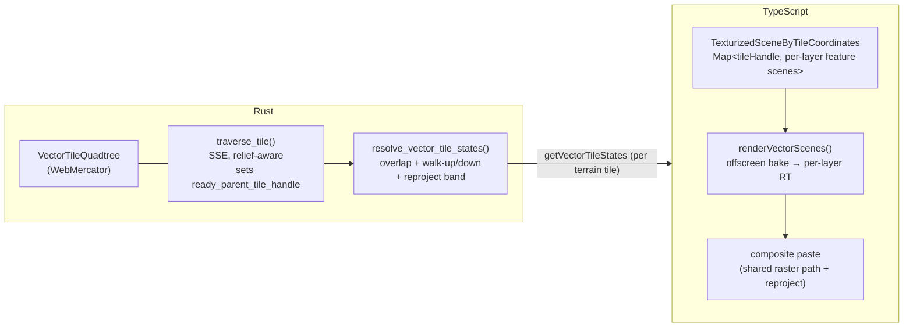
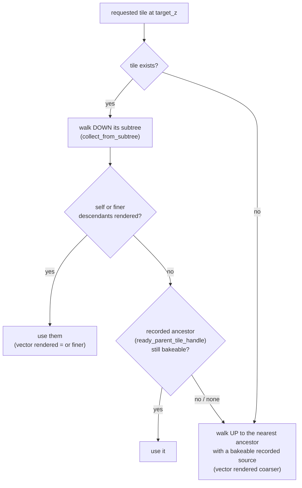

# Clamp-to-Ground Vector Tile Draping

How Navara drapes **clamp-to-ground vector** features (MVT polygons, draped
polylines) onto terrain so they hug the surface — including **Geographic /
quantized-mesh** terrain, where the vector (always WebMercator) and the terrain
grids do not nest.

This is a different mechanism from [DRAPED_MESH.md](DRAPED_MESH.md), which paints
an arbitrary 3D mesh onto terrain with a stencil test. Here the vector features
are **rendered offscreen to a texture** and that texture is composited onto the
terrain tile — reusing the raster imagery drape path. For the traversal/LOD
machinery see [TILE_TERRAIN_TRAVERSAL.md](TILE_TERRAIN_TRAVERSAL.md); for the GPU
compositing it plugs into see
[TILE_TEXTURE_COMPOSITING.md](TILE_TEXTURE_COMPOSITING.md).

## Overview

A clamp-to-ground vector layer is drawn like imagery: its features are baked into
a per-terrain-tile texture and pasted onto the terrain mesh. The split of
responsibility is deliberate and mirrors raster:

- **Rust owns all resolution.** Which WebMercator vector tile backs a given
  terrain tile, the UV transform, the ancestor/descendant fallback, and the
  WM→Geographic reprojection band are all decided in the engine.
- **TypeScript is a dumb cache + offscreen renderer.** It keeps a
  `Map<tileHandle, Scene>` of rendered feature meshes and, told by Rust which
  tiles to bake and where, renders them into a render target. It never searches
  for a fallback tile itself.

The vector data is tiled in **WebMercator** and baked in WebMercator; the paste
then reprojects the baked texture's latitude WM→Geographic on Geographic terrain,
reusing the composite shader's `uReproject*` path. So the polygon/polyline
**vertex** shaders are untouched — everything scheme-specific lives in the pull
(Rust) and the composite paste.

## Vector vs raster imagery — the key difference

Both pipelines pick a WebMercator tile per terrain tile via the same
`wm_zoom_for_lng_span` + `overlapping_tiles_within_budget`, and both walk a
quadtree to find a bakeable source. The difference is **what "a source" is** and
**at which levels it exists**:

| | Raster imagery | Clamp-to-ground vector |
| --- | --- | --- |
| Tile content | a downloaded **texture image** | **features that must be rendered** (meshes → offscreen bake) |
| Cost per level | cheap (just fetch) | expensive (render + bake) |
| Levels available | `traverse_raster` requests a fragment at **every level along the descent path** (`raster/traverse.rs`, "coarse fallback while finer children load") → a coarse texture is **always** loaded | only the **rendered leaf** level is a source; coarser levels are not baked |
| Resolve fallback | walk **up** always hits a loaded texture | walk **up or down** — the rendered level may be finer *or* coarser than the terrain-driven zoom |

That asymmetry is the whole reason the vector resolve is more involved than
raster's. Raster keeps a texture at every level for free, so its up-only walk
never misses. Vector renders exactly one level per region, so the resolve must
find that level whether it sits above or below the requested zoom (see
[Resolve](#resolve-covering-the-terrain-tile)).

Since the quantized-mesh multi-tile fix, the raster imagery drape on
Geographic terrain reuses this same baked mechanism — one render target per
layer, N:M mosaic bake, per-layer overlap budget, a `RasterResolveRevision`
gate mirroring the vector one (see
[TILE_TERRAIN_TRAVERSAL.md](TILE_TERRAIN_TRAVERSAL.md)). What stays
vector-specific is the up-**or-down** resolve above and the offscreen scene
rendering; on the web both live behind the shared `DrapeResolver` interface
(`mesh/tile/drapeResolver.ts`).

## The pipeline

Per terrain tile, every rendered frame, the tile's `VectorDrapeResolver`
(`mesh/tile/vectorDrapeResolver.ts`, driven from `TileMesh._onBeforeRender`)
pulls the Rust-resolved sources, groups them by layer, bakes the backing
feature scenes into a per-layer render target, and the composite pass pastes
each RT onto the terrain tile (with reprojection on Geographic terrain).

## Rust side: the traverse and the drape source

The vector traverse (`crates/navara_vector_tile/src/tile/traverse.rs`) is an SSE
quadtree walk like the raster one. It reads terrain relief **by extent**
(`terrain_height_for_extent`, scheme-agnostic) so its LOD tracks the terrain's
subdivision depth rather than treating the tile as flat.

The load-bearing piece for draping is a single field on `VectorTile`
(`crates/navara_tile_component/src/vector_tile.rs`):

> **`ready_parent_tile_handle: Option<TileHandle>`** — the **self-inclusive
> nearest bakeable tile**: `Some(self)` when this tile's draped features are all
> active (rendered and confirmed by the web side), otherwise the nearest
> at-or-above ancestor that is. The traverse recomputes it every frame from the
> live ECS activation state.

Because it is derived from ECS activation (a feature is "active" only after the
web side reports the mesh rendered via `markFeatureIsRendered`), a tile is only
offered as a drape source once JS actually holds its baked scene — no separate
JS→Rust "scene ready" flag is needed. This replaced an earlier persistent
`scene_ready` bool that got out of sync on cache eviction.

## Resolve: covering the terrain tile

`resolve_vector_tile_states` → `resolve_vector_tiles`
(`crates/navara_vector_tile/src/resolve.rs`) is a **pure function over the
quadtrees** (unit-testable without an `App`). For a terrain tile it:

1. Picks `target_z = wm_zoom_for_lng_span(terrain_lng_span)` — the WebMercator
   zoom whose tile matches the terrain tile's longitude span.
2. Enumerates the overlapping WM tiles at `target_z`
   (`overlapping_tiles_within_budget`), capped **per layer** at
   `VECTOR_DRAPE_OVERLAP_BUDGET` (the overlap grows toward the poles; beyond the
   budget the query coarsens the zoom). It is per-layer, not divided across
   layers, because each layer bakes into its own render target.
3. For **each** overlap coord, gathers the bakeable sources covering it with
   `collect_drape_sources`, then dedupes and caps the total at
   `VECTOR_DRAPE_MAX_SOURCES`.

Two distinct budgets, then: `VECTOR_DRAPE_OVERLAP_BUDGET` bounds how many
*terrain-driven* WM tiles are queried, while `VECTOR_DRAPE_MAX_SOURCES` bounds the
*final* source count after each overlap fans out to its rendered descendants — the
one that actually bounds the offscreen bake work.

`collect_drape_sources` covers every case so no sub-region is ever left
un-draped, whether the vector rendered coarser **or** finer than `target_z`:

- **Rendered self** → the matching tile.
- **Finer descendants** (the vector's SSE subdivided deeper than the
  terrain-driven zoom): `collect_from_subtree` descends to the rendered leaves.
  This is what an up-only walk would miss — the fix for the latitude-row gaps on
  Geographic terrain.
- **Coarser ancestor** (children not ready, or the vector rendered shallower):
  the tile's recorded `ready_parent_tile_handle` — the "show the parent while
  children prepare" fallback.

The recorded field is trusted only as far as it can be: a source is used only
while it still records *itself* as its own source (its features are active); a
stale pointer — the source deactivated or was evicted on a path the traverse
skipped that frame — is rejected. And a node that exists but never recorded a
source at all (an early-returned traverse path, typically tiles past
`overscaled_max_zoom` under deeply upsampled terrain) is climbed *past*, not
stopped at. Both rules keep the walk-up landing on the nearest genuinely
bakeable ancestor; without them such nodes swallowed the fallback and left the
terrain tile blank.

The descendant fan-out is bounded by `VECTOR_DRAPE_MAX_SOURCES` (all sources for a
layer draw into that layer's one render target, so the bake cost is bounded).

## TypeScript side: per-feature scene cache and bake

`TexturizedSceneByTileCoordinates` (`web/navara_three/src/scene.ts`) holds one
`TileScene` per `(tileHandle, layerId)`, each accumulating that tile+layer's
feature meshes. It is a **per-feature** cache:

- **Insert on create.** A draped feature's mesh is fully built at the end of its
  create event, so `processRenderableFeatureAdded` (`event/feature.ts`) inserts
  it into the cache there (invisible meshes are kept; the bake skips them). This
  is also the point at which Rust learns the feature is rendered, so ECS
  activation and cache membership stay in lockstep.
- **Remove one mesh.** `removeMesh(handle, layerId, mesh)` removes only that
  feature's mesh (on its `removedFromWorld`); the `TileScene`/`SceneGroup` are
  pruned only when empty. Removing one feature no longer blanks its siblings.
- **`markDirty`** on material/visibility changes bumps the scene revision so the
  consuming `TileMesh` re-bakes.

`VectorDrapeResolver.update` → `TileTextureCompositor.renderVectorScenes`
(`tileTexture/TileTextureCompositor.ts`) clears each per-layer render target once
and draws every resolved source's scene into it. Each source is framed by a
**single fixed** `[-1, 1]` orthographic camera reframed to the source's Rust-supplied
`uvOffset` / `uvScale` sub-rect — there is no per-tile camera transform or
JS-side parent walk anymore, because the ancestor/descendant fallback is already
baked into those affines. The sources accumulate additively, so the RT ends up
spanning the terrain tile's extent. The composite pass then pastes it like a raster
layer (identity UV in longitude, latitude reprojected).

`VectorDrapeResolver.bindSlots` then points the slot's texture at its RT and copies a
**representative** source mesh's enhancer state (water/specular/emissive/effect id, …)
into the main shader's per-slot uniforms via `copyMeshAttrs`. Any source mesh
of a layer works as the representative because these attributes are uniform across a
clamp-to-ground layer's tiles. See
[TILE_TEXTURE_COMPOSITING.md](TILE_TEXTURE_COMPOSITING.md) for how the bake and paste
consume this.

### Avoiding per-frame cost

The resolver's `update()` runs per terrain tile per rendered frame, so the
WASM-boundary resolve is gated by a **revision counter**: Rust bumps
`VectorResolveRevision` (`crates/navara_vector_tile/src/lib.rs`) whenever a
traverse runs; JS reads `vectorRevision()` once per frame and re-fetches a tile's
slots only when it changed (`vectorDrapeResolver.ts` `lastRevision`).

## Scheme cases

The vector data is always WebMercator; only the **terrain** scheme varies. The WM
terrain case is the degenerate one the Geographic path subsumes:

| | WM terrain + WM vector | Geographic / quantized-mesh terrain + WM vector |
| --- | --- | --- |
| Schemes | same | differ (terrain 2 roots, vector 1 root) |
| `target_z` | = terrain `z` | = terrain `z` **+ 1** (a Geographic tile spans half a WM tile's longitude at the same `z`) |
| Relationship | **1:1 identity** — one vector tile per terrain tile | **N:M** — one terrain tile overlaps several WM vector tiles (a longitude column × latitude rows via Mercator) |
| Reprojection | none (identity UV) | WM→Geographic latitude reproject in the composite paste |

Because they share the same `wm_zoom_for_lng_span` mapping and the terrain's
geometric error is now **scheme-aware** (a Geographic level-zero error is halved
for its 2 root tiles — Cesium's `getNumberOfXTilesAtLevel(0)`, in
`crates/navara_core/src/terrain/geometric_error.rs` /
`terrain_tile.rs`), a Geographic terrain tile and a WM terrain tile at the same
on-screen LOD select the **same** draped WM zoom. Without that scheme-awareness
the Geographic drape came out one level finer than WM.

## Layer ordering

Vector layers stack by declaration order (lower = bottom, later = on top), matching the
composite's last-writer-wins blend. `get_vector_tiles`
(`crates/navara_ecs/src/lib.rs`) sorts the layers by `LayerDescStore::get_order`
before resolving — the vector `LayerResources` carry no `Order` component, so
without this sort the composite would stack them in arbitrary ECS query order.

## Key files

| File | Role |
| --- | --- |
| `crates/navara_vector_tile/src/tile/traverse.rs` | SSE traverse; sets `ready_parent_tile_handle` (self-inclusive drape source) |
| `crates/navara_vector_tile/src/resolve.rs` | `resolve_vector_tile_states` / `collect_drape_sources` — overlap + walk-up/down, dedup, cap |
| `crates/navara_tile_component/src/vector_tile.rs` | `VectorTile.ready_parent_tile_handle` |
| `crates/navara_vector_tile/src/lib.rs` | `VectorResolveRevision` (per-frame re-fetch gate) |
| `crates/navara_ecs/src/lib.rs` | `get_vector_tiles` (layer-order sort), `vector_revision` |
| `crates/navara_wasm/src/lib.rs` | `getVectorTileStates`, `vectorRevision` bindings |
| `crates/navara_core/src/terrain/geometric_error.rs` | scheme-aware level-zero geometric error (keeps drape zoom consistent across schemes) |
| `web/navara_three/src/scene.ts` | `TexturizedSceneByTileCoordinates` — per-feature scene cache |
| `web/navara_three/src/event/feature.ts` | draped feature lifecycle: insert on create, `removeMesh`, `markDirty` |
| `web/navara_three/src/mesh/tile/vectorDrapeResolver.ts` | `VectorDrapeResolver` — `refreshSlots`, `signature` re-bake gate, `bindSlots` (identity UV + representative mesh attrs), bake driver |
| `web/navara_three/src/mesh/tile/drapeResolver.ts` | `DrapeResolver` interface shared with the raster drape resolvers |
| `web/navara_three/src/tileTexture/TileTextureCompositor.ts` | `renderVectorScenes` offscreen bake |
| `material/enhancer/tileComposite/tileCompositeBaseEnhancer/` | composite paste + WM→Geographic reproject (shared with raster) |
